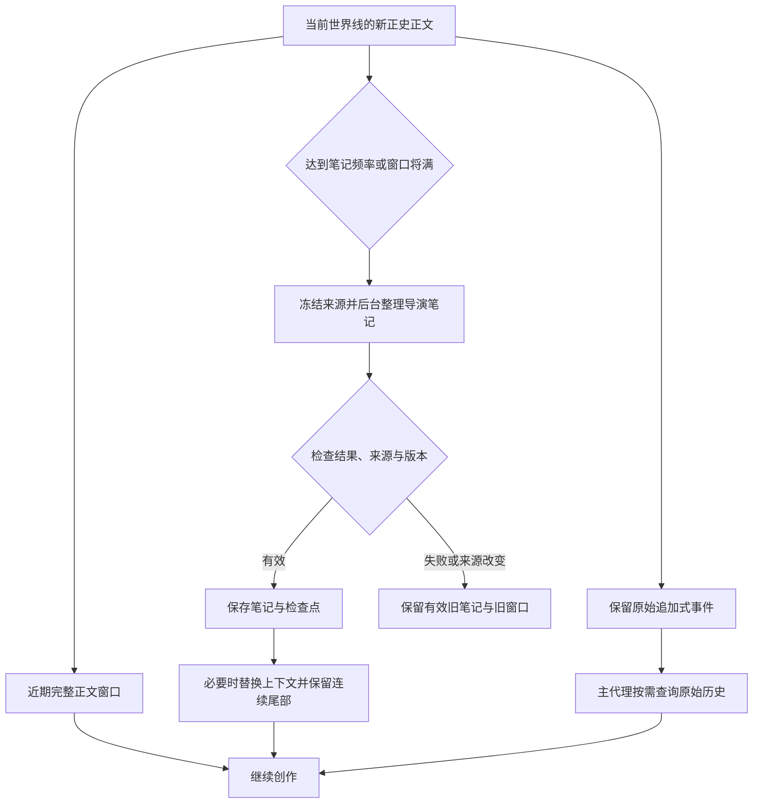

# dsh-NextTavern 架构

[返回首页](README.md) · [安装与兼容范围](README.md#安装) · [反馈](https://github.com/a86582751/dsh-nexttavern/issues)

NextTavern 在 DeepSeek Harness 的原生 Agent Loop 上组织长篇角色扮演。角色卡、剧情、记忆、角色协作、分支和导出共享同一套 Session 来源与任务生命周期。它的设计目标是让长篇叙事既能持续演进，也能解释“当前看到的内容从哪里来”。

本页描述 0.1.0 的已有设计与实现。它不是所有模型的质量、速度、缓存率或无限记忆保证；具体安装验证边界见首页。

## 1. 程序准备上下文，Agent 决定如何行动

每轮输入经过原生 Inbox。程序解析当前世界线，装配稳定设定、当前窗口正文和有效导演笔记；主代理在原生循环内使用工具推进创作。

| 信息 | 提供方式 | 设计原因 |
| --- | --- | --- |
| 核心设定、人物与作者规则 | 按当前设定版本装配 | 保持长期身份和叙事约束，固定卡片字段不参与剧情摘要。 |
| 当前窗口正文 | 程序按完整正文边界选择 | 保留眼前剧情的细节与连续性，预算判断无需模型。 |
| 导演笔记 | 读取当前世界线有效版本 | 承接长线事件、人物状态与待处理线索。 |
| 世界书 | 主代理调用搜索、列表与读取工具 | 将低频世界知识作为可查询资料，按剧情需要读取。 |
| 早期历史 | 主代理调用 `rp_history` | 当笔记不足以回答细节时，回到有来源的原文。 |

主代理可用 `rp_worldbook_list` 查看条目摘要、用 `rp_worldbook_search` 查询相关正文，用 `rp_history` 查询旧事件。程序不会每回合强制先调一个模型做场景整理，再调一个模型做资料召回。已有信息充分时，主代理可以直接创作。

稳定设定锚点按版本复用；避免无意义地反复改写提示前缀。缓存效果仍取决于模型供应商、路由与实际请求，不能由这一设计单独保证。

实现入口：[roleplay-core.js](preset/lib/roleplay-core.js)。

## 2. 硬切窗口、导演笔记与原始历史组成记忆闭环

这套机制借鉴了 Codex 类长任务系统的上下文管理思路，具体窗口与记忆逻辑由 NextTavern 实现，不是 OpenAI 官方组件。

普通笔记更新在独立原生子代理中运行。更新未完成时可以使用有效旧笔记继续，后台任务不会自动降级成阻塞正文的长任务。真正淘汰窗口之前则有严格关口：待淘汰内容必须有有效检查点与来源记录，保存失败就保留旧窗口。

整理频率按“新增正史槽位”计数。重生成和改写同一槽位更新其来源，不算又推进了一个新回合。笔记记录来源版本；编辑、分支或来源变化后，旧结果不能仅因轮数满足就继续生效。

硬切改变模型当前看到的上下文，不删除原始 Session 事件。需要细节时仍可查询当前世界线及其可证明继承的原始历史。

窗口正文预算、尾部完整正文保留预算和后台笔记频率支持全局默认与会话覆盖。窗口预算应结合实际模型上下文容量配置。

实现入口：[roleplay-memory-engine.js](preset/lib/roleplay-memory-engine.js)、[roleplay-core.js](preset/lib/roleplay-core.js)。

## 3. 世界线有执行起点，也有继承边界

一个可见对话可以容纳多条原生 Session 世界线。重新生成、编辑后发送和显式克隆有不同的产品含义：

| 操作 | 可见结果 | 数据边界 |
| --- | --- | --- |
| 重新生成 | 当前对话中的新回复版本 | 从目标回合前的原生来源准备分支。 |
| 修改玩家消息后发送 | 当前对话中的新输入世界线 | 后续回复属于新输入，状态与记忆重新遵循该分支来源。 |
| 切换已有版本 | 切换当前选中世界线 | 读取这条世界线的正文、笔记、状态与资源来源。 |
| 在新对话中分支 | 新建独立可见对话 | 显式克隆，保留可追溯的起点。 |

世界线创建使用原生 `forkPrepared`，经历准备、创建/绑定 Session、登记世界线和入队。操作 ID 与请求 ID 用于不确定响应后的查询与恢复，减少重复提交同一玩家输入的风险。

继承只到 fork seed。未来正文、后来才完成的笔记、已撤销的来源，以及其他分支的工具结果不能被当作当前世界线已发生的事实。迟到任务提交还需通过所属分支、来源和 generation 校验。

导演笔记与角色模型偏好的作用域也不同：前者属于实际世界线，后者可在当前可见对话的世界线之间共用。共享偏好不等于共享错误的剧情历史。

实现入口：[tavern-conversations.js](preset/lib/tavern-conversations.js)、[roleplay-core.js](preset/lib/roleplay-core.js)。安装需要 Session Controller 的对应兼容补丁。

## 4. 多模型协同与角色集群各有执行语义

NextTavern 区分三类协作，避免把所有工作都变成同一种子代理：

| 类型 | 如何执行 | 为什么这样分工 |
| --- | --- | --- |
| 普通维护、读写卡与导出任务 | 相同主路由且条件兼容时可在主循环内执行；不同路由使用原生子代理，兼容相邻任务可共享循环 | 减少重复调度，同时保留每项任务的结果校验、错误与恢复状态。 |
| 后台导演笔记 | 即使同模型也独立运行 | 长任务有独立生命周期，不与前台状态任务混为一批。 |
| 角色 Agent 集群 | 每个角色独立、并行推演，即使模型相同 | 保留不同人物的上下文与意图，由主代理综合协调。 |

六类普通任务为 memory、card-import、card-export、status、decision、novel-export。批次合并还要求分支、阶段、路由、思考设置和工具权限兼容；模型名称相同本身不足以合并。某成员失败时，只恢复未完成成员，已完成结果不重做；迟到结果不能覆盖回退后的新版本。

角色集群开启后，主代理通过 `rp_character_cast` 选择本轮主要人物。程序为每个角色装配当前正文、玩家输入、核心设定、自己的人设、导演笔记及近期主代理已经成功读取的世界书内容。角色可使用受限且归属当前世界线的只读历史查询；不获得主代理的任意工具权限。

角色返回语言、行为与意图建议，主代理处理冲突和意外，再生成正式正文。读卡、创作问卷和诊断不自动启动角色集群。集群默认关闭，只属于当前对话；每个角色可设置模型与思考强度。

实现入口：[tavern-tasks.js](preset/lib/tavern-tasks.js)、[character-cluster.js](preset/lib/character-cluster.js)。

## 5. 正文可读，不必等到全部维护结束

玩家的一轮通常经过准备、可选角色推演、正文、局后维护和完成。正文完成与原生 `turn/end` 是两个不同边界：正文已经持久化时，状态和建议仍可能在运行。

阅读视图展示当前世界线的流式正文；状态、工具和维护过程按阶段与来源归到对应回合。过程折叠不会凭关键词猜测“这是剧情还是日志”。维护失败应保留已落盘正文和可恢复的失败锚点。

此时输入下一步行动会进入原生队列。后台记忆有独立生命周期，窗口切换时再执行严格保存检查。

实现入口：[roleplay-core.js](preset/lib/roleplay-core.js)、[conversation-projection.js](src/conversation-projection.js)、[client.js](src/client.js)。

## 6. 创作成果可以编辑、验证与带走

交互式写卡通过原生 questions 了解题材、人物关系、氛围与偏好；世界、人设、开场、状态、叙事方法、HTML/CSS 和正则等十二项创作检查由 AI 承担。用户可以委托“你来决定”。

读卡保存原始文件和分页来源，经过分类、覆盖检查后再激活；设定栏目分别管理核心、人设、世界书、剧情指引、文风与规则。未来路线与猜测不会自动成为已发生的正史。

导出冻结当前卡片或选定世界线的来源。模型负责章节组织等创作判断，程序按来源引用物化正文并检查覆盖与顺序，不必让模型再逐段抄写原文和额外复核。完成文件进入资源库，保留主题名称、修改时间、哈希与下载入口。

实现入口：[card-export.js](preset/lib/card-export.js)、[novel-export.js](preset/lib/novel-export.js)、[tavern-library.js](preset/lib/tavern-library.js)。

## 请求、延迟与成本如何看待

项目的设计检查始终问：**“原本程序直接完成的步骤，现在需要模型推理；预计增加几次请求，为什么值得？”** 这是开发审查，不会再启动一个运行时模型做审查。

| 机制 | 正常路径 | 重试与回退 | 延迟、缓存与成本含义 |
| --- | --- | --- | --- |
| 上下文装配、来源校验、排序、切分 | 新增 0 次模型请求 | 新增 0 次模型请求 | 程序确定性执行；稳定前缀有利于复用，但不保证命中率。 |
| 主动世界书/历史查询 | 由主代理按需选择，0 次或多次工具查询 | 工具结果可能引发模型续轮 | 减少常驻资料，必要查询仍有续轮成本。 |
| 后台笔记 | 到频率或关口时启动独立任务 | 相同失败来源不反复自动付费重试；新来源或显式重试可重新调度 | 普通整理可跨轮运行；切窗口必须等待有效保存，且新窗口会改变提示前缀。 |
| 兼容辅助任务合批 | 两个简单任务可共享一次子代理循环 | 仅未完成成员恢复 | 子代理循环可能含多个 API 请求；收益需按实际调用统计。 |
| N 个角色集群 | 至少 N 个角色推演及主代理的工具后接续 | 历史查询和原生供应商重试可能续轮；不同角色路由失败可回退主模型一次 | 并行等待主要受最慢角色影响，但 N 份上下文照常消耗用量。 |
| 本次公开文档与打包适配 | 新增 0 次运行时模型请求 | 新增 0 次 | 仅增加本地构建和校验时间，不改变运行时提示与成本。 |

统计按真实模型调用计量，包含失败、重试、回退、重生成和子代理。共享调用不会因关联多个任务而重复计费；缺失用量或价格保留未知。实现入口：[tavern-telemetry.js](preset/lib/tavern-telemetry.js)、[tavern-pricing.js](preset/lib/tavern-pricing.js)。

## 验证边界

公开版完成隔离原生 Harness 安装、六单元补丁应用与回滚、真实归档生命周期、公开下载摘要、公开源码 UI 重建、合成原生事件的分支契约、questions 浏览器提交与 DOCX 读写验证。合成分支测试拦截模型调度，不等于所有模型的完整剧情测试。

本轮没有新增供应商剧情、性能、缓存或全格式/OCR测试，不承诺“永不遗忘”、固定命中率或固定生成时间。安装针对 Harness 0.1.2-alpha.3 和 pi-ai 0.84.4，完整功能须按 README 显式应用兼容补丁。
