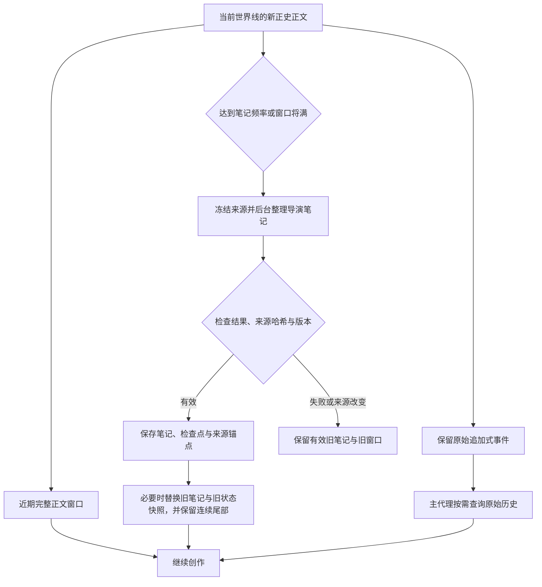
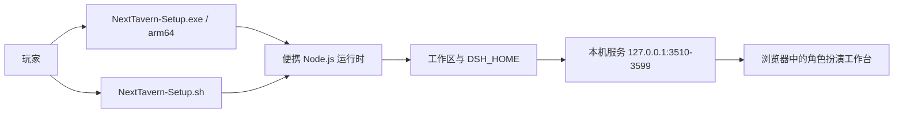

# dsh-NextTavern 架构

[返回首页](README.md) · [一键安装](README.md#一键安装) · [手动安装与兼容范围](README.md#安装) · [反馈](https://github.com/a86582751/dsh-nexttavern/issues)

NextTavern 在 DeepSeek Harness 的原生 Agent Loop 上组织长篇角色扮演。角色卡、剧情、记忆、角色协作、分支和导出共享同一套 Session 来源与任务生命周期。它的设计目标是让长篇叙事既能持续演进，也能解释“当前看到的内容从哪里来”。

本页描述 0.2.5 已有设计与实现。它不是所有模型的质量、速度、缓存率或无限记忆保证；具体安装验证边界见首页。

## 1. 程序准备上下文，Agent 决定如何行动

每轮输入经过原生 Inbox。程序解析当前世界线，装配稳定设定、当前窗口正文和有效导演笔记；主代理在原生循环内使用工具推进创作。

| 信息 | 提供方式 | 设计原因 |
| --- | --- | --- |
| 核心设定、人物与作者规则 | 按当前设定版本装配，不参与压缩 | 保持长期身份和叙事约束，固定卡片字段不被摘要改写。 |
| 当前窗口正文 | 程序按完整正文边界选择，并保留尾部连续正文 | 保留眼前剧情的细节与连续性，预算判断无需模型。 |
| 导演笔记 | 读取当前世界线有效版本，带来源哈希与锚点 | 承接长线事件、人物状态与待处理线索，并保持可追溯。 |
| 世界书 | 主代理调用搜索、列表与读取工具 | 将低频世界知识作为可查询资料，按剧情需要读取。 |
| 早期历史 | 主代理按当前选择的关键词／语义／混合方式查询 | 当笔记不足以回答细节时，回到有来源的原文。 |

主代理可用 `rp_worldbook_list` 查看条目摘要、用 `rp_worldbook_search` 查询相关正文，用 `rp_history` 查询旧事件。程序不会每回合强制先调一个模型做场景整理，再调一个模型做资料召回。已有信息充分时，主代理可以直接创作；需要旧细节时，由它自己决定是否查询、查什么。

稳定设定锚点按版本复用；避免无意义地反复改写提示前缀。缓存效果仍取决于模型供应商、路由与实际请求，不能由这一设计单独保证。

这一层由角色扮演 preset 与原生 Harness 共同承担：Harness 提供 Session、输入队列与工具循环，NextTavern 负责设定、窗口和笔记的装配与来源校验。

## 2. 记忆：固定设定、硬切窗口、可追溯笔记与混合召回

这套机制借鉴了 Codex 类长任务系统的上下文管理思路，具体窗口与记忆逻辑由 NextTavern 实现，不是 OpenAI 官方组件。

### 2.1 四个支柱

| 支柱 | 机制 | 为什么这样设计 |
| --- | --- | --- |
| **固定设定不压缩始终注入** | 冻结的设定与系统前缀每轮都在场，从不进入压缩流程。 | 人物的身份、作者规则和叙事约束属于长期契约，不能被一段摘要替换掉。 |
| **有尾部保留的硬切窗口** | 程序按完整正文边界推进窗口，并在推进时保留尾部连续正文。 | 近期正文保持完整细节，正在读的那一段不会因为切窗口而丢失或被摘要。 |
| **可追溯来源的后台导演笔记** | 由独立后台任务撰写，每条笔记带来源哈希与同一世界线锚点。 | 来源可被机器校验：任何一条笔记都能追回到产生它的正文。悬空引用与未知旧格式不被猜测，追加式原始历史从不删除。 |
| **关键词与语义混合的历史召回** | 主代理按需查询，三种方式：关键词（默认）／语义／混合。 | 语料是玩家输入与有效剧情正文，向量按查询时的世界线过滤；程序不预先强制召回。 |

### 2.2 窗口推进与淘汰关口

普通笔记更新在独立原生子代理中运行。更新未完成时可以使用有效旧笔记继续，后台任务不会自动降级成阻塞正文的长任务。真正淘汰窗口之前则有严格关口：待淘汰内容必须有有效检查点与来源记录，保存失败就保留旧窗口。

旧导演笔记与旧状态快照曾经随每次请求一起发送（约 52k 字符），现在只在准备好有效新锚点之后才被替换；未被替换的引用保持原有精确内容，回滚时重新提供完整文本，原始事件始终是追加式的。一次十回合实测中发现了两个真实缺陷并已修复：一段被压缩的维护后缀让旧任务无法被回收，以及旧导演笔记与状态快照的无界堆积。

整理频率按“新增正史槽位”计数。重生成和改写同一槽位更新其来源，不算又推进了一个新回合。笔记记录来源版本；编辑、分支或来源变化后，旧结果不能仅因轮数满足就继续生效。

硬切改变模型当前看到的上下文，不删除原始 Session 事件。需要细节时仍可查询当前世界线及其可证明继承的原始历史。

窗口正文预算、尾部完整正文保留预算和后台笔记频率支持全局默认与会话覆盖。窗口预算应结合实际模型上下文容量配置。

**原文回收。** 一条研究笔记被确认后，对应很长的工具结果会被替换成匹配的检查点，但前提是归属、来源哈希、generation 与 packetIds 全部一致。部分保存、来源不符、写入失败以及确认后重新读取的场合都不回收。

### 2.3 检索的语料、世界线与指纹

| 环节 | 设计 |
| --- | --- |
| 语料 | 玩家输入与有效剧情正文，包含已归档／已淘汰的正文。状态、工具输出、CSS、决策卡和推理过程不进入语料。 |
| 世界线过滤 | 向量是派生的共享数据，在查询时过滤到当前世界线；切换世界线不强制重建索引。 |
| 配方指纹 | 模型、修订、维度、任务角色、池化方式、量化与运行时共同构成指纹。指纹不一致会把索引标记为 `stale` 并停止对外服务，直到重建，避免静默给出错误答案。 |
| 分块 | 全局可配置，默认 480 字符（192／480／960 选项，128–2048 区间，80 重叠）。本地模型使用 512 的分词预算。 |
| 作用域 | 清空、重建与填充都限定在当前可见对话及其全部世界线；清空保留正文、来源与账本。 |

### 2.4 嵌入模型：在线与本地

管理界面为嵌入模型提供独立页面（位于模型与使用统计之间）。

- **在线**：DashScope、OpenAI 兼容接口、OpenAI 官方；模型列表可刷新，也支持手填模型 ID，密钥只保存在服务端，并提供连接测试。
- **本地**：BGE small zh、Qwen3-Embedding 0.6B、Jina Nano、Jina Small INT8、Nomic q8，在独立编码进程中使用 ONNX Runtime 1.29.0。下载显示真实字节进度、速度与预计时间，支持暂停／取消／继续，并有 `queued → downloading → verifying → preparing-runtime → self-testing → installed` 的状态机。本地推理不需要 API Key，也不需要网络。
- 索引、查询、测试与重试都计入既有的用量统计；未知价格保持 N/A，失败不会虚构 token。

实测到的边界要如实说明：BGE 速度快但跨语言能力较弱；Qwen 在长正文上构建索引更慢；5 万条分块的扫描已接近检索时限。合成分块评估不等于人工标注或长期质量保证。

上面这些环节都是程序侧或按需触发的：窗口推进与笔记淘汰本身不产生模型请求，只有主代理主动查询历史时，才按所选方式付出一次查询代价。

## 3. 预设与文风作用域

预设库与卡片文风共同决定叙事风格，但两者的作用范围和作用强度是分开定义的。

| 维度 | 取值 | 语义 |
| --- | --- | --- |
| 作用范围 | 当前对话／指定对话／全局 | 同一对话的全部世界线共享覆盖；未设覆盖时沿用全局设置。 |
| 文风模式 | 前景系统美学（默认）／与卡片文风融合／仅卡片文风 | 前两者同时注入预设与卡片文风，冲突时预设优先；第三种只使用卡片文风。 |

预设库由全部对话共享，因此编辑一个正在被使用的预设会影响使用它的对话后续生成。系统自带预设只读，只能查看或另存副本；自定义预设提供 200 个槽位。

存储是带版本号的，使用单一锁和整配置修订 CAS：并发修改返回冲突（409），草稿不会被覆盖丢失。卡片导入、编辑、导出与持久化都保留三个卡片文风字段，排除发生在故事上下文装配阶段，不修改原始卡片。

## 4. 长文本改编为角色卡

管理界面新增「长文本转角色卡」TAB（位于角色集群之后），接口为 `/api/roleplay/card-adaptation`。它把一部长文本读成一张可玩的角色卡，并把“读到什么”和“写了什么”分开记账。

**两种阅读方式，在研究开始前选择。**

| 方式 | 做什么 | 前置条件 |
| --- | --- | --- |
| **精读（默认）** | 逐段完整阅读，每段都保存带原文引证的研究笔记。 | 需可用的模型与完整索引。 |
| **粗颗粒度** | 围绕人物／组织／事件面做多轮关系前沿检索，再做主角纵向追踪。 | **需要**可用的小说模型与完整的当前索引；否则用对话框引导配置并结束本轮，不会静默降级。 |

**原文冻结。** 工作区 TXT 上限 64 MB，按严格 UTF-8 → GB18030 → 带 BOM 感知的 UTF-16 解码，记录原始字节哈希、解码文本哈希与大小，且从不修改上传的原文件。分段是确定性的，批次大小被限制在原生切分器之下。

**证据门控。** 一条研究笔记成立的条件是：该批次确实被读过，且引用的原文确实出现在该批次中。笔记分三节：事实／改编机会／未决问题。检索命中不会推进已读覆盖。

**独立索引。** 小说有自己的语义索引，与故事记忆分离；小说模型的选择也独立于故事记忆模型。相同的原始哈希复用研究基线，相同配方复用向量。

可引用的实测数据：一部约 119 万字符的长篇网络小说（前 354 章）建立了 3027 条在线向量，程序为等待索引完成挂起约 292 秒；交付角色卡与打开导入是两个独立回合，开场输入约 52k tokens。

改编复用与交互式创作相同的问卷和十二项写卡检查，并且多张卡、多个对话可以共享同一份原文库。诚实的边界：粗颗粒度的证据覆盖不等于理解了每个细节，实测中仍观察到个别事实写错，人工质量复核仍然必要。

## 5. 世界线有执行起点，也有继承边界

一个可见对话可以容纳多条原生 Session 世界线。重新生成、编辑后发送和显式克隆有不同的产品含义：

| 操作 | 可见结果 | 数据边界 |
| --- | --- | --- |
| 重新生成 | 当前对话中的新回复版本 | 从目标回合前的原生来源准备分支。 |
| 修改玩家消息后发送 | 当前对话中的新输入世界线 | 后续回复属于新输入，状态与记忆重新遵循该分支来源。 |
| 切换已有版本 | 切换当前选中世界线 | 读取这条世界线的正文、笔记、状态与资源来源。 |
| 在新对话中分支 | 新建独立可见对话 | 显式克隆，保留可追溯的起点。 |

世界线创建使用原生 `forkPrepared`，经历准备、创建/绑定 Session、登记世界线和入队。操作 ID 与请求 ID 用于不确定响应后的查询与恢复，减少重复提交同一玩家输入的风险。

继承只到 fork seed。未来正文、后来才完成的笔记、已撤销的来源，以及其他分支的工具结果不能被当作当前世界线已发生的事实。迟到任务提交还需通过所属分支、来源和 generation 校验。

三类作用域需要分清：导演笔记属于实际世界线；角色的模型偏好属于当前可见对话并可在其世界线之间共用；向量索引按查询时的世界线过滤。共享偏好或共享向量不等于共享错误的剧情历史。

世界线创建依赖 Session Controller 的对应兼容补丁，补丁范围见首页[补丁与依赖来源](README.md#补丁与依赖来源)。

## 6. 多模型协同与角色集群各有执行语义

NextTavern 区分三类协作，避免把所有工作都变成同一种子代理：

| 类型 | 如何执行 | 为什么这样分工 |
| --- | --- | --- |
| 普通维护、读写卡与导出任务 | 相同主路由且条件兼容时可在主循环内执行；不同路由使用原生子代理，兼容相邻任务可共享循环 | 减少重复调度，同时保留每项任务的结果校验、错误与恢复状态。 |
| 后台导演笔记 | 即使同模型也独立运行 | 长任务有独立生命周期，不与前台状态任务混为一批。 |
| 角色 Agent 集群 | 每个角色独立、并行推演，即使模型相同 | 保留不同人物的上下文与意图，由主代理综合协调。 |

六类普通任务为 memory、card-import、card-export、status、decision、novel-export。批次合并还要求分支、阶段、路由、思考设置和工具权限兼容；模型名称相同本身不足以合并。某成员失败时，只恢复未完成成员，已完成结果不重做；迟到结果不能覆盖回退后的新版本。

角色集群开启后，主代理通过 `rp_character_cast` 选择本轮主要人物。程序为每个角色装配当前正文、玩家输入、核心设定、自己的人设、导演笔记及近期主代理已经成功读取的世界书内容。角色可使用受限且归属当前世界线的只读历史查询；不获得主代理的任意工具权限。

角色返回语言、行为与意图建议，主代理处理冲突和意外，再生成正式正文。读卡、创作问卷和诊断不自动启动角色集群。集群默认关闭，只属于当前对话。模型配置分两级：全局默认模型加单角色覆盖；覆盖属于当前可见对话并与其世界线共用，但每个实际世界线的输入与结果仍然互相隔离。后台子代理不会再出现在可选择会话列表中。

## 7. 正文可读，不必等到全部维护结束

玩家的一轮通常经过准备、可选角色推演、正文、局后维护和完成。正文完成与原生 `turn/end` 是两个不同边界：正文已经持久化时，状态和建议仍可能在运行。

阅读视图展示当前世界线的流式正文；状态、工具和维护过程按阶段与来源归到对应回合。过程折叠不会凭关键词猜测“这是剧情还是日志”。维护失败应保留已落盘正文和可恢复的失败锚点。

行动建议只出现在独立决策卡里，不再重复写入状态栏或正文尾部；旧卡片里遗留的行动区域会被隐藏，原卡本身不被修改。决策卡与阅读区相互独立：可折叠／恢复、可“稍后处理”关闭、可拖动并按双击或 Home 复位，可视高度有上限。作者编写的状态 HTML/CSS 在导入、生成与旧数据恢复三条路径上都被校验并保留。

此时输入下一步行动会进入原生队列。后台记忆有独立生命周期，窗口切换时再执行严格保存检查。

## 8. 创作成果可以编辑、验证与带走

交互式写卡通过原生 questions 了解题材、人物关系、氛围与偏好；世界、人设、开场、状态、叙事方法、HTML/CSS 和正则等十二项创作检查由 AI 承担。用户可以委托“你来决定”。

读卡保存原始文件和分页来源，经过分类、覆盖检查后再激活；设定栏目分别管理核心、人设、世界书、剧情指引、文风与规则。未来路线与猜测不会自动成为已发生的正史。

SillyTavern / TauriTavern 格式由自有适配器解析：PNG 读取 `chara`/`ccv3` 的 Base64 `tEXt` 数据，JSON 识别 v1/v2/v3。PNG 先校验结构、CRC 和尺寸，再解析卡片；两种块同时存在时优先 `ccv3`。内嵌 `character_book` 进入同一来源审阅流程。结构化字段的映射是分类建议，仍须审阅内容与检查覆盖。

完整原始字节与哈希保留；未知扩展、替代开场和外部资源引用归档，不自动执行或下载。头像从 PNG 图像部分提取，不把卡片元数据混入头像输出。作者卡片的 JavaScript 在受限环境中运行：`beauty.js` 只能访问受限的 `document`／`window` 面，注册挂在阅读器根节点上并被无条件回收。详见首页[导入说明](README.md#导入-sillytavern--tauritavern-人物卡)。

导出冻结当前卡片或选定世界线的来源。模型负责章节组织等创作判断，程序按来源引用物化正文并检查覆盖与顺序，不必让模型再逐段抄写原文和额外复核。完成文件进入资源库，保留主题名称、修改时间、哈希与下载入口。

## 9. 一键安装器的位置

安装器只负责“把运行时和工作区准备好”：便携运行时、工作区、桌面入口、启动／停止入口和快捷方式。它不打包模型供应商，也不分发任何 API Key——密钥始终由玩家自己填写，保存在本机。下载采用镜像优先、逐文件 SHA-256 校验和断点缓存。

服务固定只监听 127.0.0.1，端口在 3510–3599 之间自动选择；Windows 安装器不修改 PATH、注册表或全局 npm 注册表。Windows 新版本支持在旧安装上原地升级并保留故事与设置；Linux 安装器是 0.2.5 新增，支持 x86_64 与 aarch64（glibc），不需要 root，也不需要系统包管理器。

不想用安装器、或想自己控制运行时与补丁的用户，可以继续走首页的[手动安装](README.md#安装)路径：两者产出的都是同一套 preset 与同一套兼容补丁。

## 请求、延迟与成本如何看待

项目的设计检查始终问：**“原本程序直接完成的步骤，现在需要模型推理；预计增加几次请求，为什么值得？”** 这是开发审查，不会再启动一个运行时模型做审查。

| 机制 | 正常路径 | 重试与回退 | 延迟、缓存与成本含义 |
| --- | --- | --- | --- |
| 上下文装配、来源校验、排序、切分 | 新增 0 次模型请求 | 新增 0 次模型请求 | 程序确定性执行；稳定前缀有利于复用，但不保证命中率。 |
| 硬切窗口、尾部保留与旧笔记淘汰 | 新增 0 次模型请求 | 保存失败即保留旧窗口，不重试付费 | 窗口推进本身不产生请求；新窗口会改变提示前缀。 |
| 关键词检索 | 新增 0 次模型请求 | 新增 0 次 | 纯程序确定性匹配，不需要嵌入模型。 |
| 语义／混合检索 | 每次查询需要一次嵌入编码 | 索引标记 `stale` 时停止服务，不猜答案 | 本地嵌入不发网络请求、不产生费用；在线嵌入按供应商计费，并计入用量统计。 |
| 嵌入索引构建与重建 | 每个分块一次嵌入调用，不调用正文模型 | 失败分块可重试，不虚构 token | 长正文构建时间随分块数增长；本地模型占用本机算力。 |
| 主动世界书/历史查询 | 由主代理按需选择，0 次或多次工具查询 | 工具结果可能引发模型续轮 | 减少常驻资料，必要查询仍有续轮成本。 |
| 后台笔记 | 到频率或关口时启动独立任务 | 相同失败来源不反复自动付费重试；新来源或显式重试可重新调度 | 普通整理可跨轮运行；切窗口必须等待有效保存。 |
| 长文本改编（精读） | 请求数与分段数成正比，每段一次阅读 | 未读到不产生笔记；证据不足不落笔 | 一次改编是长任务，可跨回合；等待索引期间程序挂起而不空转调用。 |
| 长文本改编（粗颗粒度） | 多轮关系前沿检索 | 前置条件不满足则引导配置并结束本轮 | 直接复用成品向量，但覆盖不等于理解全部细节。 |
| 预设与文风切换 | 新增 0 次模型请求 | 新增 0 次 | 只改变提示装配；切换后前缀变化可能影响缓存复用。 |
| 兼容辅助任务合批 | 两个简单任务可共享一次子代理循环 | 仅未完成成员恢复 | 子代理循环可能含多个 API 请求；收益需按实际调用统计。 |
| N 个角色集群 | 至少 N 个角色推演及主代理的工具后接续 | 历史查询和原生供应商重试可能续轮；不同角色路由失败可回退主模型一次 | 并行等待主要受最慢角色影响，但 N 份上下文照常消耗用量。 |
| 一键安装器 | 新增 0 次运行时模型请求 | 网络失败可重试，已校验文件复用缓存 | 只消耗下载流量与本地安装时间，不改变运行时提示与成本。 |
| 本次公开文档与打包适配 | 新增 0 次运行时模型请求 | 新增 0 次 | 仅增加本地构建和校验时间，不改变运行时提示与成本。 |

统计按真实模型调用计量，包含失败、重试、回退、重生成和子代理。共享调用不会因关联多个任务而重复计费；缺失用量或价格保留未知。价格与币种转换只在你显式配置后生效。

轮询节奏按状态选择，而不是在定时器回调里做判断：空闲时活动轮询 3 秒改为 30 秒，重建确认 2 秒改为 30 秒，记忆面板 2 秒改为 20 秒，目录读取合并为每 10 秒一次并带一次收尾读取。一个第三方余额组件是当时最大的请求来源，已停用。这些是减少自身请求量的改动，不代表页面加载不受带宽限制——合并后的前端包约 4.1 MB。

## 验证边界

公开版完成隔离原生 Harness 安装、六单元补丁应用与回滚、真实归档生命周期、公开下载摘要、公开源码 UI 重建、合成原生事件的分支契约、questions 浏览器提交与 DOCX 读写验证。合成分支测试拦截模型调度，不等于所有模型的完整剧情测试。

0.2.5 的窗口淘汰、原文回收与检索改动、嵌入模型管理和长文本改编都在真实会话或真实长文本上跑过定点回归，并记录了上面列出的实测数字；这些数字是单次测量的结果，不是性能或质量承诺。Windows 安装器没有代码签名，也没有在全新 Win11 虚拟机或真实 ARM64 设备上验证；Linux 安装器是本次新增，列出的发行版与架构即为已测试范围。

本轮没有新增供应商剧情、性能、缓存或全格式/OCR测试，不承诺“永不遗忘”、固定命中率或固定生成时间，也不承诺嵌入模型的质量排名。安装针对 Harness 0.1.2-alpha.3 和 pi-ai 0.84.4，完整功能须按 README 显式应用兼容补丁。
