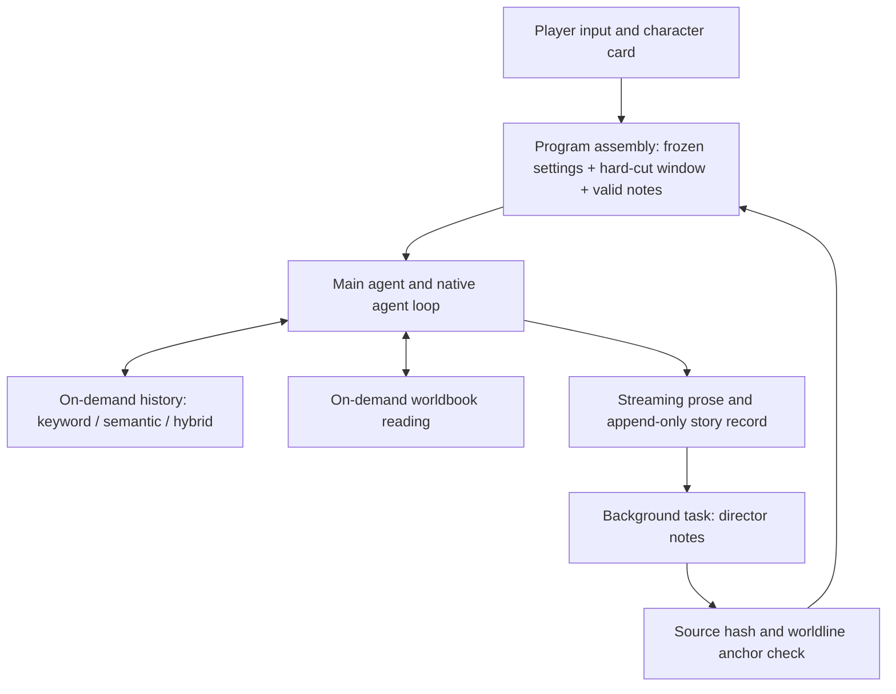
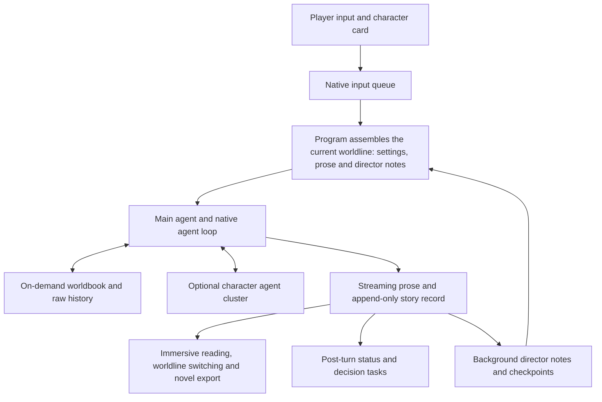

# dsh-NextTavern

[简体中文](README.md) · **English**

> **0.3 is in active development, with code updates published in this repository.** This tree includes the unpublished source-layout and module-cohesion refactor. Unified plugin installation, enable/disable and upgrade behavior are still being implemented and tested. A GitHub Release will follow when 0.3 is complete; installer links below still target **0.2.5**. See the [development notes and compatibility changes](CHANGELOG.md) and [contributor guide](CONTRIBUTING.md).

> **0.3 targets Harness `0.1.6-alpha.2` and does not support old session data.** Export character cards or novels from the old environment before migrating; novel export does not preserve complete session state. Current `main` is unfinished migration source, not an installable 0.3 release.

**Let your characters think for themselves, and let the world unfold from your choices.**

NextTavern is a long-form roleplay / Tavern plugin for DeepSeek Harness (DSH), with SillyTavern character-card compatibility, worldlines, long-term memory, and hybrid keyword + semantic retrieval. A character card, a sudden idea, one choice you refuse to compromise on — any of them can start a story. NextTavern brings the native agent loop to long-form roleplay: the agent looks things up on its own, keeps memory in order and reasons as individual characters, while you hold the direction.

**Create a world, step into it, and take it with you.**

[One-click install](#one-click-install) · [Getting started](#getting-started) · [Windows](INSTALL-WINDOWS.md) · [Linux](INSTALL-LINUX.md) · [Capabilities](#capabilities) · [Memory system](#memory-system) · [Architecture](#architecture) · [Public access guide (Chinese)](PUBLIC-ACCESS.md) · [All screenshots](SCREENSHOTS.md) · [Report an issue](https://github.com/a86582751/dsh-nexttavern/issues/new/choose)


**0.2.5 Preview** · Harness **0.1.2-alpha.3** · pi-ai **0.84.4** · project-owned code **GPL-3.0**

Want to start reading quickly? Use the [one-click installers](#one-click-install). Want to control the runtime and the patches yourself? Follow the [manual install](#manual-install) and apply the six compatibility units.

This document is the English counterpart of the Chinese README. The Chinese one is the primary document and carries the same content.

## One-click install

**Two one-click paths, for people who would rather not provision a runtime and apply patches by hand.** The installers do one thing: prepare the runtime and the workspace. Models and API keys stay your decision.

### Windows

Download [NextTavern-Setup.exe](https://github.com/a86582751/dsh-nexttavern/releases/download/v0.2.5/NextTavern-Setup.exe), double-click, choose an install directory, and wait. It provisions a portable PowerShell and Node.js runtime, installs the Microsoft Visual C++ runtime when needed, creates the workspace and start/stop shortcuts, and opens your browser when it is done. The default location is `%LOCALAPPDATA%\NextTavern`. On Windows on ARM, use [NextTavern-Setup-arm64.exe](https://github.com/a86582751/dsh-nexttavern/releases/download/v0.2.5/NextTavern-Setup-arm64.exe).

**In-place upgrade since 0.2.5**: run the new installer over an older installation and your stories, character cards and settings stay. Full steps and caveats are in the [Windows install guide](INSTALL-WINDOWS.md) (Chinese).

The Windows installers are not code-signed, so SmartScreen may warn on first run. The ARM64 installer is new in this release; if something goes wrong after installing, please [tell us](https://github.com/a86582751/dsh-nexttavern/issues/new/choose).

### Linux

[NextTavern-Setup.sh](https://github.com/a86582751/dsh-nexttavern/releases/download/v0.2.5/NextTavern-Setup.sh) is new in 0.2.5: a self-contained script that asks very little of the host — a POSIX shell, `curl` or `wget`, `tar`, and something that computes SHA-256. It downloads and verifies a portable Node.js runtime itself, then prepares the install directory, a desktop entry and start/stop launchers. x86_64 and aarch64 (glibc) are supported; **no root and no system packages are required**. See the [Linux install guide](INSTALL-LINUX.md) (Chinese).

### What both paths share

| Property | Detail |
| --- | --- |
| **Loopback only** | The local service binds `127.0.0.1` and picks a free port in 3510–3599. It is not exposed to the LAN or the internet by default. |
| **You supply the keys** | Model API keys are entered by the player and stored locally; the installers carry and distribute no keys. |
| **Verify before use** | Mirror-first download sources, per-file SHA-256 verification, and verified files are cached for reuse. |
| **Resumable** | After a network failure or a mid-download exit, re-running the installer skips verified files and continues. |

**Both installers are only a more convenient entry point**: the preset and the compatibility patches they produce are identical to the [manual install](#manual-install) path.

## Getting started

Once [one-click install](#one-click-install) (or [manual install](#manual-install)) is done and your model is configured:

1. **Create a dedicated workspace.** Give this roleplay its own folder so character cards, story resources and exports live together.
2. **Pick "roleplay mode" in the preset menu.** Switch to it when creating a session and you are in your story workspace.
3. **Upload a character card, or talk one into existence.** SillyTavern / TauriTavern PNG and JSON cards are supported, and you can also describe a genre, characters, relationships and mood and build the card in conversation.
4. **Start playing.** Follow the opening, type your actions, switch worldlines, or open "tavern management" to adjust settings at any time.

With no card at hand, a sentence is enough:

> Create a steampunk mystery character card. I want to play an investigator who just arrived at the port. Slow burn, several factions, and relationships that develop. You decide the rest.

Tell the agent who you want to meet and what story you want to live through. You can polish every detail, or say "you decide" and let it carry on with a world, a cast, an opening and a style. DOCX/PDF card reading can be enabled through the [document extensions](#document-extensions). Have a whole novel lying around? You can have it read into a card, see [long text to character card](#long-text-to-character-card).

### Importing SillyTavern / TauriTavern cards

Upload the original card file and tell the agent: **"Read this character card and prepare to start roleplay."** No manual decoding, no import-tool parameters.

| Format | Supported |
| --- | --- |
| **PNG character cards** | Base64 character data from the `chara` / `ccv3` `tEXt` chunks; `ccv3` wins when both are present. |
| **JSON character cards** | v1, v2 (`chara_card_v2`) and v3 (`chara_card_v3`). |
| **Embedded worldbooks** | `character_book` is read, reviewed through the normal import flow and mapped into settings and worldbook. |

Use the original PNG that still carries its metadata: a plain avatar, a screenshot or an image with stripped metadata has no character data to import. PNG/JSON parsing is built in and does not need anydoc; the upload entry point ships with a full installation.

After import you can keep working on the character, the worldbook and the writing rules, and the original card plus its extended data are preserved. All three card style fields survive intact; how they interact with presets is your choice, see [style presets](#style-presets).

## Capabilities

| Capability | What you get |
| --- | --- |
| **One-click install** | Self-contained installers for Windows and Linux: portable runtime, workspace, shortcuts, mirror-first verified downloads, and in-place upgrade on Windows. |
| **SillyTavern / TauriTavern card import** | PNG `chara`/`ccv3` and JSON v1/v2/v3 cards, originals preserved, embedded worldbooks included. |
| **Frozen settings + hard-cut window + director notes + hybrid retrieval** | Frozen settings injected every turn, never compacted; the window keeps recent complete prose and its tail; background notes carry a source hash and a worldline anchor; history recall in keyword, semantic or hybrid mode. |
| **Style presets** | A dedicated presets page, scoped to the current conversation, a designated conversation or globally, three style modes, 16 built-in styles and 200 custom slots. |
| **Long text to character card** | Read a long TXT as a playable card: intensive or coarse reading, source frozen with hashes, every research note traceable to the text, its own semantic index. |
| **Embedding management** | Online: DashScope, OpenAI-compatible endpoints and OpenAI official. Local: BGE small zh, Qwen3-Embedding 0.6B, Jina Nano / Small INT8, Nomic q8 — no key and no network. |
| **Multi-model collaboration** | Route prose and memory, card reading and writing, status, decisions and novel export to the models you choose. |
| **Character agent cluster** | Major characters reason in separate contexts about language, behaviour and intent; the main agent reconciles them into the story. Per-character model overrides. |
| **Decision card and status bar** | Action suggestions live in a standalone, collapsible, draggable decision card; the author's status HTML/CSS survives import, generation and restore. |
| **Self-owned skin** | The first own skin, day and night themes, whole interface redrawn from one token set; installed but off by default. |
| **Worldlines** | Regenerate, edit-and-send and switch versions inside one conversation; an explicit branch creates a new conversation. |
| **Custom writing rules** | Manage core settings, characters, worldbook, story guidance, style and rules separately, controlling viewpoint, pacing, character knowledge and reply shape. |
| **On-demand worldbook reading** | The main agent consults locations, factions and background details when the scene needs them, as a queryable reference rather than a fixed dump. |
| **HTML/CSS reading presentation** | Card HTML/CSS, status templates and regex rules shape the reading view; prose streams while it is written, and author scripts run in a restricted environment. |
| **One-click novel export** | Turn a chosen worldline into a novel manuscript, or export the full character card; results land in the resource library. |
| **Resource library** | Cards, story files and exports in one place, sorted by time or name, refreshable and downloadable. |
| **Interactive character creation** | Start from an idea and build world, cast, opening, style and layout in conversation, checked against twelve completeness items. |
| **Usage and cache statistics** | Requests, input/output tokens, cache, speed and known cost by session, provider or model, including regenerations, embedding calls and failed attempts. |

## Memory system

The longer a story runs, the more accumulates: what characters lived through, foreshadowing you planted, promises not yet kept. NextTavern borrows the context-management ideas of long-running agent tasks and splits long-form memory into four things with clear boundaries: **a frozen settings prefix that is never compacted and is always injected, a hard-cut context window that keeps the tail, background director notes with traceable provenance, and on-demand history recall in keyword and semantic mode.**

| Pillar | What it does | Why it matters for long stories |
| --- | --- | --- |
| **Frozen settings, never compacted** | The frozen settings and system prefix are present every turn and never enter the compaction path. | Identity, author rules and narrative constraints are long-term contracts; a summary must not replace them. |
| **Hard-cut window with tail retention** | The program advances the context window on complete prose boundaries and preserves the trailing continuous prose as it moves. | Recent prose keeps its full detail; the passage you are reading is never dropped mid-scene or replaced by a summary. |
| **Background director notes with provenance** | Written by a separate background task, each note carries a source hash and a same-worldline anchor. | Every note traces back to the prose that produced it; notes that cannot be traced stay where they are instead of being guessed at. Raw history is append-only and never deleted. |
| **Keyword and semantic hybrid recall** | The main agent queries history on demand in three modes: **keyword (default), semantic or hybrid**. | Old detail is looked up when it is needed, instead of forcing a recall step before every turn. |



### Three query modes over one corpus

The corpus is **player input and valid story prose**, including archived or evicted prose. Status text, tool output, CSS, decision cards and reasoning never enter it.

| Mode | Computed by | When to use it |
| --- | --- | --- |
| **Keyword (default)** | Deterministic matching in the program; no model call. | Fastest when you remember the exact words, names or places. |
| **Semantic** | An embedding model encodes the query into a vector. | Better when you remember the gist but not the wording. |
| **Hybrid** | Keyword and vector results ranked together. | Both exact hits and near meanings. |

Vectors are derived shared data and queries are filtered to the **current worldline**, so switching worldlines never forces a rebuild. Every vector index carries a recipe fingerprint (model, revision, dimensions, task role, pooling, quantization, runtime): when the fingerprint does not match, the index is marked `stale` and stops serving until you rebuild it — it would rather make you rebuild than answer from stale vectors. Chunk size is configurable, default 480 characters (192 / 480 / 960, range 128–2048, 80 overlap), and local models use a 512-token budget. Clear, rebuild and fill are scoped to the current visible conversation and all of its worldlines; clearing removes only the index, while prose, provenance and the ledger stay.


### Old notes and old status are no longer sent with every request

Old director notes and state snapshots used to travel with every request (about 52k characters). They are now replaced **only after a valid new anchor has been prepared**: references that were not replaced keep their exact backing, a rollback serves the full text again, and raw events stay append-only. A long story stops dragging an ever-heavier pile of old notes through every request.

The same confirm-then-replace rule applies to long tool results: once a research note is confirmed, the matching long tool result is recycled into its checkpoint, but only when owner, source hash, generation and packetIds all match. Partial saves, wrong sources, failed writes and re-reads after confirmation are never recycled.

### All of it is adjustable per session

Window size, tail retention and the background note cadence support a global default and per-session overrides; leaving them empty keeps the global setting. Window assembly, provenance checks, note eviction and recycling are program work and produce no model request. Only when the main agent actually decides to look something up does a query cost anything (semantic and hybrid also need an embedding model, see [embeddings](#embeddings)).

Switch to another worldline and you continue with that line's history; polish the same scene repeatedly and memory follows the version you selected.


## Style presets

Style is no longer something you can only change by editing a card. A dedicated **presets page** (before the resource library) lets you create, edit, save a copy, select and delete presets; the built-ins are read-only and you get 200 custom slots.

| Dimension | Values | Meaning |
| --- | --- | --- |
| **Scope** | current conversation / designated conversation / global | All worldlines of one conversation share the override; empty follows the global setting. |
| **Style mode** | foreground system aesthetic (default) / blend with card style / card style only | The first two inject both preset and card style, with the preset winning conflicts; the third uses only the card style. |

The preset library is shared by all conversations, so editing a preset that is in use affects that conversation's later generations — the interface says so explicitly. If two windows edit the same preset, the later submission gets a conflict notice and **your draft is kept**.

**16 built-in styles.** Besides the default and blank presets, 14 ready-to-use styles ship: 日式轻小说, 乙女风格, 三体文风, 日式游戏, 电影感文风, 春秋文风, 极简文风, 细腻文风, 奇幻网文风, 恐怖文风, 鲁迅文风, 抒情文风, 日常搞笑风 and 古文文风. Each has a complete seven-section guide with original examples, not a one-line description.


## Long text to character card

Have a novel and want it as a playable world? The management interface has a **long-text-to-card tab** (after the character cluster). It does more than summarise: **what was read, where a note came from and whether a claim has textual support all have to line up.**

**Two reading modes, chosen before research starts.**

- **Intensive (default)**: complete segmented reading, with a source-cited research note for every segment.
- **Coarse**: multi-round relation-frontier retrieval around characters, organisations and events, then longitudinal tracking of the protagonist. It **requires** a usable novel model and a complete current index; when those are missing the interface guides you through configuration and ends the round instead of silently degrading.

**The source is frozen first.** Workspace TXT up to 64 MB, decoded as UTF-8 → GB18030 → BOM-aware UTF-16, recording the raw-byte hash, decoded-text hash and size without ever mutating your upload. Segmentation is deterministic and batches stay below the native clipper.

**Notes need evidence.** A research note only counts when the batch was actually read and the quoted text actually appears in it. Notes are split into facts, adaptation opportunities and open questions.

**The novel has its own index**, separate from story memory, and the novel model can be configured separately from the story memory model. The same source hash reuses the research baseline and the same recipe reuses vectors, so one book can serve several cards and conversations.

For scale: a ~1.19M-character web novel (first 354 chapters) produced 3027 online vectors, and the program suspended for ~292 seconds waiting for the index; delivering the card and opening the import are separate turns, with ~52k tokens of opening input. Adaptation reuses the same questionnaire and twelve-item card check as interactive creation.

Long novels can still get individual details wrong; read the finished card through once.


## Embeddings

Semantic and hybrid recall need vectors, so there is a dedicated **embedding page** (between models and usage).

**Online.** DashScope, OpenAI-compatible endpoints and OpenAI official: refreshable model lists, manual model IDs, keys stored server-side only, and a connection test.

**Local.** Five models install directly: **BGE small zh, Qwen3-Embedding 0.6B, Jina Nano, Jina Small INT8, Nomic q8**, running on ONNX Runtime 1.29.0 in a separate encoding process. Downloads show real byte progress, speed and ETA, support pause/cancel/resume, and run a `queued → downloading → verifying → preparing-runtime → self-testing → installed` state machine. **Local inference needs no API key and no network.**

Indexing, querying, testing and retries all enter the existing usage statistics. Unknown prices stay **N/A**, and failures never invent token counts.

Which one? BGE is fast but weaker across languages; Qwen builds indexes more slowly on long prose; at 50k chunks retrieval time is already close to the limit.


## Character cluster

With the **character agent cluster** enabled, major characters reason in separate contexts. Each can have its own model and thinking effort, and they run independently even on the same model. They receive their own persona, the current story, director notes and recently read worldbook material; the main agent then reconciles their suggestions into the story.

Model configuration has two levels: **a global default plus per-character overrides**. An override belongs to the current visible conversation and is shared across its worldlines, while each actual worldline keeps its inputs and results isolated — preferences are shared, history is written separately.

Background subagents no longer appear in the conversation list, and draft saving, resource and export replies and task actions no longer submit twice or expire.


**Beyond per-character reasoning, models can also divide the work.** Prose, background memory, card reading, status and export tasks can each use a fitting model, or all follow the main model; model settings support a global default and per-session overrides.

## Status bar and decision card

**Action suggestions appear only in the standalone decision card**, never duplicated into the status bar or the prose tail. Legacy action areas inside old cards are hidden, and the original card is left untouched.

The decision card has its own controls: **collapse/restore (⌃ / —)**, a separate **× later** action, drag to move, double-click or Home to reset, and a capped visible height so it never eats the screen.

Reading presentation improved in the same pass: the author's status HTML/CSS is validated and preserved across import, generation and legacy restore; fenced status styles and opaque panels came back; the status panel fills the available height while keeping internal scrolling; the collapsed rail's reopen button stays visible. Status template dynamic slots accept real values while keeping the author's HTML/CSS/JS structure, and failed task validation now reports structured diagnostics, failure time and retry guidance.


## The bundled skin

0.2.5 ships the project's **first own skin, `dsh-nexttavern-amber`**: the whole interface redrawn from one design-token set, with **day and night themes** that change the mood in one switch; a chibi tavern keeper sits in the sidebar with a different illustration per theme; the tavern reading mode in the night theme lies on aged parchment while the author's own ink colours are untouched.

The skin is installed with the package but **off by default**, so your interface stays as it was. To switch it on: **Settings → Plugin market → Installed**, find `dsh-nexttavern-amber` and toggle it. It writes to the profile's `cordis.patch.yml` and hot-loads in about a second, **without a restart**; toggle it back whenever you like, and the choice survives restarts. The toggle comes from the bundled third-party plugin market — see [patch and dependency sources](#patch-and-dependency-sources) for its origin, outbound requests and how to turn it off.


## Worldlines and branching

Not happy with a development? Regenerate. Want to change a choice? Edit the player message and send it. The versions form worldlines inside the current conversation and you can switch between them. A separate conversation is only created when you explicitly choose "branch into a new conversation".

Each worldline has its own story, status and memory; notes belong to the actual worldline, while a character's model preferences and the vector index are shared per conversation or per queried worldline. Novel export follows the worldline you selected, so the version you liked is the one you keep.


## Reading and writing your way

In "tavern management" you adjust characters, world background, story direction, style and custom rules separately. Put viewpoint, pacing and character boundaries into the rules, put HTML/CSS, status templates and regex decoration into the card, and give each story its own reading presentation.

Prose is readable while it is generated; post-turn status and note maintenance have their own progress. Player actions typed meanwhile enter the native queue.


## From character card to a novel you can take away

The dialogue you polished, the turn you did not expect, the ending you finally reached — all of it deserves to become a real piece of work. Pick the worldline you like and collect it into a novel manuscript; export the polished character card as well, so the world keeps being read, shared and written.


## Interactive authoring

**You do not need a finished card to begin — imagination is enough.** A harbour city where it always rains, a relationship full of friction, or simply "I want a slow-burn adventure" can be the start.

The agent talks with you about characters, relationships, atmosphere and direction, and grows your answers into a world background, a multi-character cast, an opening, a style and a reading layout, then runs a twelve-item completeness check. Polish every detail yourself, or leave the blanks to it: "you decide." From the first idea to a playable card, the creation itself is part of the journey.


## Usage statistics

**Explore freely, and see what the models did and what they cost.** Request logs, provider statistics and model statistics share one panel; switch by session, time and model to see input/output tokens, cache hit rate, generation speed and cost. Embedding indexing, queries, tests and retries count into the same statistics.

Compare what different models cost you, watch cache behaviour as a long story advances, and review what a regeneration or a cluster call consumed. Model price multipliers, manual unit prices and currency conversion are supported.


## Architecture

NextTavern connects these capabilities into the native agent loop: **the main agent advances the narrative, memory agents keep the long threads, character agents reason independently, and the program assembles the context the current story needs.** From card reading and the opening to branching and export, one architecture runs through the whole creative process.



[Read the full architecture notes: context composition, the four memory pillars, preset scopes, the long-text pipeline and request cost](ARCHITECTURE.md)

## Downloads

- [Main package dsh-nexttavern.tgz](https://github.com/a86582751/dsh-nexttavern/releases/download/v0.2.5/dsh-nexttavern.tgz) — prebuilt UI, sources, preset, reference cards, patcher, CLI and the optional public-access auth source package.
- [Standalone dsh-debug.tgz](https://github.com/a86582751/dsh-nexttavern/releases/download/v0.2.5/dsh-debug.tgz).
- [Public-access plugin dsh-auth-webserver.tgz](https://github.com/a86582751/dsh-nexttavern/releases/download/v0.2.5/dsh-auth-webserver.tgz), see the [public access guide](PUBLIC-ACCESS.md) (Chinese).

Installers: [NextTavern-Setup.exe](https://github.com/a86582751/dsh-nexttavern/releases/download/v0.2.5/NextTavern-Setup.exe) (Windows x64) · [NextTavern-Setup-arm64.exe](https://github.com/a86582751/dsh-nexttavern/releases/download/v0.2.5/NextTavern-Setup-arm64.exe) (Windows on ARM) · [NextTavern-Setup.sh](https://github.com/a86582751/dsh-nexttavern/releases/download/v0.2.5/NextTavern-Setup.sh) (Linux x86_64 / aarch64).

Verification: [SHA256SUMS](https://github.com/a86582751/dsh-nexttavern/releases/download/v0.2.5/SHA256SUMS) and [provenance.json](https://github.com/a86582751/dsh-nexttavern/releases/download/v0.2.5/provenance.json). It is not published to npm; do not use `npm install dsh-nexttavern`.

## Manual install

The one-click installers cover almost every case; this section is the **manual path**, for controlling the runtime version yourself, applying patches yourself, fixing the port, or fitting the install into your own operational process. The commands below are PowerShell 7 examples using fresh directories; continue only when each command succeeds. The [Chinese README](README.md) carries the same procedure with the surrounding notes.

```powershell
$ReleaseDir = Join-Path $PWD 'nexttavern-release'
$HarnessRoot = Join-Path $PWD 'nexttavern-harness'
$env:DSH_HOME = Join-Path $PWD 'nexttavern-home'
New-Item -ItemType Directory -Path $ReleaseDir,$HarnessRoot -ErrorAction Stop | Out-Null
tar -xzf ./dsh-nexttavern.tgz -C $ReleaseDir
Copy-Item -LiteralPath "$ReleaseDir/package/harness/package.json" -Destination $HarnessRoot
Copy-Item -LiteralPath "$ReleaseDir/package/harness/package-lock.json" -Destination $HarnessRoot
npm ci --prefix $HarnessRoot --ignore-scripts --no-audit --no-fund
node "$HarnessRoot/node_modules/@deepseek-ai/dsh/lib/bin.js" web --dump-config | Out-Null
$ProfileDir = Join-Path $env:DSH_HOME 'profiles/web'
npm install --prefix $ProfileDir --legacy-peer-deps --ignore-scripts --no-audit --no-fund "$PWD/dsh-nexttavern.tgz" "$HarnessRoot/node_modules/@deepseek-ai/dsh-tools"
$PackageRoot = Join-Path $ProfileDir 'node_modules/dsh-nexttavern'
```

Stop the target instance before installing the preset or modifying the Harness, and choose a new backup directory for each operation:

```powershell
node "$PackageRoot/tools/install.mjs" --home $env:DSH_HOME --harness $HarnessRoot
node "$PackageRoot/tools/install.mjs" --home $env:DSH_HOME --harness $HarnessRoot --apply --stopped --backup "$PWD/nexttavern-preset-backup-1"
node "$PackageRoot/tools/patch-harness.mjs" --harness $HarnessRoot
$env:DSH_ALLOW_HARNESS_PATCH = '1'
node "$PackageRoot/tools/patch-harness.mjs" --harness $HarnessRoot --apply --stopped --backup "$PWD/nexttavern-harness-backup-1"
Remove-Item Env:DSH_ALLOW_HARNESS_PATCH
node "$HarnessRoot/node_modules/@deepseek-ai/dsh/lib/bin.js" web --host 127.0.0.1 --port 3510
```

In the browser, configure your provider, choose a workspace and pick "roleplay mode" in the new-session preset menu. The tavern management sidebar and the tavern tab appear once the roleplay session is open. The plugin loads without the patches, but full UI slots and worldline support are missing — that is not a complete installation. `--stopped` is your confirmation that the instance is down; the tools never stop services or sessions for you. Existing roleplay presets that the installer does not manage are refused rather than overwritten; unknown versions or file fingerprints stop the install instead of degrading into a partial one.

## Document extensions

Upload and `read_document` ship with a full installation. anydoc's DOCX/PDF conversion and office's DOCX export are also delivered with their configuration entries; enabling them means installing dependencies and re-running the preset install:

```powershell
npm install --prefix $ProfileDir --legacy-peer-deps --ignore-scripts --no-audit --no-fund 'https://github.com/a86582751/dsh-plugin-anydoc/releases/download/v0.1.0-nexttavern.1/dsh-plugin-anydoc-0.1.0-nexttavern.1.tgz' '@huiliyi37/dsh-office@0.2.2'
node "$PackageRoot/tools/install.mjs" --home $env:DSH_HOME --harness $HarnessRoot --documents
node "$PackageRoot/tools/install.mjs" --home $env:DSH_HOME --harness $HarnessRoot --documents --apply --stopped --backup "$PWD/nexttavern-documents-backup-1"
```

Installing again without `--documents` unmounts both and deletes no documents. Enabling them explicitly without their dependencies fails loudly. Scanned PDFs go through OCR and what it can read depends on the file; which formats work depends on the components available on the system. Long text to character card reads workspace TXT and does not depend on these extensions.

## Patch and dependency sources

| Unit | Target version | Purpose |
| --- | --- | --- |
| ui-chat | 0.1.2-alpha.3 | slots, action bar and maintenance projection |
| ui-workspace | 0.1.2-alpha.3 | sidebar slots and CSS identifiers |
| token-meter | 0.1.2-alpha.3 | edit metering and hot path |
| session-projection | 0.1.2-alpha.3 | projection hot path and missing-event recovery |
| Session Controller | 0.1.2-alpha.3 | native `forkPrepared` worldline preparation |
| pi-ai | 0.84.4 | Google, OpenAI Completions/Responses and Anthropic stream termination |

Every target is transformed and checked in memory before anything is backed up or written. Re-applying the same patch is idempotent; a failure restores that batch, and an interruption can be rolled back from the transaction backup. Files changed by another upgrade or by you are never force-overwritten. There is no postinstall patch.

Community compatibility packages use formal forks that keep upstream history and attribution, so they cannot be mistaken for original-author releases:

- [dsh-file-upload](https://github.com/a86582751/dsh-file-upload), upstream [HongMing-Huang/dsh-file-upload](https://github.com/HongMing-Huang/dsh-file-upload) 0.4.3. Fixes upload callbacks, stable references, non-destructive attachment dismissal, complete pagination and Markdown escaping; the base package keeps the upstream Host check.
- [anydoc](https://github.com/a86582751/dsh-plugin-anydoc), upstream [beancookie/dsh-plugin-anydoc](https://github.com/beancookie/dsh-plugin-anydoc) 0.1.0 at a fixed commit, conservatively restoring Markdown escaping.
- [pi-ai diff](https://github.com/a86582751/pi/tree/codex/nexttavern-alpha3/nexttavern-compat), upstream [earendil-works/pi](https://github.com/earendil-works/pi) 0.84.4. The unified patcher resolves the instance the Harness actually uses instead of installing an unused profile copy.

A third-party plugin market ships with the package and provides the skin toggle above:

- [dsh-market](https://github.com/dsh-market/dsh-market) (npm name `dshmarket`), pinned at **1.39.0**, MIT: browse, search and one-click install community plugins from the settings page.
- It is an independent third-party project maintained by [dsh-market](https://github.com/dsh-market/dsh-market), not written by us. Opening the market reads the public plugin directory at [awesome-dsh-plugin.com](https://awesome-dsh-plugin.com), and opening comments connects to giscus and GitHub — this is the additional outbound traffic beyond our "local service binds 127.0.0.1 only" rule. We pin the version, do not follow upstream and do not modify its code.
- To keep it offline, turn it off in **Settings → Plugins → Plugin configuration**; the skin keeps working, but switching it then means editing the profile's `cordis.patch.yml` by hand.

`better-sidebar` is not a required dependency; the official sidebar is enough. Public-access players can explicitly install the bundled `@isund/dsh-auth-webserver` (0.1.0-alpha.3.2) to configure their own Cloudflare Access, domain and login identity. Auth sources, sanitized templates and three reversible public-access compatibility options are delivered; the default local install never opens the network.

## Update, uninstall and rollback

With the one-click installers, updating means running the new installer over the old installation (Windows upgrades in place and keeps stories and settings); uninstalling means stopping the service and removing the install directory and shortcuts. Details are in the [Windows](INSTALL-WINDOWS.md) and [Linux](INSTALL-LINUX.md) guides (Chinese).

For a manual installation: stop the instance, back up, check compatibility with the new version, install the new tgz and run the new installer and a patch audit. Managed preset files you changed are never overwritten, but keep and check your changes first. The installer manages files through `.nexttavern-install.json`.

```powershell
# Uninstall the preset and bundle registrations, keeping stories, resources, notes and model configuration.
node "$PackageRoot/tools/install.mjs" --home $env:DSH_HOME --harness $HarnessRoot --uninstall --apply --stopped --backup "$PWD/nexttavern-uninstall-backup-1"
# Roll back a specific install or uninstall transaction.
node "$PackageRoot/tools/install.mjs" --rollback "$PWD/nexttavern-uninstall-backup-1" --stopped
# Restore the stock Harness on its own; full tavern functionality goes with it.
$env:DSH_ALLOW_HARNESS_PATCH = '1'
node "$PackageRoot/tools/patch-harness.mjs" --rollback "$PWD/nexttavern-harness-backup-1" --stopped
Remove-Item Env:DSH_ALLOW_HARNESS_PATCH
```

The uninstaller does not remove npm dependencies. Once the plugin is no longer used, you can remove its package from the profile; keep the upload/document tools other plugins still depend on. Rollback uses the original backup of the matching instance only.

## Sources and verification scope

**TypeScript is the only maintained source.** Hand-written `.ts` / `.mts` files, with `.js` / `.mjs` generated from a shared build manifest by TypeScript 5.9.3. This release contains 637 build artifacts, 24 schemas and 158 TypeScript modules; the runtime is fully migrated, including core, UI, memory, auth, card reading, tasks, telemetry, branch and worldline routes, and the release and install toolchain.

`provenance.json` records the maintenance source commit, per-file origins, tool versions and SHA-256; `tools/harness-patches.json` records pinned upstream sources with before/after fingerprints. The main repository carries no full official patch snapshot. To rebuild the UI:

```powershell
npm ci --prefix ./build-tools --ignore-scripts --no-audit --no-fund
npm run build
```

The same sources and lockfiles should rebuild the same `lib/client.js`. If you change the sources, update your own version and provenance rather than passing it off as the original release. Each compatibility fork has its own rebuild command and archive digest that need no maintenance repository.

## Community

Thanks to [@ljs1997sh](https://github.com/ljs1997sh) for [dsh-nexttavern-qq-mobile](https://github.com/ljs1997sh/dsh-nexttavern-qq-mobile), which arrived soon after the release with a QQ-style interface, a compact layout and phone, LAN and remote access paths. The 0.2.5 own skin is an independent implementation inside this repository; it does not merge or forward that project's interface or code.

This is a community project maintained by its author; follow its own repository instructions for installation and scope. The optional CF Access auth plugin and the [public access guide](PUBLIC-ACCESS.md) require step-by-step configuration and confirmation.

## Feedback and license

Bring your world, and bring your experience back too: [share feedback and suggestions](https://github.com/a86582751/dsh-nexttavern/issues). When reporting a problem, include the version and reproduction steps, and redact keys and private content.

Project-owned code is **[GPL-3.0](LICENSE)**. Bundled upstream patches and community changes keep their own licenses (DeepSeek and pi MIT, the upload and anydoc forks MIT, office Apache-2.0), listed item by item in [NOTICE](NOTICE.md).
