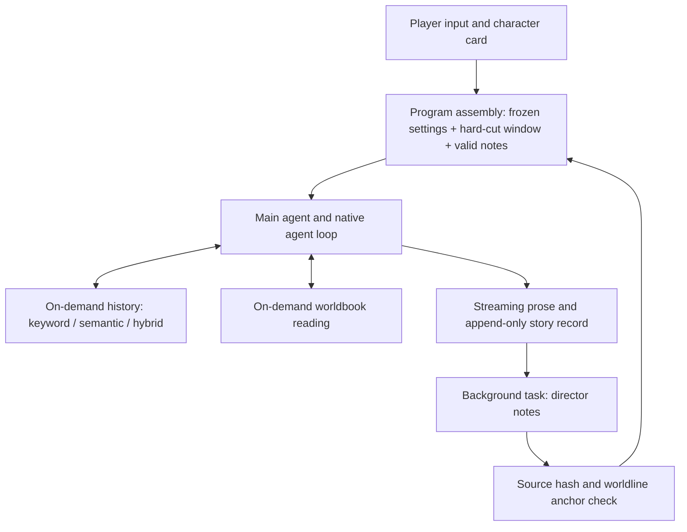
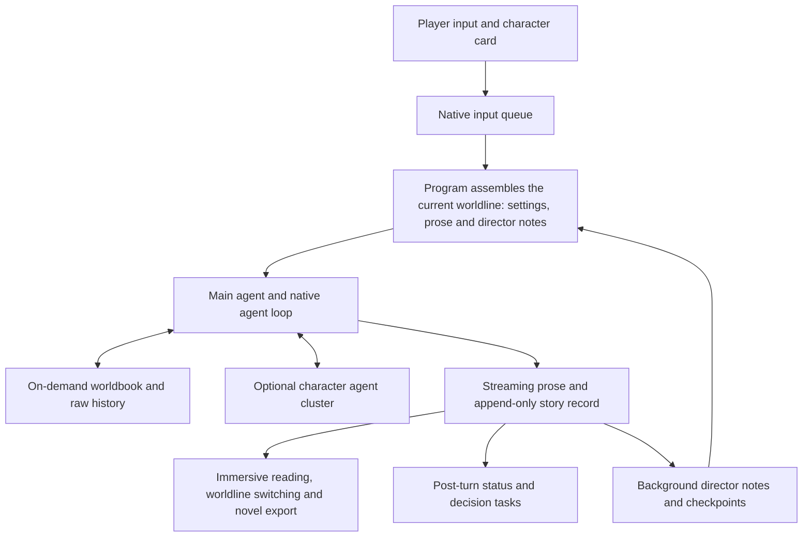

# dsh-NextTavern

[简体中文](README.md) · **English**

> **0.2.9 — Distribution & Installation Fix.** This installation patch builds on 0.2.8: bundled third-party SDK dependencies fix build-script permission failures during first installation and private-component relinking. Official sources are [npm `dsh-nexttavern`](https://www.npmjs.com/package/dsh-nexttavern/v/0.2.9) and the [v0.2.9 Release](https://github.com/a86582751/dsh-nexttavern/releases/tag/v0.2.9). The supported host remains Harness `0.1.7-rc.2` / web / Session V4. See the [contributor guide](CONTRIBUTING.md) for development.

> **Migrating from 0.2.5 or another old host requires fresh directories.** Export character cards or novels before installing 0.2.9; old sessions are incompatible and novels lack full session state. 0.2.8 → 0.2.9 keeps the same host and session line; see [update, uninstall and rollback](#update-uninstall-and-rollback).

MVU, EJS, RUBY and broader SillyTavern community-card frontend compatibility remain in development for 0.3. 0.2.9 improves distribution, installation and third-party dependency compatibility; roleplay features continue from 0.2.8.

**Let your characters think for themselves, and let the world unfold from your choices.**

NextTavern is a long-form roleplay / Tavern plugin for DeepSeek Harness (DSH), with SillyTavern character-card compatibility, worldlines, long-term memory, and hybrid keyword + semantic retrieval. A character card, a sudden idea, one choice you refuse to compromise on — any of them can start a story. NextTavern brings the native agent loop to long-form roleplay: the agent looks things up on its own, keeps memory in order and reasons as individual characters, while you hold the direction.

**Create a world, step into it, and take it with you.**

[Online documentation](https://a86582751.github.io/dsh-nexttavern/) · [One-click install](#one-click-install) · [Getting started](#getting-started) · [Windows](INSTALL-WINDOWS.md) · [Linux](INSTALL-LINUX.md) · [Capabilities](#capabilities) · [Memory system](#memory-system) · [Architecture](#architecture) · [Public access guide (Chinese)](PUBLIC-ACCESS.md) · [All screenshots](SCREENSHOTS.md) · [Report an issue](https://github.com/a86582751/dsh-nexttavern/issues/new/choose)


**0.2.9** · Harness **0.1.7-rc.2** · pi-ai **0.85.1** · project-owned code **GPL-3.0**

Install the host, then use the official [one-command plugin installation](#one-click-install). For a fresh home, fixed port or local archive, see [manual install](#manual-install).

This document is the English counterpart of the Chinese README. The Chinese one is the primary document and carries the same content.

## One-click install

**With Harness already installed, run one command:**

```powershell
dsh plugin --profile web add dsh-nexttavern
```

`dsh-nexttavern` is the official npm package name. Some third-party Hub or market directories fall back to Git source installation when they cannot identify the npm source; their catalog still needs a separate update. Use the official command above or a verified Release archive. This release does not establish Git source installation or DSH 0.2 / desktop compatibility.

For a first DSH installation, install Node.js 24+ and the host first:

```powershell
npm install -g @deepseek-ai/dsh@0.1.7-rc.2
```

Run `dsh web --host 127.0.0.1`, open the address printed in the terminal, configure your own model and API key, and choose the roleplay preset. The unified plugin prepares its compatibility components, document reader and skin. The skin is installed but off by default. First preparation takes time and network access; later starts reuse verified components.

**Moving from 0.2.5 requires exports and fresh directories.** Do not use the old home or workspace to continue old sessions. See [manual install](#manual-install) for isolation.

### Windows

For portable runtimes and shortcuts, download [NextTavern-Setup.exe](https://github.com/a86582751/dsh-nexttavern/releases/download/v0.2.9/NextTavern-Setup.exe), or [NextTavern-Setup-arm64.exe](https://github.com/a86582751/dsh-nexttavern/releases/download/v0.2.9/NextTavern-Setup-arm64.exe) on Windows on ARM. Choose a new root when moving from 0.2.5. See the [Windows guide](INSTALL-WINDOWS.md) (Chinese) for steps, unsigned-program prompts and verification limits.

### Linux

[NextTavern-Setup.sh](https://github.com/a86582751/dsh-nexttavern/releases/download/v0.2.9/NextTavern-Setup.sh) prepares portable Node.js and launchers for x86_64 and aarch64 (glibc), without root or a system package manager. Use a fresh `--root` when moving from 0.2.5. See the [Linux guide](INSTALL-LINUX.md) (Chinese).

### Installation and model costs

Installation, byte verification, recovery and removal are program operations with no story-model call. Supply your own API keys; none are included. The local server binds `127.0.0.1`. Story generation and existing background memory/status tasks still incur the configured model's costs; opening a session can resume background maintenance.

## Getting started

Once [one-click install](#one-click-install) (or [manual install](#manual-install)) is done and your model is configured:

1. **Create a dedicated workspace.** Give this roleplay its own folder so character cards, story resources and exports live together.
2. **Pick "roleplay mode" in the preset menu.** Switch to it when creating a session and you are in your story workspace.
3. **Upload a character card, or talk one into existence.** SillyTavern / TauriTavern PNG and JSON cards are supported, and you can also describe a genre, characters, relationships and mood and build the card in conversation.
4. **Start playing.** Follow the opening, type your actions, switch worldlines, or open "tavern management" to adjust settings at any time.

With no card at hand, a sentence is enough:

> Create a steampunk mystery character card. I want to play an investigator who just arrived at the port. Slow burn, several factions, and relationships that develop. You decide the rest.

Tell the agent who you want to meet and what story you want to live through. You can polish every detail, or say "you decide" and let it carry on with a world, a cast, an opening and a style. See [document extensions](#document-extensions) for DOCX and other documents. Have a whole novel lying around? You can have it read into a card, see [long text to character card](#long-text-to-character-card).

### Importing SillyTavern / TauriTavern cards

Upload the original card file and tell the agent: **"Read this character card and prepare to start roleplay."** No manual decoding, no import-tool parameters.

| Format | Supported |
| --- | --- |
| **PNG character cards** | Base64 character data from the `chara` / `ccv3` `tEXt` chunks; `ccv3` wins when both are present. |
| **JSON character cards** | v1, v2 (`chara_card_v2`) and v3 (`chara_card_v3`). |
| **Embedded worldbooks** | `character_book` is read, reviewed through the normal import flow and mapped into settings and worldbook. |

Use the original PNG that still carries its metadata: a plain avatar, a screenshot or an image with stripped metadata has no character data to import. PNG/JSON parsing is built in and does not need anydoc; the upload entry point ships with a full installation.

After import you can keep working on the character, the worldbook and the writing rules, and the original card plus its extended data are preserved. All three card style fields survive intact; how they interact with presets is your choice, see [style presets](#style-presets).

## Capabilities

| Capability | What you get |
| --- | --- |
| **One-click install** | One official plugin command installs the product and required components; Windows/Linux portable-runtime installers are also available. Old-version migration uses fresh directories. |
| **SillyTavern / TauriTavern card import** | PNG `chara`/`ccv3` and JSON v1/v2/v3 cards, originals preserved, embedded worldbooks included. |
| **Frozen settings + hard-cut window + director notes + hybrid retrieval** | Frozen settings injected every turn, never compacted; the window keeps recent complete prose and its tail; background notes carry a source hash and a worldline anchor; history recall in keyword, semantic or hybrid mode. |
| **Style presets** | A dedicated presets page, scoped to the current conversation, a designated conversation or globally, three style modes, 16 built-in styles and 200 custom slots. |
| **Long text to character card** | Read a long TXT as a playable card: intensive or coarse reading, source frozen with hashes, every research note traceable to the text, its own semantic index. |
| **Embedding management** | Online: DashScope, OpenAI-compatible endpoints and OpenAI official. Local: BGE small zh, Qwen3-Embedding 0.6B, Jina Nano / Small INT8, Nomic q8 — no key and no network. |
| **Multi-model collaboration** | Route prose and memory, card reading and writing, status, decisions and novel export to the models you choose. |
| **Character agent cluster** | Major characters reason in separate contexts about language, behaviour and intent; the main agent reconciles them into the story. Per-character model overrides. |
| **Decision card and status bar** | Action suggestions live in a standalone, collapsible, draggable decision card; the author's status HTML/CSS survives import, generation and restore. |
| **Self-owned skin** | The first own skin, day and night themes, whole interface redrawn from one token set; installed but off by default. |
| **Worldlines** | Regenerate, edit-and-send and switch versions inside one conversation; an explicit branch creates a new conversation. |
| **Custom writing rules** | Manage core settings, characters, worldbook, story guidance, style and rules separately, controlling viewpoint, pacing, character knowledge and reply shape. |
| **On-demand worldbook reading** | The main agent consults locations, factions and background details when the scene needs them, as a queryable reference rather than a fixed dump. |
| **HTML/CSS reading presentation** | Card HTML/CSS, status templates and regex rules shape the reading view; prose streams while it is written, and author scripts run in a restricted environment. |
| **One-click novel export** | Turn a chosen worldline into a novel manuscript, or export the full character card; results land in the resource library. |
| **Resource library** | Cards, story files and exports in one place, sorted by time or name, refreshable and downloadable. |
| **Interactive character creation** | Start from an idea and build world, cast, opening, style and layout in conversation, checked against twelve completeness items. |
| **Usage and cache statistics** | Requests, input/output tokens, cache, speed and known cost by session, provider or model, including regenerations, embedding calls and failed attempts. |

## Memory system

The longer a story runs, the more accumulates: what characters lived through, foreshadowing you planted, promises not yet kept. NextTavern borrows the context-management ideas of long-running agent tasks and splits long-form memory into four things with clear boundaries: **a frozen settings prefix that is never compacted and is always injected, a hard-cut context window that keeps the tail, background director notes with traceable provenance, and on-demand history recall in keyword and semantic mode.**

| Pillar | What it does | Why it matters for long stories |
| --- | --- | --- |
| **Frozen settings, never compacted** | The frozen settings and system prefix are present every turn and never enter the compaction path. | Identity, author rules and narrative constraints are long-term contracts; a summary must not replace them. |
| **Hard-cut window with tail retention** | The program advances the context window on complete prose boundaries and preserves the trailing continuous prose as it moves. | Recent prose keeps its full detail; the passage you are reading is never dropped mid-scene or replaced by a summary. |
| **Background director notes with provenance** | Written by a separate background task, each note carries a source hash and a same-worldline anchor. | Every note traces back to the prose that produced it; notes that cannot be traced stay where they are instead of being guessed at. Raw history is append-only and never deleted. |
| **Keyword and semantic hybrid recall** | The main agent queries history on demand in three modes: **keyword (default), semantic or hybrid**. | Old detail is looked up when it is needed, instead of forcing a recall step before every turn. |


```mermaid
flowchart TD
    Player[Player input and character card] --> Program[Program assembly: frozen settings + hard-cut window + valid notes]
    Program --> Writer[Main agent and native agent loop]
    Writer <--> Recall[On-demand history: keyword / semantic / hybrid]
    Writer <--> Lore[On-demand worldbook reading]
    Writer --> Story[Streaming prose and append-only story record]
    Story --> Background[Background task: director notes]
    Background --> Anchor[Source hash and worldline anchor check]
    Anchor --> Program
```

### Three query modes over one corpus

The corpus is **player input and valid story prose**, including archived or evicted prose. Status text, tool output, CSS, decision cards and reasoning never enter it.

| Mode | Computed by | When to use it |
| --- | --- | --- |
| **Keyword (default)** | Deterministic matching in the program; no model call. | Fastest when you remember the exact words, names or places. |
| **Semantic** | An embedding model encodes the query into a vector. | Better when you remember the gist but not the wording. |
| **Hybrid** | Keyword and vector results ranked together. | Both exact hits and near meanings. |

Vectors are derived shared data and queries are filtered to the **current worldline**, so switching worldlines never forces a rebuild. Every vector index carries a recipe fingerprint (model, revision, dimensions, task role, pooling, quantization, runtime): when the fingerprint does not match, the index is marked `stale` and stops serving until you rebuild it — it would rather make you rebuild than answer from stale vectors. Chunk size is configurable, default 480 characters (192 / 480 / 960, range 128–2048, 80 overlap), and local models use a 512-token budget. Clear, rebuild and fill are scoped to the current visible conversation and all of its worldlines; clearing removes only the index, while prose, provenance and the ledger stay.


### Old notes and old status are no longer sent with every request

Old director notes and state snapshots used to travel with every request (about 52k characters). They are now replaced **only after a valid new anchor has been prepared**: references that were not replaced keep their exact backing, a rollback serves the full text again, and raw events stay append-only. A long story stops dragging an ever-heavier pile of old notes through every request.

The same confirm-then-replace rule applies to long tool results: once a research note is confirmed, the matching long tool result is recycled into its checkpoint, but only when owner, source hash, generation and packetIds all match. Partial saves, wrong sources, failed writes and re-reads after confirmation are never recycled.

### All of it is adjustable per session

Window size, tail retention and the background note cadence support a global default and per-session overrides; leaving them empty keeps the global setting. Window assembly, provenance checks, note eviction and recycling are program work and produce no model request. Only when the main agent actually decides to look something up does a query cost anything (semantic and hybrid also need an embedding model, see [embeddings](#embeddings)).

Switch to another worldline and you continue with that line's history; polish the same scene repeatedly and memory follows the version you selected.


## Style presets

Style is no longer something you can only change by editing a card. A dedicated **presets page** (before the resource library) lets you create, edit, save a copy, select and delete presets; the built-ins are read-only and you get 200 custom slots.

| Dimension | Values | Meaning |
| --- | --- | --- |
| **Scope** | current conversation / designated conversation / global | All worldlines of one conversation share the override; empty follows the global setting. |
| **Style mode** | foreground system aesthetic (default) / blend with card style / card style only | The first two inject both preset and card style, with the preset winning conflicts; the third uses only the card style. |

The preset library is shared by all conversations, so editing a preset that is in use affects that conversation's later generations — the interface says so explicitly. If two windows edit the same preset, the later submission gets a conflict notice and **your draft is kept**.

**16 built-in styles.** Besides the default and blank presets, 14 ready-to-use styles ship: 日式轻小说, 乙女风格, 三体文风, 日式游戏, 电影感文风, 春秋文风, 极简文风, 细腻文风, 奇幻网文风, 恐怖文风, 鲁迅文风, 抒情文风, 日常搞笑风 and 古文文风. Each has a complete seven-section guide with original examples, not a one-line description.


## Long text to character card

Have a novel and want it as a playable world? The management interface has a **long-text-to-card tab** (after the character cluster). It does more than summarise: **what was read, where a note came from and whether a claim has textual support all have to line up.**

**Two reading modes, chosen before research starts.**

- **Intensive (default)**: complete segmented reading, with a source-cited research note for every segment.
- **Coarse**: multi-round relation-frontier retrieval around characters, organisations and events, then longitudinal tracking of the protagonist. It **requires** a usable novel model and a complete current index; when those are missing the interface guides you through configuration and ends the round instead of silently degrading.

**The source is frozen first.** Workspace TXT up to 64 MB, decoded as UTF-8 → GB18030 → BOM-aware UTF-16, recording the raw-byte hash, decoded-text hash and size without ever mutating your upload. Segmentation is deterministic and batches stay below the native clipper.

**Notes need evidence.** A research note only counts when the batch was actually read and the quoted text actually appears in it. Notes are split into facts, adaptation opportunities and open questions.

**The novel has its own index**, separate from story memory, and the novel model can be configured separately from the story memory model. The same source hash reuses the research baseline and the same recipe reuses vectors, so one book can serve several cards and conversations.

For scale: a ~1.19M-character web novel (first 354 chapters) produced 3027 online vectors, and the program suspended for ~292 seconds waiting for the index; delivering the card and opening the import are separate turns, with ~52k tokens of opening input. Adaptation reuses the same questionnaire and twelve-item card check as interactive creation.

Long novels can still get individual details wrong; read the finished card through once.


## Embeddings

Semantic and hybrid recall need vectors, so there is a dedicated **embedding page** (between models and usage).

**Online.** DashScope, OpenAI-compatible endpoints and OpenAI official: refreshable model lists, manual model IDs, keys stored server-side only, and a connection test.

**Local.** Five models install directly: **BGE small zh, Qwen3-Embedding 0.6B, Jina Nano, Jina Small INT8, Nomic q8**, running on ONNX Runtime 1.29.0 in a separate encoding process. Downloads show real byte progress, speed and ETA, support pause/cancel/resume, and run a `queued → downloading → verifying → preparing-runtime → self-testing → installed` state machine. **Local inference needs no API key and no network.**

Indexing, querying, testing and retries all enter the existing usage statistics. Unknown prices stay **N/A**, and failures never invent token counts.

Which one? BGE is fast but weaker across languages; Qwen builds indexes more slowly on long prose; at 50k chunks retrieval time is already close to the limit.


## Character cluster

With the **character agent cluster** enabled, major characters reason in separate contexts. Each can have its own model and thinking effort, and they run independently even on the same model. They receive their own persona, the current story, director notes and recently read worldbook material; the main agent then reconciles their suggestions into the story.

Model configuration has two levels: **a global default plus per-character overrides**. An override belongs to the current visible conversation and is shared across its worldlines, while each actual worldline keeps its inputs and results isolated — preferences are shared, history is written separately.

Background subagents no longer appear in the conversation list, and draft saving, resource and export replies and task actions no longer submit twice or expire.


**Beyond per-character reasoning, models can also divide the work.** Prose, background memory, card reading, status and export tasks can each use a fitting model, or all follow the main model; model settings support a global default and per-session overrides.

## Status bar and decision card

**Action suggestions appear only in the standalone decision card**, never duplicated into the status bar or the prose tail. Legacy action areas inside old cards are hidden, and the original card is left untouched.

The decision card has its own controls: **collapse/restore (⌃ / —)**, a separate **× later** action, drag to move, double-click or Home to reset, and a capped visible height so it never eats the screen.

Reading presentation improved in the same pass: the author's status HTML/CSS is validated and preserved across import, generation and legacy restore; fenced status styles and opaque panels came back; the status panel fills the available height while keeping internal scrolling; the collapsed rail's reopen button stays visible. Status template dynamic slots accept real values while keeping the author's HTML/CSS/JS structure, and failed task validation now reports structured diagnostics, failure time and retry guidance.


## The bundled skin

The project provides its **first own skin, `dsh-nexttavern-amber`**: the whole interface redrawn from one design-token set, with **day and night themes** that change the mood in one switch; a chibi tavern keeper sits in the sidebar with a different illustration per theme; the tavern reading mode in the night theme lies on aged parchment while the author's own ink colours are untouched.

The skin is installed with the package but **off by default**, so your interface stays as it was. To switch it on: **Settings → Plugin market → Installed**, find `dsh-nexttavern-amber` and toggle it. It writes to the profile's `cordis.patch.yml` and hot-loads in about a second, **without a restart**; toggle it back whenever you like, and the choice survives restarts. The toggle comes from a third-party plugin market; an existing market is reused and an upstream market is installed only when missing — see [patch and dependency sources](#patch-and-dependency-sources) for its origin, outbound requests and how to turn it off.


## Worldlines and branching

Not happy with a development? Regenerate. Want to change a choice? Edit the player message and send it. The versions form worldlines inside the current conversation and you can switch between them. A separate conversation is only created when you explicitly choose "branch into a new conversation".

Each worldline has its own story, status and memory; notes belong to the actual worldline, while a character's model preferences and the vector index are shared per conversation or per queried worldline. Novel export follows the worldline you selected, so the version you liked is the one you keep.


## Reading and writing your way

In "tavern management" you adjust characters, world background, story direction, style and custom rules separately. Put viewpoint, pacing and character boundaries into the rules, put HTML/CSS, status templates and regex decoration into the card, and give each story its own reading presentation.

Prose is readable while it is generated; post-turn status and note maintenance have their own progress. Player actions typed meanwhile enter the native queue.


## From character card to a novel you can take away

The dialogue you polished, the turn you did not expect, the ending you finally reached — all of it deserves to become a real piece of work. Pick the worldline you like and collect it into a novel manuscript; export the polished character card as well, so the world keeps being read, shared and written.


## Interactive authoring

**You do not need a finished card to begin — imagination is enough.** A harbour city where it always rains, a relationship full of friction, or simply "I want a slow-burn adventure" can be the start.

The agent talks with you about characters, relationships, atmosphere and direction, and grows your answers into a world background, a multi-character cast, an opening, a style and a reading layout, then runs a twelve-item completeness check. Polish every detail yourself, or leave the blanks to it: "you decide." From the first idea to a playable card, the creation itself is part of the journey.


## Usage statistics

**Explore freely, and see what the models did and what they cost.** Request logs, provider statistics and model statistics share one panel; switch by session, time and model to see input/output tokens, cache hit rate, generation speed and cost. Embedding indexing, queries, tests and retries count into the same statistics.

Compare what different models cost you, watch cache behaviour as a long story advances, and review what a regeneration or a cluster call consumed. Model price multipliers, manual unit prices and currency conversion are supported.


## Architecture

NextTavern connects these capabilities into the native agent loop: **the main agent advances the narrative, memory agents keep the long threads, character agents reason independently, and the program assembles the context the current story needs.** From card reading and the opening to branching and export, one architecture runs through the whole creative process.


```mermaid
flowchart TD
    Player[Player input and character card] --> Queue[Native input queue]
    Queue --> Context[Program assembles the current worldline: settings, prose and director notes]
    Context --> Writer[Main agent and native agent loop]
    Writer <--> Lore[On-demand worldbook and raw history]
    Writer <--> Cast[Optional character agent cluster]
    Writer --> Story[Streaming prose and append-only story record]
    Story --> Reader[Immersive reading, worldline switching and novel export]
    Story --> Tasks[Post-turn status and decision tasks]
    Story --> Memory[Background director notes and checkpoints]
    Memory --> Context
```

[Read the full architecture notes: context composition, the four memory pillars, preset scopes, the long-text pipeline and request cost](ARCHITECTURE.md)

## Downloads

- [Main package dsh-nexttavern.tgz](https://github.com/a86582751/dsh-nexttavern/releases/download/v0.2.9/dsh-nexttavern.tgz) — unified plugin, prebuilt UI, sources, preset, reference cards, bundled components, CLI and the optional public-access auth source package.
- [Standalone dsh-debug.tgz](https://github.com/a86582751/dsh-nexttavern/releases/download/v0.2.9/dsh-debug.tgz).
- [Public-access plugin dsh-auth-webserver.tgz](https://github.com/a86582751/dsh-nexttavern/releases/download/v0.2.9/dsh-auth-webserver.tgz), see the [public access guide](PUBLIC-ACCESS.md) (Chinese).

Installers: [NextTavern-Setup.exe](https://github.com/a86582751/dsh-nexttavern/releases/download/v0.2.9/NextTavern-Setup.exe) (Windows x64) · [NextTavern-Setup-arm64.exe](https://github.com/a86582751/dsh-nexttavern/releases/download/v0.2.9/NextTavern-Setup-arm64.exe) (Windows on ARM) · [NextTavern-Setup.sh](https://github.com/a86582751/dsh-nexttavern/releases/download/v0.2.9/NextTavern-Setup.sh) (Linux x86_64 / aarch64).

Verification: [SHA256SUMS](https://github.com/a86582751/dsh-nexttavern/releases/download/v0.2.9/SHA256SUMS) and [provenance.json](https://github.com/a86582751/dsh-nexttavern/releases/download/v0.2.9/provenance.json). The npm package is `dsh-nexttavern`; install it with `dsh plugin --profile web add dsh-nexttavern`.

## Manual install

For a separate home/workspace and fixed port, use Node.js 24+ and npm. These are PowerShell examples; continue only after each command succeeds.

**Before migrating from 0.2.5, export cards or novels and keep the old backup.** Old sessions cannot continue directly and novels lack full state. The example below is for fresh installations or old-host migration: use unoccupied paths for the new home and workspace, without copying the old session database. For an existing 0.2.8 installation, see [update, uninstall and rollback](#update-uninstall-and-rollback).

```powershell
npm install -g @deepseek-ai/dsh@0.1.7-rc.2
$env:DSH_HOME = Join-Path $PWD 'nexttavern-029-home'
$Workspace = Join-Path $PWD 'nexttavern-029-workspace'
New-Item -ItemType Directory -Path $env:DSH_HOME,$Workspace -ErrorAction Stop | Out-Null
dsh plugin --profile web add dsh-nexttavern
dsh web --host 127.0.0.1 --port 3510
```

Select the new workspace in the browser, configure your provider and pick the roleplay preset for a new session. For later starts, set the same `DSH_HOME` and run the last command.

Alternatively download the main archive from [v0.2.9](https://github.com/a86582751/dsh-nexttavern/releases/tag/v0.2.9), verify it against `SHA256SUMS`, then replace the npm package name with its local archive:

```powershell
dsh plugin --profile web add ./dsh-nexttavern.tgz
```

The old alpha.3 manual preset setup and host byte patches are no longer required. The product uses owned compatibility providers and restores native providers on disable or failed activation. Uploads, attachments and the sidebar use official host capabilities.

### If preparation fails

Restore network access and retry with the same home. Preparation checks bytes, uses a lock and records transaction checkpoints so interrupted work can recover. Do not edit receipts/pins or delete user directories.

If an unsuccessful official install left the package installed but its bundle unregistered, stop the target host and run these with the same home, then restart:

```powershell
dsh plugin --profile web remove dsh-nexttavern
dsh plugin --profile web add dsh-nexttavern
```

The 0.2.9 npm and Release packages include the complete runtime dependency closure for `@google/genai` and `protobufjs`. Relinking private SDKs at their fixed directories also avoids those install scripts, and the persistence component carries a prebuilt `koffi` bundle. If these packages still trigger build-script permission errors, first verify the actual version and source are the official 0.2.9 npm package or Release archive. Preserve the error and versions for a report, removing keys and private content first.

## Document extensions

PNG/JSON card parsing is built in. Uploads and attachments use the native host. The unified plugin prepares the attributed `dsh-nexttavern-anydoc` component for TXT, CSV, DOCX and other document parsing, bounded reading and full Markdown conversion. The old `file-upload` / `read_document` and Office plugins are no longer required.

Upload an original document and explain how it should be used. DOCX reading is covered; PDF and scanned-document readability depends on the file and conversion components. This release does not promise OCR or every format. Long-text adaptation reads workspace TXT. Install optional tools according to their own host compatibility requirements rather than copying alpha.3 extensions into the new profile.

## Patch and dependency sources

This release pins Harness **0.1.7-rc.2** and pi-ai **0.85.1**. Owned UI, Session Controller, persistence, projection, metering and pi-ai compatibility providers are verified and prepared as independently versioned components. Players do not need to modify installed host files. Package metadata, `provenance.json` and [NOTICE](NOTICE.md) identify their versions, sources and licenses.

0.2.9 includes Google SDK / protobuf runtime dependencies and the prebuilt `koffi` bundle, with matching private-component dependency declarations. npm metadata adds nine related keywords, the documentation homepage, issue tracker and standard repository URL. English and Simplified Chinese titles and descriptions use the host's official `locale/*` exports. These fields help identify the official package; the third-party market catalog still needs a separate update.

- [anydoc](https://github.com/a86582751/dsh-plugin-anydoc) derives from [beancookie/dsh-plugin-anydoc](https://github.com/beancookie/dsh-plugin-anydoc), preserving upstream history and MIT attribution, with owned TypeScript sources.
- [pi](https://github.com/a86582751/pi) derives from [earendil-works/pi](https://github.com/earendil-works/pi), preserving MIT attribution; the compatibility layer handles stream completion and cleanup across four protocols.
- Official uploads, attachments and sidebar replace the retired upload tools and `better-sidebar`.

The independent third-party [dsh-market](https://github.com/dsh-market/dsh-market) (`dshmarket`, MIT) browses community plugins and toggles the [skin](#the-bundled-skin). An existing market is reused unchanged. Only when missing does the product resolve and install an upstream version, recording its version and verification information in the profile. It no longer pins 1.39.0 or requires a market fork. Its directory and comments can access [awesome-dsh-plugin.com](https://awesome-dsh-plugin.com), giscus and GitHub. Disable the market in settings to turn off those market features; NextTavern's own controls do not depend on it.

For public access, explicitly configure the bundled auth plugin, your Cloudflare Access, domain and identity according to the [public access guide](PUBLIC-ACCESS.md). Local installs do not expose the network. Review old public-access settings separately for the new host; they are not a session-migration mechanism.

## Update, uninstall and rollback

**0.2.5 → 0.2.9 requires migration, not continuation of old sessions.** Export cards/novels, back up the old directories, then use fresh directories as described above. One-click installers also need a new root. Keep the old installation separate for reading and exporting old material.

**0.2.8 → 0.2.9 is an installation patch on the same host line.** Follow the official plugin update steps below. This release adds no portable-installer in-place upgrade capability; the platform guides retain their existing directory and recovery boundaries.

For updates within a compatible version line: stop the host, back up its home/workspace, check the new release notes, use official `plugin add` with the target package version or archive, and restart to load new modules. Preparation refuses corrupt packages and unknown components, retains versioned components, and reports failures. Rollback requires a matching prior package and backup; never mix another instance's receipts or pins.

**Disable/re-enable:** toggle `dsh-nexttavern` in official **Settings → Plugins → Plugin configuration**. Disable restores native UI/providers. The skin has a separate toggle and is off by default.

**Uninstall the plugin:** stop the target host, ensure `DSH_HOME` points to the intended installation, then run:

```powershell
dsh plugin --profile web remove dsh-nexttavern
```

Controlled removal unregisters the product and its managed configuration while retaining stories, cards, resources, notes, user preset copies and model settings. It does not remove a preexisting market or the whole home/workspace. Reinstalling can reuse data compatible with that version line. Deleting an installer's root deletes its home/workspace too; back them up before complete removal. See the [Windows](INSTALL-WINDOWS.md) and [Linux](INSTALL-LINUX.md) guides (Chinese).

## Sources and verification scope

**TypeScript is the only maintained source.** Hand-written `.ts` / `.mts` files, with `.js` / `.mjs` generated from a shared build manifest by TypeScript 5.9.3. Maintained sources live in `src/`, generated artifacts in `lib/`, including runtime, UI, memory, auth, card reading, telemetry, worldlines and release tooling. Root and `./client` exports remain; internal deep paths have moved. See the contributor guide for direct-reference migration.

`provenance.json` records the maintenance source commit, per-file origins, tool versions and SHA-256; component metadata records pinned versions and upstream sources. The main repository carries no full official patch snapshot. To rebuild the UI:

```powershell
npm ci --prefix ./build-tools --ignore-scripts --no-audit --no-fund
npm run build
```

Public sources rebuild all four registered browser bundles, including the product and its compatibility providers. If you change the sources, update your own version and provenance rather than passing it off as the original release. The full paid behavior acceptance used an alpha.1 candidate. The rc.2 migration received minimal source checks and real local/server installation, without rerunning that full paid suite. A clean VM and real ARM64 devices remain unverified.

## Community

Thanks to [@ljs1997sh](https://github.com/ljs1997sh) for [dsh-nexttavern-qq-mobile](https://github.com/ljs1997sh/dsh-nexttavern-qq-mobile), which arrived soon after the release with a QQ-style interface, a compact layout and phone, LAN and remote access paths. The 0.2.5 own skin is an independent implementation inside this repository; it does not merge or forward that project's interface or code.

This is a community project maintained by its author; follow its own repository instructions for installation and scope. The optional CF Access auth plugin and the [public access guide](PUBLIC-ACCESS.md) require step-by-step configuration and confirmation.

## Feedback and license

Bring your world, and bring your experience back too: [share feedback and suggestions](https://github.com/a86582751/dsh-nexttavern/issues). When reporting a problem, include the version and reproduction steps, and redact keys and private content.

Project-owned code is **[GPL-3.0](LICENSE)**. Bundled upstream patches and community changes keep their own licenses (including DeepSeek, pi and anydoc MIT terms), listed item by item in [NOTICE](NOTICE.md).
