# dsh-NextTavern

**让角色独立推演，让世界随你的选择展开。**

一张角色卡，一个突然冒出的念头，一次不愿妥协的选择，都可以成为故事的起点。dsh-NextTavern 把原生 Agent Loop 带进长篇角色扮演：AI 主动查阅世界、整理记忆、推演人物，你掌握方向，一起把故事写下去。

**创作一个世界，走进它，再把它带走。**

[开始体验](#开始体验) · [架构设计](#为长篇角色扮演重新组织-agent-的工作方式) · [核心能力](#核心能力) · [下载安装](#下载) · [全部截图](SCREENSHOTS.md) · [反馈问题](https://github.com/a86582751/dsh-nexttavern/issues/new/choose)

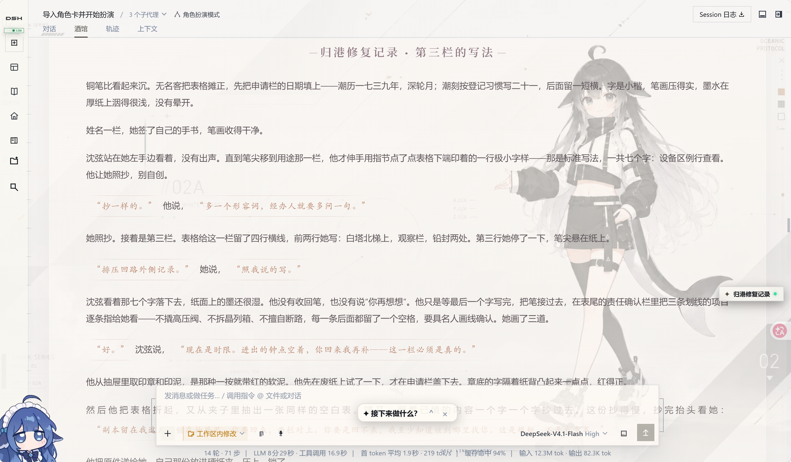

Roleplay workspace for DeepSeek Harness: interactive character creation, on-demand worldbook reading, long-form memory, multi-model collaboration, character agents, branching stories and novel exports.

**0.1.0 预览版** · Harness **0.1.2-alpha.3** · pi-ai **0.84.4** · 自有代码 **MIT**

按[安装说明](#安装)完成六项兼容补丁配置，即可开启完整体验。

## 开始体验

完成[安装](#安装)并配置自己的模型后：

1. **新建一个独立工作区。** 为这次角色扮演选择专用文件夹，集中存放角色卡、故事资源和导出文件。
2. **在预设中选择“角色扮演模式”。** 新建会话时，从预设菜单切换到角色扮演，进入你的故事工作台。
3. **上传角色卡，或者交互式创作一张新卡。** 支持 SillyTavern / TauriTavern 的 PNG、JSON 人物卡；也可以直接描述题材、人物、关系和氛围，让 AI 通过对话与你共同完成创作。
4. **开始体验。Enjoy it!** 跟随开场推进故事，输入你的行动，切换世界线，或随时打开“酒馆管理”调整设定。

没有现成角色卡，也可以从这样一句话开始：

> 帮我创作一张蒸汽都市悬疑角色卡。我想扮演刚到港口的调查员，故事慢热，有多方势力，也有人物关系的发展。其他细节你来决定。

告诉 AI 你想遇见怎样的人、经历怎样的故事。你可以一起打磨细节，也可以说“你来决定”，让它带着世界、人设、开场与文风继续创作。DOCX/PDF 读卡可通过[文档扩展](#文档扩展)启用。

### 导入 SillyTavern / TauriTavern 人物卡

直接上传原始卡文件，然后告诉 AI：**“读取这张角色卡，准备开始角色扮演。”** 无需自己解码，也无需手动填写导入工具参数。

| 格式 | 支持范围 |
| --- | --- |
| **PNG 人物卡** | 从 `chara` / `ccv3` 的 `tEXt` 块读取 Base64 编码的角色数据；两者同时存在时优先读取 `ccv3`。 |
| **JSON 人物卡** | 识别 v1、v2（`chara_card_v2`）和 v3（`chara_card_v3`）。 |
| **内嵌世界书** | 读取 `character_book`，按当前导入流程审阅并映射到设定与世界书。 |

请选择保留元数据的原始 PNG 卡，普通头像、截图或被移除元数据的图片不含可导入的角色数据。PNG/JSON 解析是内置能力，不需要 anydoc；上传入口随完整安装提供。

导入后继续打磨人物、世界书与创作规则，原始卡片和扩展数据也会一并保留。

## 为长篇角色扮演重新组织 Agent 的工作方式

写长篇，需要沿途积累的记忆、可随时翻阅的世界资料，也需要人物各自的动机。NextTavern 将这些能力连接进原生 Agent Loop：**主代理推进叙事，记忆代理整理长线，角色代理独立推演，程序把当前故事需要的上下文准备好。** 从读卡、开场到分支与导出，整个创作过程由这套架构贯穿。

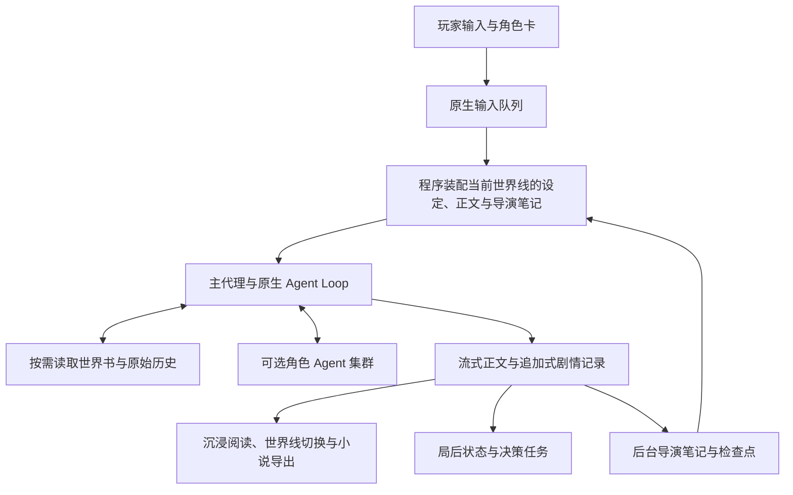

五个设计，贯穿你的每一次创作：

1. **让 AI 主动探索世界。** 当前设定、正文和笔记随时可用；需要世界知识或早期细节时，主代理自己查阅资料，再把发现融入故事。
2. **给长篇一套会整理的记忆。** 近期正文保留眼前的细节，导演笔记承接长线，历史查询让旧事有迹可循。从当前场景到早期伏笔，信息各有归处。
3. **把“换一种选择”变成真正的世界线。** 重写一句行动，重新生成一次回应，就能沿另一条路线继续。每条世界线保留自己的剧情、状态与记忆，也能单独导出。
4. **让不同角色带着自己的想法登场。** 角色分别推演，主代理综合他们的行动与意图；记忆、状态、读写卡等工作还能交给不同模型协作完成。
5. **让阅读跟上灵感。** 正文边写边读，状态与笔记随后整理。你可以继续酝酿下一步行动，让创作自然衔接。

[阅读完整架构说明：上下文组成、分支继承、任务分工、请求成本与源码入口](ARCHITECTURE.md)

## 核心能力

| 能力 | 你可以获得什么 |
| --- | --- |
| **SillyTavern / TauriTavern 卡片导入** | 直接读取 PNG `chara`/`ccv3` 和 JSON v1/v2/v3 人物卡，保留原件并支持内嵌世界书。 |
| **主动读取世界书** | 主代理根据当前剧情按需查阅地点、势力和背景细节，让世界书作为可查询的设定库参与叙事。 |
| **硬切窗口 + 导演笔记 + 历史查询** | 自动管理长篇上下文：保留近期完整正文，后台整理笔记，需要旧细节时回查原始历史。 |
| **多模型协同** | 为正文与记忆、读写卡、状态、决策、小说导出等任务配置模型路由，按需要分工。 |
| **多角色 Agent 集群** | 为主要角色启动独立推演，分别思考语言、行为与意图，再由主代理协调成最终故事。 |
| **对话分支管理** | 重新生成、修改后发送、切换版本，在同一对话里探索不同世界线；也可显式分支到新对话。 |
| **自定义创作规则** | 分别管理核心设定、人物、世界书、剧情指引、文风与规则，控制视角、节奏、人物知情边界和回复展开方式。 |
| **HTML/CSS 阅读美化** | 通过角色卡中的 HTML/CSS、状态栏模板与正则规则定制阅读呈现，正文支持流式阅读。 |
| **资源库管理** | 集中查看角色卡、故事相关文件与导出结果，按时间或名称排序、刷新和下载。 |
| **模型用量与缓存统计** | 按会话、供应商或模型查看请求、输入输出 tokens、缓存、速度与已知成本，包含重生成和失败尝试。 |
| **交互式全新角色卡创作** | 从一个想法开始，通过交流逐步构建世界、多角色人设、开场、文风和排版。 |
| **小说稿一键导出** | 将选定世界线整理成小说稿；也能导出当前完整角色卡，结果进入资源库供下载。 |

## 让长篇故事持续下去

### 记忆会整理，历史可回查

故事越写越长，人物的经历、埋下的伏笔和未完成的约定也在积累。NextTavern 借鉴 Codex 类长任务的上下文管理思路，让三层记忆接力：**当前窗口负责眼前，导演笔记衔接长线，历史查询找回细节。**

- **硬切窗口：** 保留近期完整正文，随着故事推进接续新的上下文，让当前场景拥有充分细节。
- **导演笔记：** 在后台整理已发生的事件与长线线索，记忆节奏由你调整。
- **主动历史查询：** 需要回忆早期细节时，主代理可以翻回当前世界线的原始记录。
- **主动世界书读取：** 从一个地点、一方势力到一段历史，剧情需要什么，就去查阅什么。

换一条世界线，就带着那条路线的经历继续向前。反复打磨同一幕，也能让记忆跟随你选中的版本；章节交接前，系统会先把需要延续的故事线索整理妥当。

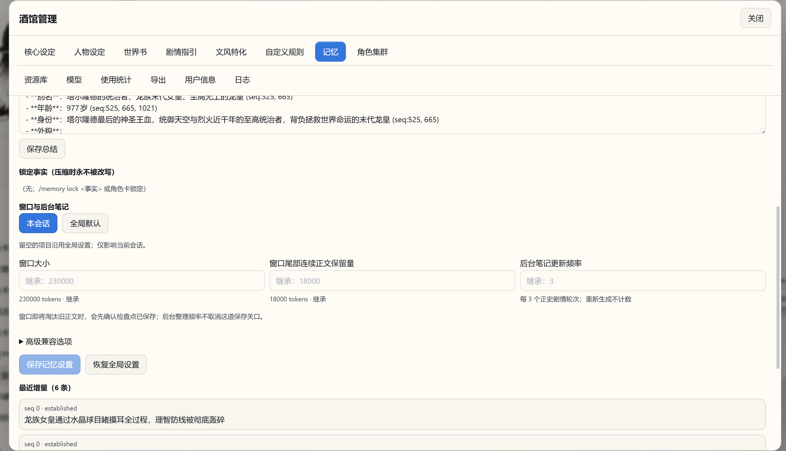

### 多模型分工，多角色独立推演

你可以让正文、后台记忆、读卡、状态与导出任务使用适合的模型，也可以统一跟随主模型；模型设置支持全局默认和当前会话覆盖。

开启**角色 Agent 集群**后，主要人物分别在独立上下文中推演。每个角色可选择模型与思考强度，即使用同一个模型也独立运行。它们获得自己的人设、当前剧情、导演笔记和近期已读取的世界书资料，主代理再综合各方建议推进故事。

想让一场相遇拥有更多角度，就为这段故事开启角色集群。让每个人物带着自己的性格、立场和打算参与推演，再由主代理把碰撞与交锋写成一幕完整的戏。你可以自由选择参与的模型，把协作方式调成自己喜欢的样子。

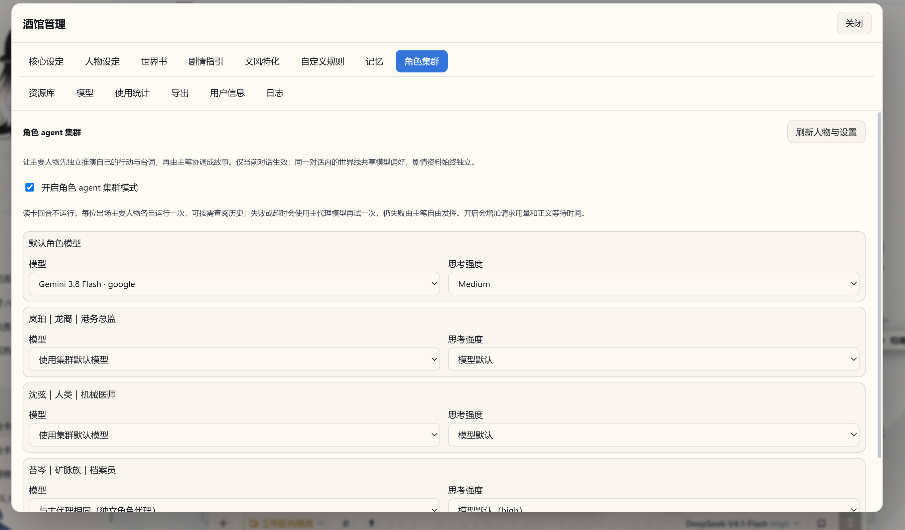

<details>
<summary>查看多模型协同设置</summary>

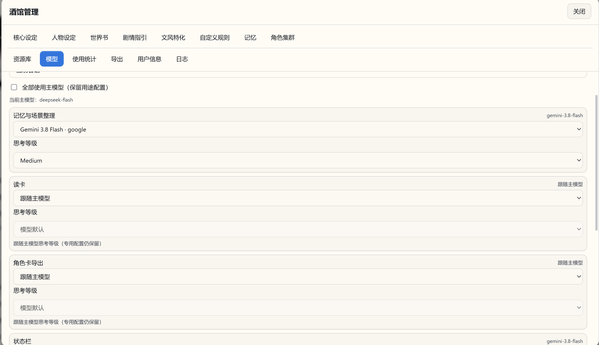

</details>

## 一个故事，多种可能

不满意某段发展，可以重新生成；想改一个选择，可以修改玩家消息后发送。不同版本组成当前对话内的世界线，可以来回切换查看。只有显式选择“在新对话中分支”，才创建独立对话。

小说导出跟随你选中的世界线，便于保留喜欢的故事版本。

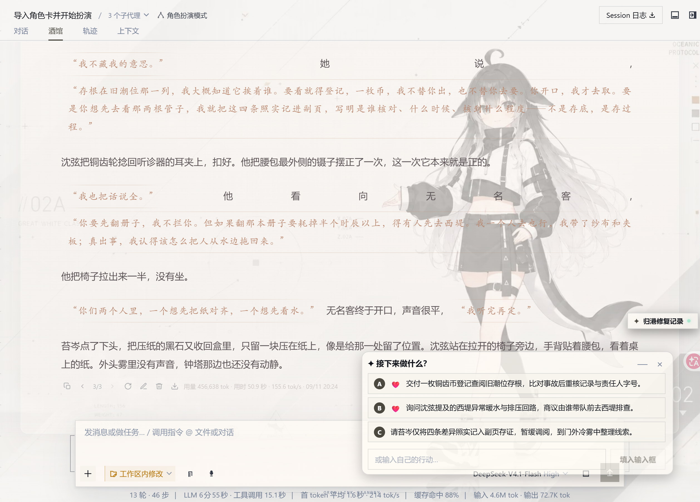

## 按你的方式阅读与创作

在“酒馆管理”中分别调整人物、世界背景、剧情方向、文风和自定义规则。把镜头、节奏与人物边界写进规则，把 HTML/CSS、状态栏和正则美化写进卡片，让不同故事拥有不同的阅读呈现。

正文生成时即可阅读；局后状态与笔记维护有独立进度。继续输入的玩家行动进入原生队列。

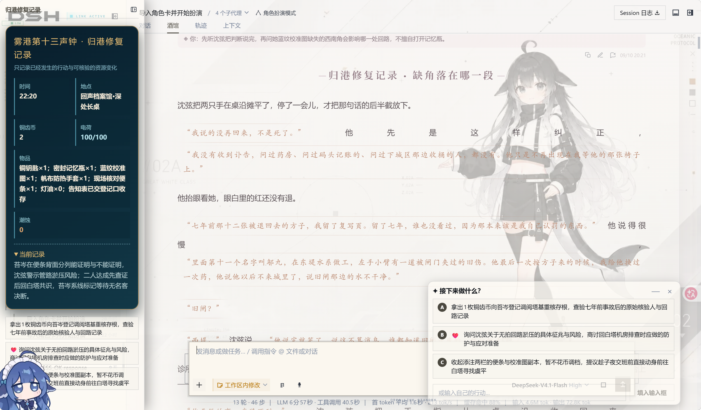

<details>
<summary>查看管理界面、自定义规则与世界书</summary>

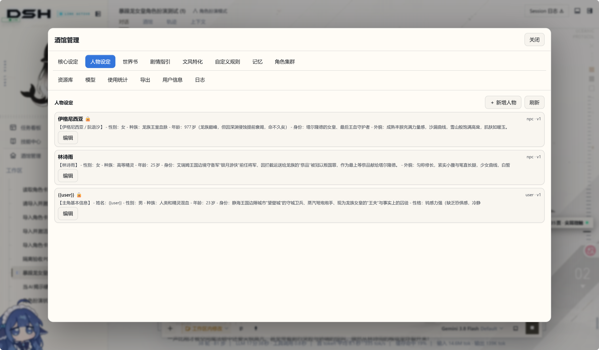

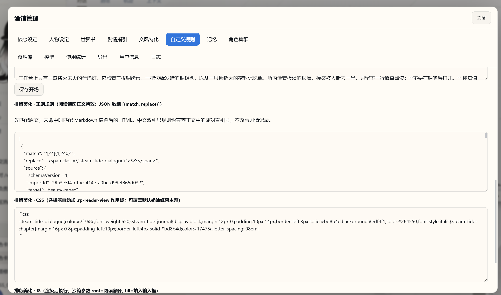

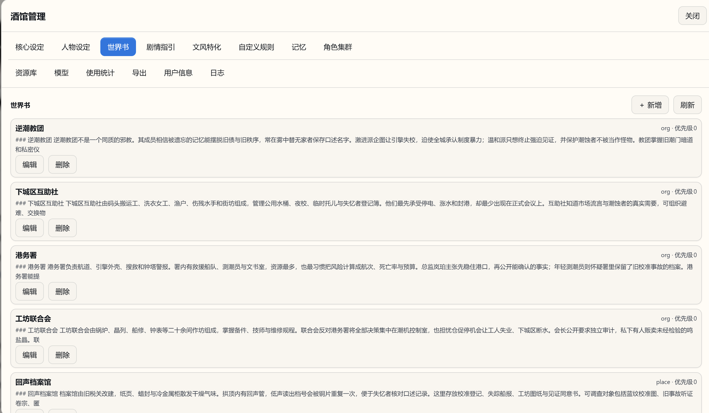

</details>

## 从角色卡的创作到可带走的小说

那些反复推敲的对白、意想不到的转折、终于抵达的结局，都值得成为一份真正的作品。选中你喜欢的世界线，一键整理成小说稿；也可以导出打磨后的完整角色卡，让这个世界继续被阅读、被分享、被创作。

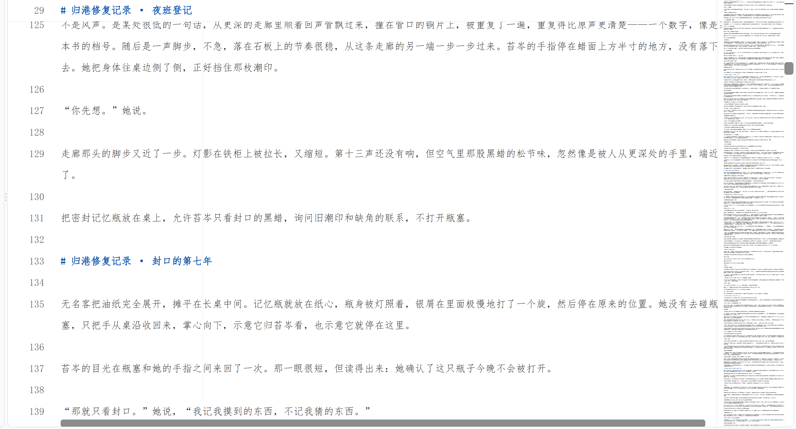

<details>
<summary>查看资源库</summary>

资源库按时间或名称排序，支持刷新、查看文件与下载；角色卡和导出文件保留可识别的主题名称。

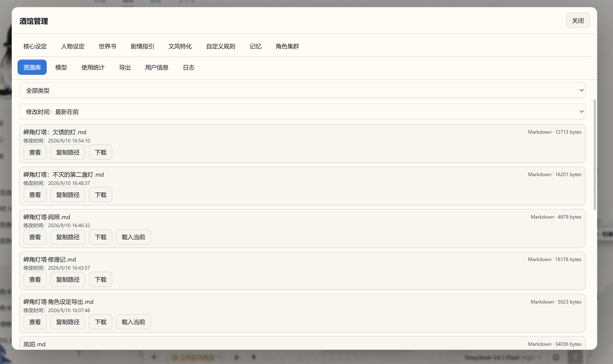

</details>

## 交互式创作：让一个念头长成一个世界

**不必先准备一张完整角色卡，带着想象力来就够了。** 一座永远下雨的港城、一段针锋相对的关系，或只是“我想经历一场慢热的冒险”，都能成为创作的开端。

AI 会和你聊人物、关系、氛围与剧情方向，把你的回答逐步展开成世界背景、多角色人设、开场、文风和阅读排版。你可以亲自雕琢每一处细节，也可以把留白交给它：“你来决定。”从最初的灵感到可以开玩的角色卡，创作本身就是旅程的一部分。

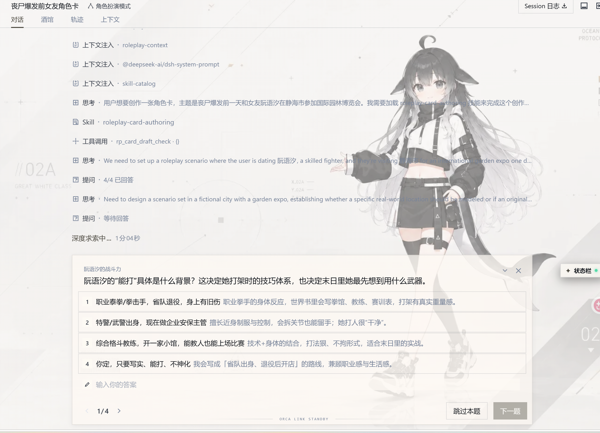

## 用量统计面板：看见每一次创作的投入

**尽情探索，也把模型的表现与开销看清楚。** 请求日志、供应商统计和模型统计集中在同一个面板，按会话、时间与模型切换，就能查看输入输出 tokens、缓存命中率、生成速度和费用。

比较不同模型的创作投入，观察长篇推进时的缓存变化，回看一次重生成或角色集群调用的消耗，都有据可查。支持模型价格倍率、手动单价与币种换算，让你按自己的预算与偏好安排下一段故事。

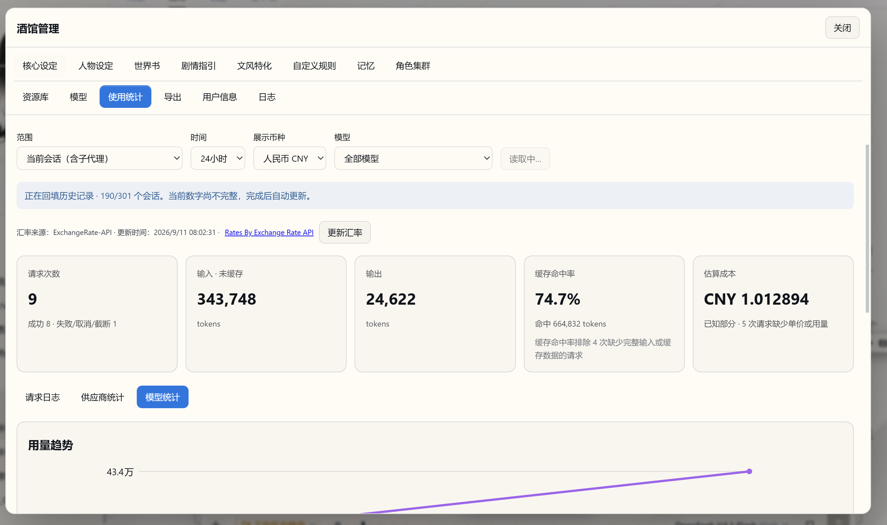

## 下载

- [主包 dsh-nexttavern.tgz](https://github.com/a86582751/dsh-nexttavern/releases/download/v0.1.0/dsh-nexttavern.tgz)，含预构建 UI、源码、preset、参考卡、补丁器及 CLI。
- [独立 dsh-debug.tgz](https://github.com/a86582751/dsh-nexttavern/releases/download/v0.1.0/dsh-debug.tgz)。
- [版本说明与 SHA-256](https://github.com/a86582751/dsh-nexttavern/releases/tag/v0.1.0)。未发布到 npm，不要使用 `npm install dsh-nexttavern`。

## 安装

需要 Node.js 22+、npm、Python 3 和 tgz 解压工具。以下为 PowerShell 7 示例，使用独立的新目录。先下载主包；每条命令成功后再继续。

```powershell
$ReleaseDir = Join-Path $PWD 'nexttavern-release'
$HarnessRoot = Join-Path $PWD 'nexttavern-harness'
$env:DSH_HOME = Join-Path $PWD 'nexttavern-home'
New-Item -ItemType Directory -Path $ReleaseDir,$HarnessRoot -ErrorAction Stop | Out-Null
tar -xzf ./dsh-nexttavern.tgz -C $ReleaseDir
Copy-Item -LiteralPath "$ReleaseDir/package/harness/package.json" -Destination $HarnessRoot
Copy-Item -LiteralPath "$ReleaseDir/package/harness/package-lock.json" -Destination $HarnessRoot
npm ci --prefix $HarnessRoot --ignore-scripts --no-audit --no-fund
node "$HarnessRoot/node_modules/@deepseek-ai/dsh/lib/bin.js" web --dump-config | Out-Null
$ProfileDir = Join-Path $env:DSH_HOME 'profiles/web'
npm install --prefix $ProfileDir --legacy-peer-deps --ignore-scripts --no-audit --no-fund "$PWD/dsh-nexttavern.tgz" "$HarnessRoot/node_modules/@deepseek-ai/dsh-tools"
$PackageRoot = Join-Path $ProfileDir 'node_modules/dsh-nexttavern'
```

随包 Harness 锁文件固定 alpha.3 官方依赖，避免旧 prerelease 的宽范围解析到新版本。本地目录依赖让社区文档工具复用 Harness 的同一个 `dsh-tools` 实例。不要在 profile 中另装不同版本的官方工具注册表。

安装 preset 和修改 Harness 前，停止目标实例，为每次操作选择新的备份目录：

```powershell
node "$PackageRoot/tools/install.mjs" --home $env:DSH_HOME --harness $HarnessRoot
node "$PackageRoot/tools/install.mjs" --home $env:DSH_HOME --harness $HarnessRoot --apply --stopped --backup "$PWD/nexttavern-preset-backup-1"
node "$PackageRoot/tools/patch-harness.mjs" --harness $HarnessRoot
$env:DSH_ALLOW_HARNESS_PATCH = '1'
node "$PackageRoot/tools/patch-harness.mjs" --harness $HarnessRoot --apply --stopped --backup "$PWD/nexttavern-harness-backup-1"
Remove-Item Env:DSH_ALLOW_HARNESS_PATCH
node "$HarnessRoot/node_modules/@deepseek-ai/dsh/lib/bin.js" web --host 127.0.0.1 --port 3510
```

浏览器中配置自己的供应商，选择工作区，在新会话预设菜单中选择“角色扮演模式”。打开角色扮演会话后，可见“酒馆管理”侧栏入口和“酒馆”TAB。未打补丁可以加载插件，但缺少完整 UI slots 和世界线支持，不能当作完整安装。

已有 alpha.3 用户可使用自己的 HarnessRoot/DSH_HOME，先 audit。已有未受安装器管理的 roleplay preset 会被拒绝覆盖；先自行备份和迁移。未知版本或文件指纹会停止，不降级成部分安装。`--stopped` 是你的停机确认，工具不会替你终止服务或会话。

## 文档扩展

上传和 `read_document` 随完整安装提供。anydoc 的 DOCX/PDF 转换与 office 的 DOCX 导出定义和配置入口也随包交付；启用需安装依赖后重新安装 preset：

```powershell
npm install --prefix $ProfileDir --legacy-peer-deps --ignore-scripts --no-audit --no-fund 'https://github.com/a86582751/dsh-plugin-anydoc/releases/download/v0.1.0-nexttavern.1/dsh-plugin-anydoc-0.1.0-nexttavern.1.tgz' '@huiliyi37/dsh-office@0.2.2'
node "$PackageRoot/tools/install.mjs" --home $env:DSH_HOME --harness $HarnessRoot --documents
node "$PackageRoot/tools/install.mjs" --home $env:DSH_HOME --harness $HarnessRoot --documents --apply --stopped --backup "$PWD/nexttavern-documents-backup-1"
```

省略 `--documents` 再安装可关闭这两个挂载，不删除文档。显式启用但缺依赖会报错。文档格式和原生组件受系统支持范围限制；扫描 PDF/OCR 和全部格式未逐一实测。office 的 `docx_read` 有长度上限，完整读卡使用 `read_document` 分页或 anydoc。

## 补丁与依赖来源

| 单元 | 目标版本 | 作用 |
| --- | --- | --- |
| ui-chat | 0.1.2-alpha.3 | slots、动作栏与维护投影 |
| ui-workspace | 0.1.2-alpha.3 | 侧栏 slots、CSS 标识符 |
| token-meter | 0.1.2-alpha.3 | 编辑计量与热路径 |
| session-projection | 0.1.2-alpha.3 | 投影热路径与缺事件恢复 |
| Session Controller | 0.1.2-alpha.3 | 原生 forkPrepared 世界线准备 |
| pi-ai | 0.84.4 | Google、OpenAI Completions/Responses、Anthropic 流终止 |

全部目标先审计并在内存转换，再备份和写入。重复应用精确相同补丁幂等，失败恢复本批改动，中断后可按事务备份回滚。后来被其他升级或用户改动的文件不会被强制覆盖。npm 安装没有 postinstall 补丁。

社区兼容包使用正式 fork，保留上游历史和署名，不能误认作原作者发布：

- [dsh-file-upload](https://github.com/a86582751/dsh-file-upload)，上游 [HongMing-Huang/dsh-file-upload](https://github.com/HongMing-Huang/dsh-file-upload) 0.4.3。修复上传回调、稳定引用、附件关闭不删资源、完整分页和 Markdown 转义；保留原版 Host/origin 检查。
- [anydoc](https://github.com/a86582751/dsh-plugin-anydoc)，上游 [beancookie/dsh-plugin-anydoc](https://github.com/beancookie/dsh-plugin-anydoc) 固定提交的 0.1.0，保守还原 Markdown 转义。
- [pi-ai 差分](https://github.com/a86582751/pi/tree/codex/nexttavern-alpha3/nexttavern-compat)，上游 [earendil-works/pi](https://github.com/earendil-works/pi) 0.84.4。统一补丁器解析 Harness 实际使用的实例，不另装无效的 profile 副本。

`better-sidebar` 不是必需依赖；隔离浏览器验证使用官方侧栏。个人 Access、systemd/Nginx、认证放行和私有模型路由不随包启用。通用 Qwen reasoning 配置辅助工具保留于 integrations，仅在明确配置匹配路由时使用。

## 更新、卸载与回滚

更新先停止实例并备份，核对新版本兼容范围；安装新 tgz 后运行新安装器和补丁 audit。用户改过的受管 preset 文件不会被覆盖，需先保留并核对改动。安装器用 `.nexttavern-install.json` 管理文件。

```powershell
# 卸载 preset 与 bundle 注册，保留故事、资源、笔记和模型配置。
node "$PackageRoot/tools/install.mjs" --home $env:DSH_HOME --harness $HarnessRoot --uninstall --apply --stopped --backup "$PWD/nexttavern-uninstall-backup-1"
# 回滚指定的安装或卸载事务。
node "$PackageRoot/tools/install.mjs" --rollback "$PWD/nexttavern-uninstall-backup-1" --stopped
# 单独恢复原版 Harness，完整酒馆功能随之不可用。
$env:DSH_ALLOW_HARNESS_PATCH = '1'
node "$PackageRoot/tools/patch-harness.mjs" --rollback "$PWD/nexttavern-harness-backup-1" --stopped
Remove-Item Env:DSH_ALLOW_HARNESS_PATCH
```

卸载器不删除 npm 依赖。确认不再使用后可从 profile 移除插件包；其他插件仍依赖的上传/文档工具应保留。回滚仅使用对应实例的原始备份。

## 源码与验证范围

`provenance.json` 记录维护源码提交、逐文件来源、工具版本和 SHA-256。`tools/harness-patches.json` 记录上游固定来源及前后指纹。主仓库不携带完整官方补丁快照。重建 UI：

```powershell
npm ci --prefix ./build-tools --ignore-scripts --no-audit --no-fund
npm run build
```

同一源码和锁文件应重建相同的 lib/client.js。修改源码后需更新自己的版本与 provenance，不可冒充原始 Release。兼容 fork 各有无需维护仓库的独立重建命令和归档摘要。

架构、源码入口与验证记录见[架构说明](ARCHITECTURE.md)。

## 反馈与许可

带着你的世界来，也把体验和想法带回来。[分享反馈与建议](https://github.com/a86582751/dsh-nexttavern/issues)，一起打磨下一段更好的创作旅程。反馈问题时请附版本与复现步骤，并隐去密钥和私密内容。

自有代码以 [MIT](LICENSE) 开源。
