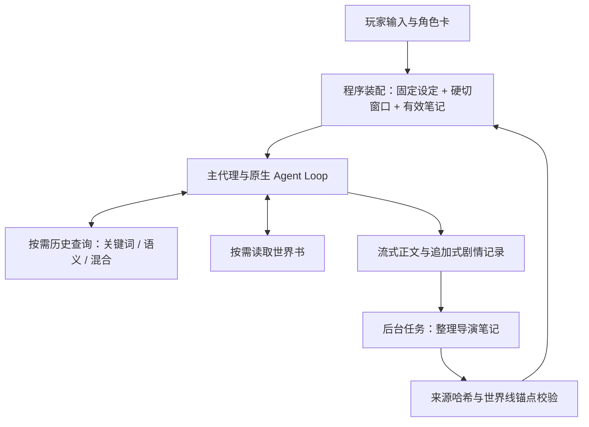
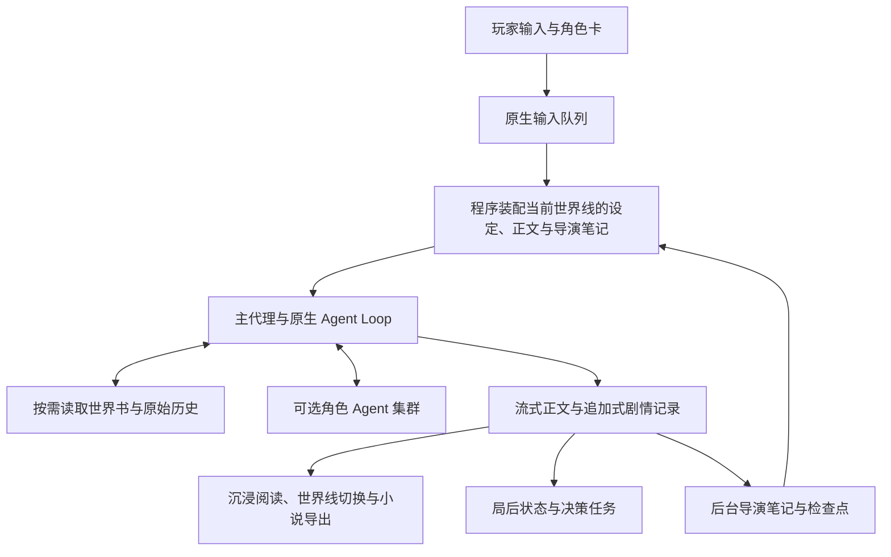

# dsh-NextTavern

**让角色独立推演，让世界随你的选择展开。**

一张角色卡，一个突然冒出的念头，一次不愿妥协的选择，都可以成为故事的起点。dsh-NextTavern 把原生 Agent Loop 带进长篇角色扮演：AI 主动查阅世界、整理记忆、推演人物，你掌握方向，一起把故事写下去。

**创作一个世界，走进它，再把它带走。**

[开始体验](#开始体验) · [一键安装](#一键安装) · [Windows](INSTALL-WINDOWS.md) · [Linux](INSTALL-LINUX.md) · [架构设计](#架构设计) · [记忆系统](#记忆系统) · [核心能力](#核心能力) · [手机电脑公网访问指南](PUBLIC-ACCESS.md) · [全部截图](SCREENSHOTS.md) · [反馈问题](https://github.com/a86582751/dsh-nexttavern/issues/new/choose)


Roleplay workspace for DeepSeek Harness: interactive character creation, on-demand worldbook reading, long-form memory, multi-model collaboration, character agents, branching stories, novel exports and one-click installers.

**0.2.5 预览版** · Harness **0.1.2-alpha.3** · pi-ai **0.84.4** · 自有代码 **MIT**

推荐用[一键安装](#一键安装)开始；想自己控制运行时与补丁，可以按[手动安装](#安装)完成六项兼容补丁配置。

## 一键安装

**不想手动配运行时和补丁？现在有两条一键路径。** 安装器只做“把运行时和工作区准备好”这件事，模型和密钥仍然由你自己决定。

### Windows

下载 [NextTavern-Setup.exe](https://github.com/a86582751/dsh-nexttavern/releases/download/v0.2.5/NextTavern-Setup.exe)（Windows on ARM 设备用 [NextTavern-Setup-arm64.exe](https://github.com/a86582751/dsh-nexttavern/releases/download/v0.2.5/NextTavern-Setup-arm64.exe)），双击，选一个安装目录，然后等待。它会准备便携的 PowerShell 与 Node.js 运行时、按需安装 Microsoft Visual C++ 运行库、建立工作区与启动/停止快捷方式，并在完成后直接打开浏览器。默认安装到 `%LOCALAPPDATA%\NextTavern`，**0.2.5 这一版新增原地升级**：在旧安装上运行新安装器，会保留你的故事、角色卡与设置。完整步骤与注意事项见 [Windows 一键安装指南](INSTALL-WINDOWS.md)。

### Linux

[NextTavern-Setup.sh](https://github.com/a86582751/dsh-nexttavern/releases/download/v0.2.5/NextTavern-Setup.sh) 是本次新增的自包含脚本。它对起点的要求很低：一个 POSIX shell、`curl` 或 `wget`、`tar`，以及一个 SHA-256 工具。脚本自己下载并校验便携 Node.js 运行时，再准备安装目录、桌面入口和启动/停止启动器。支持 x86_64 与 aarch64（glibc），**不需要 root，也不需要系统包管理器**。完整步骤见 [Linux 一键安装指南](INSTALL-LINUX.md)。

### 两条路径共同的部分

| 项目 | 说明 |
| --- | --- |
| **只监听本机** | 本地服务绑定 `127.0.0.1`，端口在 3510–3599 之间自动选择，默认不对局域网或公网开放。 |
| **密钥自己填** | 模型 API Key 由玩家输入并保存在本机；安装包不携带、也不分发任何密钥。 |
| **下载先校验** | 镜像优先的下载来源，逐文件 SHA-256 校验，已校验的文件会被缓存复用。 |
| **中断可续** | 网络失败或中途关闭后重新运行安装器，会跳过已校验的文件继续安装。 |

**两个安装器都只是更省事的入口**：它们产出的 preset 和兼容补丁，与[手动安装](#安装)路径完全一致。想自己控制运行时版本、自己应用补丁，或者需要固定端口，继续看[手动安装](#安装)。

Windows 安装器尚未代码签名，首次运行可能出现 SmartScreen 提示；也没有在全新 Win11 虚拟机和真实 ARM64 设备上验证过。Linux 安装器是 0.2.5 新增，上面列出的架构与发行版即为已测试范围。

## 开始体验

完成[一键安装](#一键安装)（或[手动安装](#安装)）并配置自己的模型后：

1. **新建一个独立工作区。** 为这次角色扮演选择专用文件夹，集中存放角色卡、故事资源和导出文件。
2. **在预设中选择“角色扮演模式”。** 新建会话时，从预设菜单切换到角色扮演，进入你的故事工作台。
3. **上传角色卡，或者交互式创作一张新卡。** 支持 SillyTavern / TauriTavern 的 PNG、JSON 人物卡；也可以直接描述题材、人物、关系和氛围，让 AI 通过对话与你共同完成创作。
4. **开始体验。Enjoy it!** 跟随开场推进故事，输入你的行动，切换世界线，或随时打开“酒馆管理”调整设定。

没有现成角色卡，也可以从这样一句话开始：

> 帮我创作一张蒸汽都市悬疑角色卡。我想扮演刚到港口的调查员，故事慢热，有多方势力，也有人物关系的发展。其他细节你来决定。

告诉 AI 你想遇见怎样的人、经历怎样的故事。你可以一起打磨细节，也可以说“你来决定”，让它带着世界、人设、开场与文风继续创作。DOCX/PDF 读卡可通过[文档扩展](#文档扩展)启用。手边只有一部长篇小说？也可以直接让它读成一张卡，见[长文本转角色卡](#长文本转角色卡)。

### 导入 SillyTavern / TauriTavern 人物卡

直接上传原始卡文件，然后告诉 AI：**“读取这张角色卡，准备开始角色扮演。”** 无需自己解码，也无需手动填写导入工具参数。

| 格式 | 支持范围 |
| --- | --- |
| **PNG 人物卡** | 从 `chara` / `ccv3` 的 `tEXt` 块读取 Base64 编码的角色数据；两者同时存在时优先读取 `ccv3`。 |
| **JSON 人物卡** | 识别 v1、v2（`chara_card_v2`）和 v3（`chara_card_v3`）。 |
| **内嵌世界书** | 读取 `character_book`，按当前导入流程审阅并映射到设定与世界书。 |

请选择保留元数据的原始 PNG 卡，普通头像、截图或被移除元数据的图片不含可导入的角色数据。PNG/JSON 解析是内置能力，不需要 anydoc；上传入口随完整安装提供。

导入后继续打磨人物、世界书与创作规则，原始卡片和扩展数据也会一并保留。卡片里的三个文风字段会被完整保留，怎么与预设配合由你决定，见[预设系统](#预设系统)。

## 记忆系统

故事越写越长，人物的经历、埋下的伏笔和未完成的约定也在积累。NextTavern 借鉴 Codex 类长任务的上下文管理思路，把长篇记忆拆成四件各有边界的事：**固定设定不压缩始终注入 + 有尾部保留的上下文硬切窗口 + 可追溯来源的后台导演笔记 + 关键词和语义混合历史上下文查询召回。**

| 支柱 | 它做什么 | 为什么这样设计 |
| --- | --- | --- |
| **固定设定不压缩，始终注入** | 冻结的设定与系统前缀每轮都在场，从不进入压缩流程。 | 身份、作者规则和叙事约束是长期契约，不该被一段摘要替换。 |
| **硬切窗口 + 尾部保留** | 程序按完整正文边界推进上下文窗口，并在推进时保留尾部连续正文。 | 近期正文保持完整细节，你正在读的那一段不会因为切窗口而丢失，也不会在场景中途被摘要掉。 |
| **可追溯来源的后台导演笔记** | 由独立的后台任务撰写，每条笔记带来源哈希与同一世界线锚点。 | 来源可以被机器校验：任何一条笔记都能追回到产生它的正文。悬空引用与未知的旧格式不会被猜测，追加式原始历史从不删除。 |
| **关键词和语义混合的历史召回** | 主代理按需查询历史，三种方式：**关键词（默认）／语义／混合**。 | 需要旧细节时再回查原文，而不是每轮都先强制召回一次。 |



### 三种查询方式，同一份语料

查询的语料是**玩家输入与有效剧情正文**，包含已经归档或被淘汰的正文；状态、工具输出、CSS、决策卡和推理过程不进入语料。

| 方式 | 谁来算 | 什么时候用 |
| --- | --- | --- |
| **关键词（默认）** | 程序确定性匹配，不调用模型。 | 想找明确的词句、人名、地名时最快。 |
| **语义** | 需要嵌入模型把查询编码成向量。 | 只记得大意、不记得原话时更有效。 |
| **混合** | 关键词与向量结果一起排序。 | 兼顾精确命中与语义相近。 |

向量是派生的共享数据，在查询时过滤到**当前世界线**：切换世界线不需要重建索引。向量配方会按模型、修订、维度、任务角色、池化方式、量化与运行时生成指纹；指纹不一致会把索引标记为 `stale` 并停止对外服务，直到重建为止——宁可提示重建，也不静默给出错误答案。分块大小全局可配置，默认 480 字符（192／480／960 选项，128–2048 区间，80 重叠），本地模型使用 512 的分词预算。清空、重建与填充都限定在当前可见对话及其全部世界线，清空会保留正文、来源和账本。


### 旧笔记与旧状态不再随每次请求发送

旧导演笔记与旧状态快照曾经随每次请求一起走（约 52k 字符）。现在它们只在**准备好有效的新锚点之后**才被替换：没有被替换的引用保持原有精确内容，回滚时重新提供完整文本，原始事件始终是追加式的。一次十回合实测中发现并修复了两个真实缺陷——一段被压缩的维护后缀让旧任务无法被回收，以及旧导演笔记与状态快照的无界堆积。

同样的“先确认再替换”也用在长工具结果上：一条研究笔记被确认后，很长的工具结果会被替换成匹配的检查点，但前提是归属、来源哈希、generation 与 packetIds 全部一致。部分保存、来源不符、写入失败以及确认后重新读取的场合都不回收。

### 这些都可以按会话调整

窗口大小、尾部保留量和后台笔记更新频率支持全局默认与会话覆盖，留空就沿用全局设置。截图里能看到的一组实际取值：

| 设置 | 含义 |
| --- | --- |
| **窗口大小** | 当前窗口的正文预算，按你实际使用的模型上下文容量来配。 |
| **窗口尾部连续正文保留量** | 切窗口时必须留住的近期正文，保证你正在读的那一段完整。 |
| **后台笔记更新频率** | 每多少个新增正史剧情轮次整理一次；重生成不计入。 |
| **记忆检索方式** | 关键词／语义／混合，以及应用到哪些会话。 |

切换检索方式不会删除已有索引。窗口即将淘汰旧正文时，会先确认检查点已保存，后台整理频率不会取消这道保存关口。

换一条世界线，就带着那条路线的经历继续向前；反复打磨同一幕，记忆会跟随你选中的版本。章节交接前，系统会先把需要延续的故事线索整理妥当。

### 一条要说明白的边界

**程序提供稳定的设定、窗口和笔记，主代理按需查询历史与世界书；不会在每轮正文前强制增加一次模型召回。** 窗口装配、来源校验、笔记淘汰和原文回收都是程序确定性完成的，本身不产生模型请求；只有主代理真的决定去查历史时，才按你选的方式付出一次查询代价（语义与混合方式还需要嵌入模型，见[嵌入模型](#嵌入模型)）。


## 预设系统

文风不再只能靠改卡片。管理界面新增独立的**预设页（位于资源库之前）**，可以新建、编辑、另存副本、选用和删除；自带预设只读，自定义预设提供 200 个槽位。

| 维度 | 可选值 | 含义 |
| --- | --- | --- |
| **作用范围** | 当前对话／指定对话／全局 | 同一对话的全部世界线共享这次覆盖；留空就沿用全局设置。 |
| **文风模式** | 前景系统美学（默认）／与卡片文风融合／仅卡片文风 | 前两种同时注入预设与卡片文风，冲突时预设优先；第三种只使用卡片文风。 |

预设库由所有对话共享，所以编辑一个正在被使用的预设，会影响使用它的对话后续生成——界面会明确提示这一点。存储是带版本的，使用单一锁与整配置修订 CAS：并发修改返回冲突并且**保留你的草稿**，不会静默覆盖。

卡片导入、编辑、导出与持久化都保留三个卡片文风字段，排除发生在故事上下文装配阶段，原始卡片不被改写。

**自带 16 种文风。** 除了默认预设和空白预设，还准备了 14 种可直接选用的写作风格：日式轻小说、乙女风格、三体文风、日式游戏、电影感文风、春秋文风、极简文风、细腻文风、奇幻网文风、恐怖文风、鲁迅文风、抒情文风、日常搞笑风、古文文风。每一种都有完整的七段式指南和原创示例，不是只有一句风格描述。


<details>
<summary>查看自带文风预设库</summary>


</details>

## 长文本转角色卡

手边有一部长篇小说，想把它变成能玩的世界？管理界面新增**「长文本转角色卡」TAB（位于角色集群之后）**。它做的不只是总结：**读过什么、笔记记在哪、卡片里的话有没有原文依据，都要能对得上。**

**两种阅读方式，在研究开始前选择。**

- **精读（默认）**：分段逐段完整阅读，每一段都留下带原文引证的研究笔记。
- **粗颗粒度**：围绕人物、组织与事件面做多轮关系前沿检索，再做主角的纵向追踪。它**需要**一个可用的小说模型和完整的当前索引；条件不满足时，界面会引导你先把配置补上并结束本轮，不会悄悄降级成另一种模式。

**原文先冻结。** 工作区 TXT 上限 64 MB，按 UTF-8 → GB18030 → 带 BOM 感知的 UTF-16 依次尝试解码，记录原始字节哈希、解码文本哈希与大小，并且从不修改你上传的原文件。分段是确定性的，批次大小被限制在原生切分器之下。

**笔记要有证据。** 一条研究笔记成立的条件是：这一批确实被读过，而且引用的原话确实出现在这一批里。笔记分事实／改编机会／未决问题三节；检索命中不会推进“已读”的覆盖记账。

**小说有自己的索引。** 它和故事记忆的语义索引分开，小说模型也可以与故事记忆模型分开配置。相同的原始哈希复用研究基线，相同配方复用向量——同一部原著可以服务多张卡、多个对话。

可引用的实测数据：一部约 119 万字符的长篇网络小说（前 354 章）建立了 3027 条在线向量，程序为等待索引完成挂起约 292 秒；交付角色卡与打开导入是两个独立回合，开场输入约 52k tokens。改编复用与交互式创作相同的问卷和十二项写卡检查。

诚实的边界：粗颗粒度的证据覆盖**不等于**理解了每个细节，实测中仍观察到个别事实写错，人工质量复核仍然必要。


## 嵌入模型

语义与混合检索需要向量，所以管理界面增加了一个独立的**嵌入模型页（位于模型与使用统计之间）**。

**在线接入。** 支持 DashScope、OpenAI 兼容接口和 OpenAI 官方：模型列表可刷新，也可以手动填写模型 ID，密钥只保存在服务端，并提供连接测试。

**本地接入。** 已验证五种本地模型：**BGE small zh、Qwen3-Embedding 0.6B、Jina Nano、Jina Small INT8、Nomic q8**，在独立编码进程中使用 ONNX Runtime 1.29.0 运行。下载显示真实字节进度、速度与预计剩余时间，支持暂停／取消／继续，并有 `queued → downloading → verifying → preparing-runtime → self-testing → installed` 的安装状态机。**本地推理不需要 API Key，也不需要网络。**

真实的索引／查询／测试／重试都会进入既有的用量统计。未知价格保持 **N/A**，失败不会虚构 token 数。

**实测到的边界，一并说明：** BGE 速度快但跨语言能力较弱；Qwen 在长正文上构建索引更慢；5 万条分块的扫描已经接近检索时限。合成评估不等于人工标注，也不构成长期质量保证。


## 角色集群

开启**角色 Agent 集群**后，主要人物分别在独立上下文中推演。每个角色可选择模型与思考强度，即使用同一个模型也独立运行。它们获得自己的人设、当前剧情、导演笔记和近期已读取的世界书资料，主代理再综合各方建议推进故事。

模型配置分两级：**全局默认模型 + 单角色覆盖**。单角色覆盖属于当前可见对话，并与其世界线共用；但每个实际世界线的输入与结果仍然互相隔离，共享偏好不等于共享剧情历史。

同时修好了几处使用体验：后台子代理不再被列为可选择的会话，保存时的草稿丢失、资源和导出回复过期、任务操作重复提交等问题都已处理。

想让一场相遇拥有更多角度，就为这段故事开启角色集群。让每个人物带着自己的性格、立场和打算参与推演，再由主代理把碰撞与交锋写成一幕完整的戏。


## 状态栏与决策卡

**行动建议只出现在独立决策卡里**，不再重复塞进状态栏或正文尾部。旧卡片里遗留的行动区域会被隐藏，但原卡本身一个字都不改。

决策卡现在有自己的操作：**折叠／恢复（⌃ / —）**、独立的 **× 稍后处理**、拖动移动，双击或按 Home 复位，可视高度有上限，不会吃掉整个屏幕。

渲染层面也顺手修了一批：作者写的状态 HTML/CSS 在导入、生成和旧数据恢复三条路径上都会被校验并保留；围栏状态样式与不透明面板恢复；状态面板撑满可用高度同时保留内部滚动；折叠后的侧栏重新展开按钮保持可见。状态模板的动态槽位可以接收真实数值，同时保留作者原有的 HTML/CSS/JS 结构；任务校验失败会带上结构化诊断、失败时间和重试指引。


## 全新自有皮肤

0.2.5 带来了项目**第一套自有皮肤 `dsh-nexttavern-amber`**，用同一套设计 token 重绘了整个界面，并且有**日间与夜间两套主题**：侧栏那位坐在 NextTavern 木牌上的 Q 版酒馆看板娘，在日夜主题下是两张不同的画。夜间主题的酒馆阅读模式铺在陈旧羊皮纸质感上，作者自己的墨色保持不变。

同时做了一轮第三方皮肤清理：删掉一个 82.6 MB 的单体皮肤包，移除皮肤中心，18 个包缩减为 4 个保留但停用；一个第三方余额组件也已停用（它当时是最大的请求来源）。

空状态标题的打字机效果只接管标题文字本身，原生字符串和“预览版”角标都不受影响。


## 架构设计

写长篇，需要沿途积累的记忆、可随时翻阅的世界资料，也需要人物各自的动机。NextTavern 将这些能力连接进原生 Agent Loop：**主代理推进叙事，记忆代理整理长线，角色代理独立推演，程序把当前故事需要的上下文准备好。** 从读卡、开场到分支与导出，整个创作过程由这套架构贯穿。



五个设计，贯穿你的每一次创作：

1. **让 AI 主动探索世界。** 当前设定、正文和笔记随时可用；需要世界知识或早期细节时，主代理自己查阅资料，再把发现融入故事。
2. **给长篇一套会整理的记忆。** 固定设定始终在场，近期正文保留眼前细节，导演笔记承接长线，历史查询让旧事有迹可循。从当前场景到早期伏笔，信息各有归处。
3. **把“换一种选择”变成真正的世界线。** 重写一句行动，重新生成一次回应，就能沿另一条路线继续。每条世界线保留自己的剧情、状态与记忆，也能单独导出。
4. **让不同角色带着自己的想法登场。** 角色分别推演，主代理综合他们的行动与意图；记忆、状态、读写卡等工作还能交给不同模型协作完成。
5. **让阅读跟上灵感。** 正文边写边读，状态与笔记随后整理。你可以继续酝酿下一步行动，让创作自然衔接。

[阅读完整架构说明：上下文组成、记忆四支柱、预设作用域、长文本流水线、请求成本与验证边界](ARCHITECTURE.md)

## 核心能力

| 能力 | 你可以获得什么 |
| --- | --- |
| **一键安装** | Windows 与 Linux 两个自包含安装器：便携运行时、工作区、快捷方式与镜像优先的校验下载，Windows 支持原地升级。 |
| **SillyTavern / TauriTavern 卡片导入** | 直接读取 PNG `chara`/`ccv3` 和 JSON v1/v2/v3 人物卡，保留原件并支持内嵌世界书。 |
| **主动读取世界书** | 主代理根据当前剧情按需查阅地点、势力和背景细节，让世界书作为可查询的设定库参与叙事。 |
| **固定设定 + 硬切窗口 + 导演笔记 + 混合检索** | 固定设定不压缩始终注入；窗口保留近期完整正文与尾部衔接；后台笔记带来源哈希与世界线锚点；历史召回支持关键词／语义／混合三种方式。 |
| **嵌入模型管理** | 在线接入 DashScope、OpenAI 兼容接口与 OpenAI 官方；本地可安装 BGE small zh、Qwen3-Embedding 0.6B、Jina Nano／Small INT8、Nomic q8，无需 Key 与网络。 |
| **预设与文风系统** | 独立预设页，作用范围可选当前对话／指定对话／全局，三种文风模式，16 种自带文风，200 个自定义槽位。 |
| **长文本转角色卡** | 把长篇 TXT 读成一张可玩的角色卡：精读或粗颗粒度两种阅读方式、原文冻结与哈希、证据门控的研究笔记、独立的语义索引。 |
| **多模型协同** | 为正文与记忆、读写卡、状态、决策、小说导出等任务配置模型路由，按需要分工。 |
| **多角色 Agent 集群** | 为主要角色启动独立推演，分别思考语言、行为与意图，再由主代理协调成最终故事；支持单角色模型覆盖。 |
| **对话分支管理** | 重新生成、修改后发送、切换版本，在同一对话里探索不同世界线；也可显式分支到新对话。 |
| **决策卡与状态栏** | 行动建议集中在独立决策卡，可折叠、可稍后处理、可拖动；作者的状态 HTML/CSS 在导入、生成与恢复路径上都被保留。 |
| **自有皮肤** | 第一套自有皮肤，日间／夜间双主题，整界面重绘并清理第三方皮肤依赖。 |
| **自定义创作规则** | 分别管理核心设定、人物、世界书、剧情指引、文风与规则，控制视角、节奏、人物知情边界和回复展开方式。 |
| **HTML/CSS 阅读美化** | 通过角色卡中的 HTML/CSS、状态栏模板与正则规则定制阅读呈现，正文支持流式阅读；作者脚本在受限环境中运行。 |
| **资源库管理** | 集中查看角色卡、故事相关文件与导出结果，按时间或名称排序、刷新和下载。 |
| **模型用量与缓存统计** | 按会话、供应商或模型查看请求、输入输出 tokens、缓存、速度与已知成本，包含重生成、嵌入调用和失败尝试。 |
| **交互式全新角色卡创作** | 从一个想法开始，通过交流逐步构建世界、多角色人设、开场、文风和排版，并经过十二项完整性检查。 |
| **小说稿一键导出** | 将选定世界线整理成小说稿；也能导出当前完整角色卡，结果进入资源库供下载。 |

## 多模型分工与多角色推演

你可以让正文、后台记忆、读卡、状态与导出任务使用适合的模型，也可以统一跟随主模型；模型设置支持全局默认和当前会话覆盖。

<details>
<summary>查看多模型协同设置</summary>


</details>

## 世界线与分支

不满意某段发展，可以重新生成；想改一个选择，可以修改玩家消息后发送。不同版本组成当前对话内的世界线，可以来回切换查看。只有显式选择“在新对话中分支”，才创建独立对话。

每条世界线有自己的剧情、状态与记忆；笔记属于实际世界线，而角色的模型偏好与向量索引按对话或查询世界线共享。小说导出跟随你选中的世界线，便于保留喜欢的故事版本。


## 按你的方式阅读与创作

在“酒馆管理”中分别调整人物、世界背景、剧情方向、文风和自定义规则。把镜头、节奏与人物边界写进规则，把 HTML/CSS、状态栏和正则美化写进卡片，让不同故事拥有不同的阅读呈现。

正文生成时即可阅读；局后状态与笔记维护有独立进度。继续输入的玩家行动进入原生队列。


<details>
<summary>查看管理界面、自定义规则与世界书</summary>


</details>

## 从角色卡到可带走的小说

那些反复推敲的对白、意想不到的转折、终于抵达的结局，都值得成为一份真正的作品。选中你喜欢的世界线，一键整理成小说稿；也可以导出打磨后的完整角色卡，让这个世界继续被阅读、被分享、被创作。


<details>
<summary>查看资源库</summary>

资源库按时间或名称排序，支持刷新、查看文件与下载；角色卡和导出文件保留可识别的主题名称。


</details>

## 交互式创作

**不必先准备一张完整角色卡，带着想象力来就够了。** 一座永远下雨的港城、一段针锋相对的关系，或只是“我想经历一场慢热的冒险”，都能成为创作的开端。

AI 会和你聊人物、关系、氛围与剧情方向，把你的回答逐步展开成世界背景、多角色人设、开场、文风和阅读排版，再用十二项完整性检查过一遍。你可以亲自雕琢每一处细节，也可以把留白交给它：“你来决定。”从最初的灵感到可以开玩的角色卡，创作本身就是旅程的一部分。


## 用量统计

**尽情探索，也把模型的表现与开销看清楚。** 请求日志、供应商统计和模型统计集中在同一个面板，按会话、时间与模型切换，就能查看输入输出 tokens、缓存命中率、生成速度和费用。嵌入模型的索引、查询、测试与重试也计入同一份统计。

比较不同模型的创作投入，观察长篇推进时的缓存变化，回看一次重生成或角色集群调用的消耗，都有据可查。支持模型价格倍率、手动单价与币种换算，让你按自己的预算与偏好安排下一段故事。


## 下载

- [主包 dsh-nexttavern.tgz](https://github.com/a86582751/dsh-nexttavern/releases/download/v0.2.5/dsh-nexttavern.tgz)，含预构建 UI、源码、preset、参考卡、补丁器、CLI 和可选公网鉴权源包。
- [独立 dsh-debug.tgz](https://github.com/a86582751/dsh-nexttavern/releases/download/v0.2.5/dsh-debug.tgz)。
- [公网鉴权插件 dsh-auth-webserver.tgz](https://github.com/a86582751/dsh-nexttavern/releases/download/v0.2.5/dsh-auth-webserver.tgz)，安装步骤见[手机电脑公网访问指南](PUBLIC-ACCESS.md)。

一键安装器：

- [NextTavern-Setup.exe](https://github.com/a86582751/dsh-nexttavern/releases/download/v0.2.5/NextTavern-Setup.exe)（Windows x64）
- [NextTavern-Setup-arm64.exe](https://github.com/a86582751/dsh-nexttavern/releases/download/v0.2.5/NextTavern-Setup-arm64.exe)（Windows on ARM）
- [NextTavern-Setup.sh](https://github.com/a86582751/dsh-nexttavern/releases/download/v0.2.5/NextTavern-Setup.sh)（Linux，x86_64 / aarch64）
- [nexttavern-setup.tgz](https://github.com/a86582751/dsh-nexttavern/releases/download/v0.2.5/nexttavern-setup.tgz)（安装器的 npm 归档）

校验与来源：

- [SHA256SUMS](https://github.com/a86582751/dsh-nexttavern/releases/download/v0.2.5/SHA256SUMS) 与 [provenance.json](https://github.com/a86582751/dsh-nexttavern/releases/download/v0.2.5/provenance.json)
- [版本说明](https://github.com/a86582751/dsh-nexttavern/releases/tag/v0.2.5)。未发布到 npm，不要使用 `npm install dsh-nexttavern`。

## 安装

一键安装器已经覆盖了绝大多数玩家的场景；这一节是**手动路径**，适合想自己控制运行时版本、自己应用补丁、需要固定端口，或者要接进自己运维流程的用户。

需要 Node.js 22+、npm、Python 3 和 tgz 解压工具。以下为 PowerShell 7 示例，使用独立的新目录。先下载主包；每条命令成功后再继续。

```powershell
$ReleaseDir = Join-Path $PWD 'nexttavern-release'
$HarnessRoot = Join-Path $PWD 'nexttavern-harness'
$env:DSH_HOME = Join-Path $PWD 'nexttavern-home'
New-Item -ItemType Directory -Path $ReleaseDir,$HarnessRoot -ErrorAction Stop | Out-Null
tar -xzf ./dsh-nexttavern.tgz -C $ReleaseDir
Copy-Item -LiteralPath "$ReleaseDir/package/harness/package.json" -Destination $HarnessRoot
Copy-Item -LiteralPath "$ReleaseDir/package/harness/package-lock.json" -Destination $HarnessRoot
npm ci --prefix $HarnessRoot --ignore-scripts --no-audit --no-fund
node "$HarnessRoot/node_modules/@deepseek-ai/dsh/lib/bin.js" web --dump-config | Out-Null
$ProfileDir = Join-Path $env:DSH_HOME 'profiles/web'
npm install --prefix $ProfileDir --legacy-peer-deps --ignore-scripts --no-audit --no-fund "$PWD/dsh-nexttavern.tgz" "$HarnessRoot/node_modules/@deepseek-ai/dsh-tools"
$PackageRoot = Join-Path $ProfileDir 'node_modules/dsh-nexttavern'
```

随包 Harness 锁文件固定 alpha.3 官方依赖，避免旧 prerelease 的宽范围解析到新版本。本地目录依赖让社区文档工具复用 Harness 的同一个 `dsh-tools` 实例；不要在 profile 中另装不同版本的官方工具注册表。

安装 preset 和修改 Harness 前，停止目标实例，为每次操作选择新的备份目录：

```powershell
node "$PackageRoot/tools/install.mjs" --home $env:DSH_HOME --harness $HarnessRoot
node "$PackageRoot/tools/install.mjs" --home $env:DSH_HOME --harness $HarnessRoot --apply --stopped --backup "$PWD/nexttavern-preset-backup-1"
node "$PackageRoot/tools/patch-harness.mjs" --harness $HarnessRoot
$env:DSH_ALLOW_HARNESS_PATCH = '1'
node "$PackageRoot/tools/patch-harness.mjs" --harness $HarnessRoot --apply --stopped --backup "$PWD/nexttavern-harness-backup-1"
Remove-Item Env:DSH_ALLOW_HARNESS_PATCH
node "$HarnessRoot/node_modules/@deepseek-ai/dsh/lib/bin.js" web --host 127.0.0.1 --port 3510
```

浏览器中配置自己的供应商，选择工作区，在新会话预设菜单中选择“角色扮演模式”。打开角色扮演会话后，可见“酒馆管理”侧栏入口和“酒馆”TAB。未打补丁可以加载插件，但缺少完整 UI slots 和世界线支持，不能当作完整安装。

已有 alpha.3 用户可使用自己的 HarnessRoot/DSH_HOME，先 audit。已有未受安装器管理的 roleplay preset 会被拒绝覆盖；先自行备份和迁移。未知版本或文件指纹会停止，不降级成部分安装。`--stopped` 是你的停机确认，工具不会替你终止服务或会话。

## 文档扩展

上传和 `read_document` 随完整安装提供。anydoc 的 DOCX/PDF 转换与 office 的 DOCX 导出定义和配置入口也随包交付；启用需安装依赖后重新安装 preset：

```powershell
npm install --prefix $ProfileDir --legacy-peer-deps --ignore-scripts --no-audit --no-fund 'https://github.com/a86582751/dsh-plugin-anydoc/releases/download/v0.1.0-nexttavern.1/dsh-plugin-anydoc-0.1.0-nexttavern.1.tgz' '@huiliyi37/dsh-office@0.2.2'
node "$PackageRoot/tools/install.mjs" --home $env:DSH_HOME --harness $HarnessRoot --documents
node "$PackageRoot/tools/install.mjs" --home $env:DSH_HOME --harness $HarnessRoot --documents --apply --stopped --backup "$PWD/nexttavern-documents-backup-1"
```

省略 `--documents` 再安装可关闭这两个挂载，不删除文档。显式启用但缺依赖会报错。文档格式和原生组件受系统支持范围限制；扫描 PDF/OCR 和全部格式未逐一实测。office 的 `docx_read` 有长度上限，完整读卡使用 `read_document` 分页或 anydoc。长文本转角色卡读的是工作区 TXT，不依赖这一节的扩展。

## 补丁与依赖来源

| 单元 | 目标版本 | 作用 |
| --- | --- | --- |
| ui-chat | 0.1.2-alpha.3 | slots、动作栏与维护投影 |
| ui-workspace | 0.1.2-alpha.3 | 侧栏 slots、CSS 标识符 |
| token-meter | 0.1.2-alpha.3 | 编辑计量与热路径 |
| session-projection | 0.1.2-alpha.3 | 投影热路径与缺事件恢复 |
| Session Controller | 0.1.2-alpha.3 | 原生 forkPrepared 世界线准备 |
| pi-ai | 0.84.4 | Google、OpenAI Completions/Responses、Anthropic 流终止 |

全部目标先审计并在内存转换，再备份和写入。重复应用精确相同补丁幂等，失败恢复本批改动，中断后可按事务备份回滚。后来被其他升级或用户改动的文件不会被强制覆盖。npm 安装没有 postinstall 补丁。

社区兼容包使用正式 fork，保留上游历史和署名，不能误认作原作者发布：

- [dsh-file-upload](https://github.com/a86582751/dsh-file-upload)，上游 [HongMing-Huang/dsh-file-upload](https://github.com/HongMing-Huang/dsh-file-upload) 0.4.3。修复上传回调、稳定引用、附件关闭不删资源、完整分页和 Markdown 转义；基础包保留原版 Host 检查。显式安装公网兼容后，额外接受鉴权插件完成 JWT 与 Origin 校验后写入的服务器标记。
- [anydoc](https://github.com/a86582751/dsh-plugin-anydoc)，上游 [beancookie/dsh-plugin-anydoc](https://github.com/beancookie/dsh-plugin-anydoc) 固定提交的 0.1.0，保守还原 Markdown 转义。
- [pi-ai 差分](https://github.com/a86582751/pi/tree/codex/nexttavern-alpha3/nexttavern-compat)，上游 [earendil-works/pi](https://github.com/earendil-works/pi) 0.84.4。统一补丁器解析 Harness 实际使用的实例，不另装无效的 profile 副本。

`better-sidebar` 不是必需依赖；隔离浏览器验证使用官方侧栏。公网玩家可按[手机电脑公网访问指南](PUBLIC-ACCESS.md)显式安装随包提供的 `@isund/dsh-auth-webserver`（0.1.0-alpha.3.2），配置自己的 Cloudflare Access、域名和登录身份。鉴权源码、脱敏模板、三个可回滚的公网兼容选项均已交付；默认本机安装不自动开放网络。个人密钥、地址、systemd/Nginx 实例配置和私有模型路由不随包分发。通用 Qwen reasoning 配置辅助工具保留于 integrations，仅在明确配置匹配路由时使用。

## 更新、卸载与回滚

用一键安装器的玩家，更新就是在旧安装上运行新安装器（Windows 支持原地升级，保留故事与设置）；卸载则在停止服务后删除安装目录和快捷方式。细节见 [Windows](INSTALL-WINDOWS.md#卸载与回滚) 与 [Linux](INSTALL-LINUX.md#卸载与回滚) 指南。

手动安装的更新流程：先停止实例并备份，核对新版本兼容范围；安装新 tgz 后运行新安装器和补丁 audit。用户改过的受管 preset 文件不会被覆盖，需先保留并核对改动。安装器用 `.nexttavern-install.json` 管理文件。

```powershell
# 卸载 preset 与 bundle 注册，保留故事、资源、笔记和模型配置。
node "$PackageRoot/tools/install.mjs" --home $env:DSH_HOME --harness $HarnessRoot --uninstall --apply --stopped --backup "$PWD/nexttavern-uninstall-backup-1"
# 回滚指定的安装或卸载事务。
node "$PackageRoot/tools/install.mjs" --rollback "$PWD/nexttavern-uninstall-backup-1" --stopped
# 单独恢复原版 Harness，完整酒馆功能随之不可用。
$env:DSH_ALLOW_HARNESS_PATCH = '1'
node "$PackageRoot/tools/patch-harness.mjs" --rollback "$PWD/nexttavern-harness-backup-1" --stopped
Remove-Item Env:DSH_ALLOW_HARNESS_PATCH
```

卸载器不删除 npm 依赖。确认不再使用后可从 profile 移除插件包；其他插件仍依赖的上传/文档工具应保留。回滚仅使用对应实例的原始备份。

## 源码与验证范围

**TypeScript 是唯一维护源码。** 手写 `.ts` / `.mts`，`.js` / `.mjs` 由共享构建清单经 TypeScript 5.9.3 生成；本版发布包含 637 个构建产物、24 个 schema 和 158 个 TypeScript 模块，运行时整体已完成迁移（核心、UI、记忆、鉴权、读卡、任务、遥测、分支与世界线路由、发布与安装工具链）。

`provenance.json` 记录维护源码提交、逐文件来源、工具版本和 SHA-256。`tools/harness-patches.json` 记录上游固定来源及前后指纹。主仓库不携带完整官方补丁快照。重建 UI：

```powershell
npm ci --prefix ./build-tools --ignore-scripts --no-audit --no-fund
npm run build
```

同一源码和锁文件应重建相同的 lib/client.js。修改源码后需更新自己的版本与 provenance，不可冒充原始 Release。兼容 fork 各有无需维护仓库的独立重建命令和归档摘要。

架构设计与验证边界见[架构说明](ARCHITECTURE.md)。安装、补丁与记忆改动都经过定点回归；一键安装器的验证范围见各自的安装指南。

## 社区支持

感谢 [@ljs1997sh](https://github.com/ljs1997sh) 在 NextTavern 发布后迅速带来 [dsh-nexttavern-qq-mobile](https://github.com/ljs1997sh/dsh-nexttavern-qq-mobile)，为手机玩家提供 QQ 风格界面、紧凑布局，以及手机、局域网和远程访问方案，让更多人能随时继续自己的故事。0.2.5 的自有皮肤与第三方皮肤清理均为本仓库内的独立实现，未合并其界面或转发其代码。

这是作者独立维护的社区项目，请按其仓库说明了解安装方式和兼容范围。这里提供的 CF Access 鉴权插件和[公网访问指南](PUBLIC-ACCESS.md)有自己的配置与验收步骤。

## 反馈与许可

带着你的世界来，也把体验和想法带回来。[分享反馈与建议](https://github.com/a86582751/dsh-nexttavern/issues)，一起打磨下一段更好的创作旅程。反馈问题时请附版本与复现步骤，并隐去密钥和私密内容。

自有代码以 [MIT](LICENSE) 开源。
