# dsh-NextTavern

**简体中文** · [English](README.en.md)

> **0.2.8 已发布：整合安装与维护改善。** 宿主升级到 Harness `0.1.7-rc.2`／Session V4，一条官方插件命令即可安装酒馆与所需组件。当前 `main` 继续同步 0.3 开发源码；安装请使用 npm 发布包或 [v0.2.8 Release](https://github.com/a86582751/dsh-nexttavern/releases/tag/v0.2.8)，开发请读[重建指南](CONTRIBUTING.md)。

> **旧会话不兼容，请使用新目录。** 先在旧环境导出角色卡或小说，再安装 0.2.8。小说稿不保存完整会话状态，不能用它恢复原会话。

抱歉让大家久等了。0.3 希望兼容更广泛的 SillyTavern 社区卡，包括 MVU 变量、EJS、RUBY 与前端美化；要让它们接入自有状态、事件和恢复链，难度比预期更大，我们正在加速推进。这次先交付已完成的整合安装和维护改善，上述兼容仍在开发。感谢大家继续反馈、陪我们把它打磨好。

**让角色独立推演，让世界随你的选择展开。**

一张角色卡，一个突然冒出的念头，一次不愿妥协的选择，都可以成为故事的起点。dsh-NextTavern 把原生 Agent Loop 带进长篇角色扮演：AI 主动查阅世界、整理记忆、推演人物，你掌握方向，一起把故事写下去。

**创作一个世界，走进它，再把它带走。**

[在线文档](https://a86582751.github.io/dsh-nexttavern/) · [一键安装](#一键安装) · [开始体验](#开始体验) · [Windows](INSTALL-WINDOWS.md) · [Linux](INSTALL-LINUX.md) · [核心能力](#核心能力) · [记忆系统](#记忆系统) · [架构设计](#架构设计) · [手机电脑公网访问指南](PUBLIC-ACCESS.md) · [全部截图](SCREENSHOTS.md) · [反馈问题](https://github.com/a86582751/dsh-nexttavern/issues/new/choose)

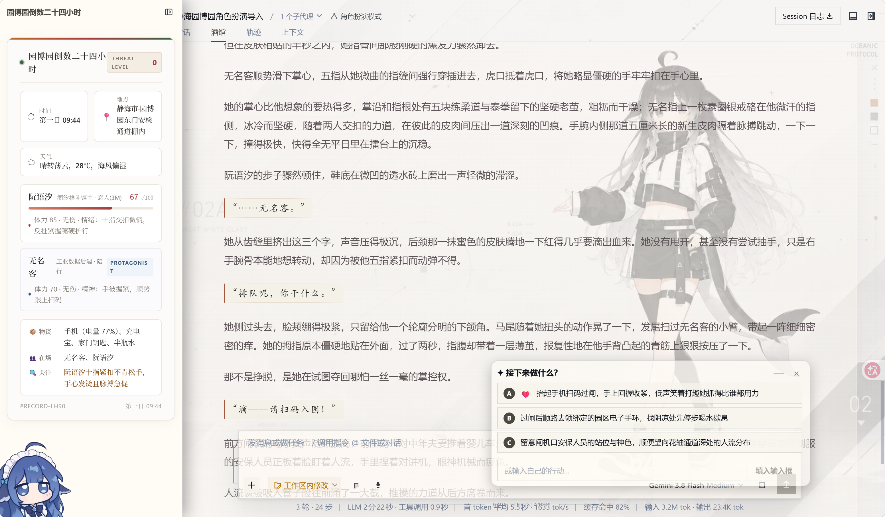

Roleplay workspace for DeepSeek Harness: interactive character creation, on-demand worldbook reading, long-form memory, multi-model collaboration, character agents, branching stories, novel exports and one-click installers.

**0.2.8** · Harness **0.1.7-rc.2** · pi-ai **0.85.1** · 自有代码 **GPL-3.0**

先装宿主，再用[一键安装](#一键安装)的官方插件命令。需要自己指定目录、端口或使用归档时，见[安装](#安装)。

## 一键安装

**已经装好 Harness 的玩家，只需这一条命令：**

```powershell
dsh plugin --profile web add dsh-nexttavern
```

第一次使用 DSH，请先安装 Node.js 24+ 和宿主：

```powershell
npm install -g @deepseek-ai/dsh@0.1.7-rc.2
```

安装后运行 `dsh web --host 127.0.0.1`，按终端地址打开浏览器，配置自己的模型与 Key，再选择“角色扮演模式”。所需兼容组件、文档读取组件和自有皮肤由统一插件准备；皮肤随包安装、默认关闭。首次准备需要时间与网络，准备完成后的启动会复用已校验的组件。

**从旧版本迁移：先导出，再用新目录。** 0.2.5 的旧会话无法直接延续，目录隔离步骤见[安装](#安装)。不要对旧 home 或工作区执行这条命令来尝试迁移会话。

### Windows

希望由安装器准备便携运行时与快捷方式，可下载 [NextTavern-Setup.exe](https://github.com/a86582751/dsh-nexttavern/releases/download/v0.2.8/NextTavern-Setup.exe)。Windows on ARM 使用 [NextTavern-Setup-arm64.exe](https://github.com/a86582751/dsh-nexttavern/releases/download/v0.2.8/NextTavern-Setup-arm64.exe)。从旧版本迁移时选择新的安装目录；完整步骤、未签名提示与验证范围见 [Windows 一键安装指南](INSTALL-WINDOWS.md)。

两端安装器准备便携宿主后，也通过官方 `plugin add` 安装已校验的归档；不再向宿主重放旧兼容补丁。安装失败时保留未完成回执，重新运行可以恢复本安装器拥有的工作。

### Linux

[NextTavern-Setup.sh](https://github.com/a86582751/dsh-nexttavern/releases/download/v0.2.8/NextTavern-Setup.sh) 准备便携 Node.js、安装目录及启动／停止入口，面向 x86_64 与 aarch64（glibc），不需要 root 或系统包管理器。从旧版本迁移时使用新的 `--root`；完整步骤与验证范围见 [Linux 一键安装指南](INSTALL-LINUX.md)。

### 安装与模型费用

安装、字节校验、恢复和卸载由程序完成，不调用故事模型。模型 API Key 由玩家输入，安装包不携带密钥；本机服务绑定 `127.0.0.1`。故事生成及既有后台记忆、状态等任务仍按所配置模型计费，打开已有会话也可能恢复后台维护。

## 开始体验

完成[一键安装](#一键安装)（或[手动安装](#安装)）并配置好自己的模型后：

1. **新建一个独立工作区。** 给这次角色扮演一个专用文件夹，角色卡、故事资源和导出文件都放在一起。
2. **在预设里选“角色扮演模式”。** 新建会话时从预设菜单切过去，就进入了你的故事工作台。
3. **上传角色卡，或者直接聊出一张新的。** 支持 SillyTavern / TauriTavern 的 PNG、JSON 人物卡；也可以只描述题材、人物、关系和氛围，让 AI 通过对话和你一起把这张卡做出来。
4. **开始体验。Enjoy it!** 跟着开场推进故事，输入你的行动，切换世界线，或随时打开“酒馆管理”调整设定。

没有现成角色卡，也可以从这样一句话开始：

> 帮我创作一张蒸汽都市悬疑角色卡。我想扮演刚到港口的调查员，故事慢热，有多方势力，也有人物关系的发展。其他细节你来决定。

告诉 AI 你想遇见怎样的人、经历怎样的故事。你可以一起打磨细节，也可以说“你来决定”，让它带着世界、人设、开场与文风继续创作。DOCX 等文档的读取方式见[文档扩展](#文档扩展)。手边只有一部长篇小说？也可以直接让它读成一张卡，见[长文本转角色卡](#长文本转角色卡)。

### 导入 SillyTavern / TauriTavern 人物卡

直接上传原始卡文件，然后告诉 AI：**“读取这张角色卡，准备开始角色扮演。”** 不用自己解码，也不用填导入工具的参数。

| 格式 | 支持范围 |
| --- | --- |
| **PNG 人物卡** | 从 `chara` / `ccv3` 的 `tEXt` 块读取 Base64 编码的角色数据；两者同时存在时优先读取 `ccv3`。 |
| **JSON 人物卡** | 识别 v1、v2（`chara_card_v2`）和 v3（`chara_card_v3`）。 |
| **内嵌世界书** | 读取 `character_book`，按当前导入流程审阅并映射到设定与世界书。 |

请选保留元数据的原始 PNG 卡：普通头像、截图或被移除元数据的图片里没有可导入的角色数据。PNG/JSON 解析是内置能力，不需要 anydoc；上传入口随完整安装提供。

导入后可以继续打磨人物、世界书与创作规则，原始卡片和扩展数据都会一并保留。卡片里的三个文风字段会完整保留，怎么和预设配合由你决定，见[预设系统](#预设系统)。

## 核心能力

**这是这个版本的能力总览，也是后面各章的索引。** 想先知道这一版能做什么，看这张表；想细看某一项，按下面的章节顺序翻。

| 能力 | 你可以获得什么 |
| --- | --- |
| **一键安装** | 官方一条 plugin add 安装酒馆与所需组件；另有 Windows／Linux 便携运行时安装器。旧版迁移使用新目录。 |
| **SillyTavern / TauriTavern 卡片导入** | 直接读取 PNG `chara`/`ccv3` 和 JSON v1/v2/v3 人物卡，保留原件并支持内嵌世界书。 |
| **固定设定 + 硬切窗口 + 导演笔记 + 混合检索** | 固定设定不压缩始终注入；窗口保留近期完整正文与尾部衔接；后台笔记带来源哈希与世界线锚点；历史召回支持关键词／语义／混合三种方式。 |
| **预设与文风系统** | 独立预设页，作用范围可选当前对话／指定对话／全局，三种文风模式，16 种自带文风，200 个自定义槽位。 |
| **长文本转角色卡** | 把长篇 TXT 读成一张可玩的角色卡：精读或粗颗粒度两种阅读方式、原文冻结与哈希、每一条研究笔记都能对上原文、独立的语义索引。 |
| **嵌入模型管理** | 在线接入 DashScope、OpenAI 兼容接口与 OpenAI 官方；本地可安装 BGE small zh、Qwen3-Embedding 0.6B、Jina Nano／Small INT8、Nomic q8，无需 Key 与网络。 |
| **多模型协同** | 为正文与记忆、读写卡、状态、决策、小说导出等任务配置模型路由，按需要分工。 |
| **多角色 Agent 集群** | 为主要角色启动独立推演，分别思考语言、行为与意图，再由主代理协调成最终故事；支持单角色模型覆盖。 |
| **决策卡与状态栏** | 行动建议集中在独立决策卡，可折叠、可稍后处理、可拖动；作者的状态 HTML/CSS 在导入、生成与恢复路径上都被保留。 |
| **自有皮肤** | 第一套自有皮肤，日间／夜间双主题，整套界面统一重绘；随包安装，默认关闭。 |
| **对话分支管理** | 重新生成、修改后发送、切换版本，在同一对话里探索不同世界线；也可显式分支到新对话。 |
| **自定义创作规则** | 分别管理核心设定、人物、世界书、剧情指引、文风与规则，控制视角、节奏、人物知情边界和回复展开方式。 |
| **主动读取世界书** | 主代理根据当前剧情按需查阅地点、势力和背景细节，让世界书作为可查询的设定库参与叙事。 |
| **HTML/CSS 阅读美化** | 通过角色卡中的 HTML/CSS、状态栏模板与正则规则定制阅读呈现，正文支持流式阅读；作者脚本在隔离的环境里运行。 |
| **小说稿一键导出** | 将选定世界线整理成小说稿；也能导出当前完整角色卡，结果进入资源库供下载。 |
| **资源库管理** | 集中查看角色卡、故事相关文件与导出结果，按时间或名称排序、刷新和下载。 |
| **交互式全新角色卡创作** | 从一个想法开始，通过交流逐步构建世界、多角色人设、开场、文风和排版，并经过十二项完整性检查。 |
| **模型用量与缓存统计** | 按会话、供应商或模型查看请求、输入输出 tokens、缓存、速度与已知成本，包含重生成、嵌入调用和失败尝试。 |

下面从长篇体验最吃重的记忆系统开始，逐章展开这张表。

## 记忆系统

故事越写越长，人物的经历、埋下的伏笔和未完成的约定也在积累。NextTavern 借鉴 Codex 类长任务的上下文管理思路，把长篇记忆拆成四件各有边界的事：**固定设定不压缩始终注入 + 有尾部保留的上下文硬切窗口 + 可追溯来源的后台导演笔记 + 关键词和语义混合历史上下文查询召回。**

| 支柱 | 它做什么 | 写长篇时有什么用 |
| --- | --- | --- |
| **固定设定不压缩，始终注入** | 冻结的设定与系统前缀每轮都在场，从不进入压缩流程。 | 身份、作者规则和叙事约束是长期契约，不该被一段摘要替换掉。 |
| **硬切窗口 + 尾部保留** | 程序按完整正文边界推进上下文窗口，并在推进时保留尾部连续正文。 | 近期正文保持完整细节，你正在读的那一段不会因为切窗口而丢失，也不会在场景中途被摘要掉。 |
| **可追溯来源的后台导演笔记** | 由独立的后台任务撰写，每条笔记带来源哈希与同一世界线锚点。 | 每条笔记都能追回到写出它的那段正文；追不回来的旧记录会留在原处，程序不会替它猜。追加式原始历史从不删除。 |
| **关键词和语义混合的历史召回** | 主代理按需查询历史，三种方式：**关键词（默认）／语义／混合**。 | 需要旧细节时再回查原文，而不是每轮都先强制召回一次。 |

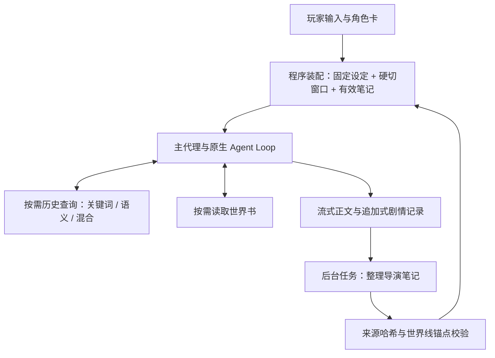
```mermaid
flowchart TD
    Player[玩家输入与角色卡] --> Program[程序装配：固定设定 + 硬切窗口 + 有效笔记]
    Program --> Writer[主代理与原生 Agent Loop]
    Writer <--> Recall[按需历史查询：关键词 / 语义 / 混合]
    Writer <--> Lore[按需读取世界书]
    Writer --> Story[流式正文与追加式剧情记录]
    Story --> Background[后台任务：整理导演笔记]
    Background --> Anchor[来源哈希与世界线锚点校验]
    Anchor --> Program
```

### 三种查询方式，同一份语料

查询的语料是**玩家输入与有效剧情正文**，包含已经归档或被淘汰的正文；状态、工具输出、CSS、决策卡和推理过程都不会进去。

| 方式 | 谁来算 | 什么时候用 |
| --- | --- | --- |
| **关键词（默认）** | 程序确定性匹配，不调用模型。 | 想找明确的词句、人名、地名时最快。 |
| **语义** | 需要嵌入模型把查询编码成向量。 | 只记得大意、不记得原话时更有效。 |
| **混合** | 关键词与向量结果一起排序。 | 兼顾精确命中与语义相近。 |

向量是派生的共享数据，查询时会过滤到**当前世界线**，所以切换世界线不用重建索引。每份向量索引都带一个配方指纹（模型、修订、维度、任务角色、池化方式、量化与运行时）：指纹对不上时，索引会被标记为 `stale` 并停止对外服务，直到你重建为止——它宁可让你重建，也不会拿旧向量凑出错误答案。分块大小全局可配置，默认 480 字符（192／480／960 三个选项，128–2048 区间，80 重叠），本地模型使用 512 的分词预算。清空、重建与填充都限定在当前可见对话及其全部世界线；清空只清索引，正文、来源和账本都留着。

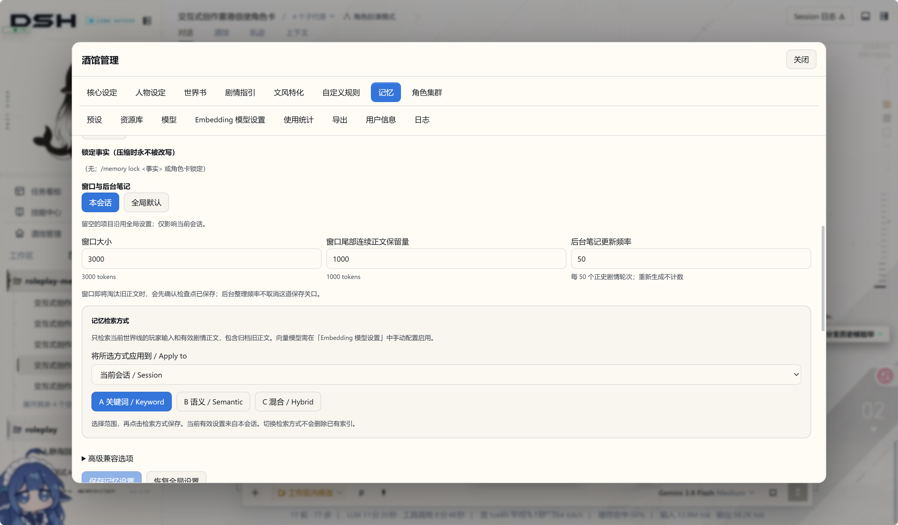

### 旧笔记与旧状态不再随每次请求发送

旧导演笔记与旧状态快照以前会跟着每次请求一起走（约 52k 字符）。现在它们只在**有效的新锚点准备好之后**才被替换：没被替换的引用保持原本的精确内容，回滚时重新提供完整文本，原始事件始终是追加式的。写长故事时，请求里不会一直拖着越来越重的旧笔记。

同样的“先确认再替换”也用在很长的工具结果上：一条研究笔记被确认后，对应的长工具结果会被替换成匹配的检查点，前提是归属、来源哈希、generation 与 packetIds 全部一致。部分保存、来源不符、写入失败，以及确认之后又重读过的情况，都不会回收。

### 这些都可以按会话调整

窗口大小、尾部保留量和后台笔记更新频率支持全局默认与会话覆盖，留空就沿用全局设置。截图里能看到的一组实际取值：

| 设置 | 含义 |
| --- | --- |
| **窗口大小** | 当前窗口的正文预算，按你实际使用的模型上下文容量来配。 |
| **窗口尾部连续正文保留量** | 切窗口时必须留住的近期正文，保证你正在读的那一段完整。 |
| **后台笔记更新频率** | 每多少个新增正史剧情轮次整理一次；重生成不计入。 |
| **记忆检索方式** | 关键词／语义／混合，以及应用到哪些会话。 |

切换检索方式不会删除已有索引。窗口即将淘汰旧正文时，会先确认检查点已保存；后台整理频率不会取消这道保存关口。

窗口装配、来源校验、笔记淘汰和原文回收都由程序完成，不产生模型请求。只有主代理真的决定去查历史时，才按你选的方式付出一次查询代价（语义与混合还需要嵌入模型，见[嵌入模型](#嵌入模型)）。

换一条世界线，就带着那条路线的经历继续向前；反复打磨同一幕，记忆会跟随你选中的版本。章节交接前，系统会先把需要延续的故事线索整理妥当。

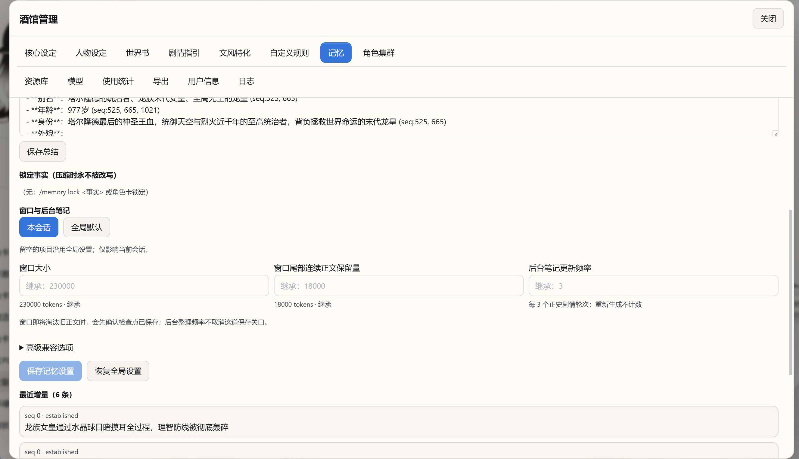

## 预设系统

文风不再只能靠改卡片。管理界面里多了一页独立的**预设页（位于资源库之前）**，可以新建、编辑、另存副本、选用和删除；自带预设是只读的，自定义预设给你 200 个槽位。

| 维度 | 可选值 | 含义 |
| --- | --- | --- |
| **作用范围** | 当前对话／指定对话／全局 | 同一对话的全部世界线共享这次覆盖；留空就沿用全局设置。 |
| **文风模式** | 前景系统美学（默认）／与卡片文风融合／仅卡片文风 | 前两种同时注入预设与卡片文风，冲突时预设优先；第三种只使用卡片文风。 |

预设库由所有对话共享，所以编辑一个正在被使用的预设，会影响使用它的对话后续生成——界面会明确提示这一点。要是两个窗口同时改同一个预设，后提交的一方会收到冲突提示，**你的草稿仍然留着**，不会被悄悄覆盖。

卡片导入、编辑、导出与持久化都保留三个卡片文风字段，排除只发生在故事上下文装配阶段，原始卡片不会被改写。

**自带 16 种文风。** 除了默认预设和空白预设，还准备了 14 种可直接选用的写作风格：日式轻小说、乙女风格、三体文风、日式游戏、电影感文风、春秋文风、极简文风、细腻文风、奇幻网文风、恐怖文风、鲁迅文风、抒情文风、日常搞笑风、古文文风。每一种都有完整的七段式指南和原创示例，不是只有一句风格描述。

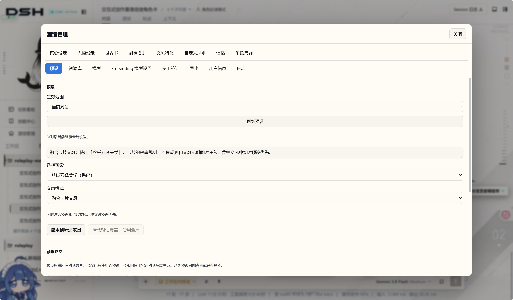

<details>
<summary>查看自带文风预设库</summary>

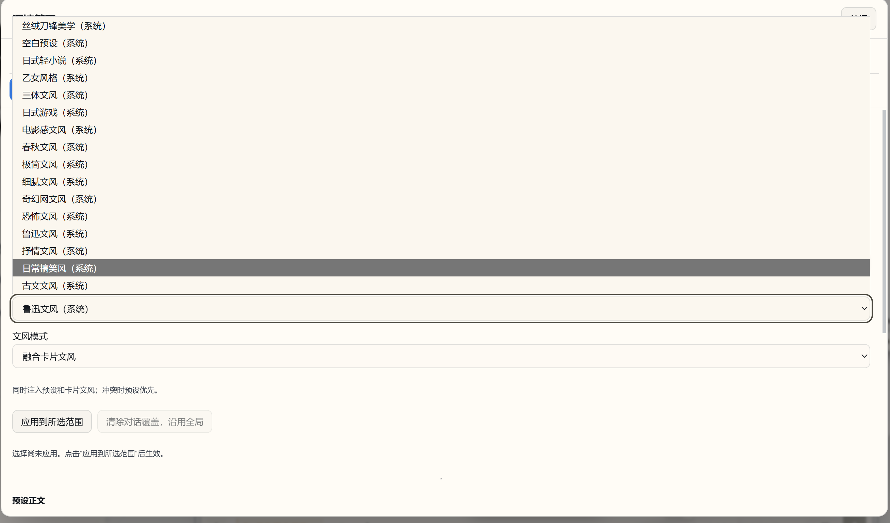

</details>

## 长文本转角色卡

手边有一部长篇小说，想把它变成能玩的世界？管理界面里多了一个**「长文本转角色卡」TAB（位于角色集群之后）**。它做的不只是总结：**读过什么、笔记记在哪、卡片里的话有没有原文依据，都要能对得上。**

**两种阅读方式，在研究开始前选。**

- **精读（默认）**：分段逐段完整阅读，每一段都留下带原文引证的研究笔记。
- **粗颗粒度**：围绕人物、组织与事件面做多轮关系前沿检索，再做主角的纵向追踪。它**需要**一个可用的小说模型和完整的当前索引；条件不满足时，界面会引导你先把配置补上并结束本轮，不会悄悄降级成另一种模式。

**原文先冻结。** 工作区 TXT 上限 64 MB，按 UTF-8 → GB18030 → 带 BOM 感知的 UTF-16 依次尝试解码，记录原始字节哈希、解码文本哈希与大小，并且从不修改你上传的原文件。分段是确定性的，批次大小被限制在原生切分器之下。

**笔记要有证据。** 一条研究笔记要成立，得同时满足两件事：这一批确实被读过，引用的原话也确实出现在这一批里。笔记分事实／改编机会／未决问题三节；只在检索里命中，不算这一批已经被读过。

**小说有自己的索引。** 它和故事记忆的语义索引分开，小说模型也可以与故事记忆模型分开配置。相同的原始哈希复用研究基线，相同配方复用向量——同一部原著可以服务多张卡、多个对话。

举个例子：一部约 119 万字符的长篇网络小说（前 354 章）建立了 3027 条在线向量，程序为等待索引完成挂起约 292 秒；交付角色卡与打开导入是两个独立回合，开场输入约 52k tokens。改编复用与交互式创作相同的问卷和十二项写卡检查。

小说很长时，个别细节仍可能写错，成稿后建议自己通读一遍。

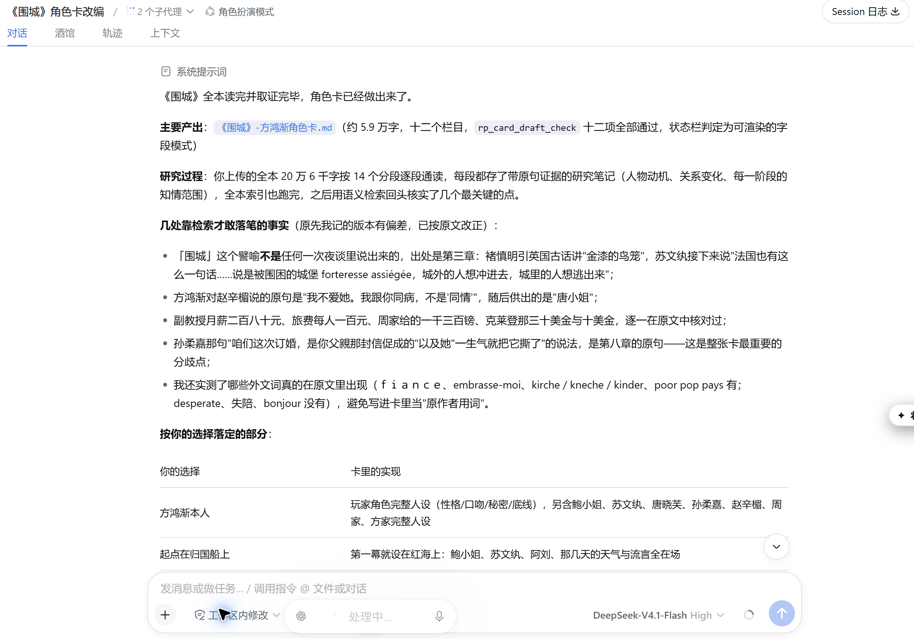

## 嵌入模型

语义与混合检索需要向量，所以管理界面里多了一页独立的**嵌入模型页（位于模型与使用统计之间）**。

**在线接入。** 支持 DashScope、OpenAI 兼容接口和 OpenAI 官方：模型列表可刷新，也可以手动填写模型 ID，密钥只保存在服务端，并提供连接测试。

**本地接入。** 五种本地模型可以直接装：**BGE small zh、Qwen3-Embedding 0.6B、Jina Nano、Jina Small INT8、Nomic q8**，在独立编码进程中使用 ONNX Runtime 1.29.0 运行。下载显示真实字节进度、速度与预计剩余时间，支持暂停／取消／继续，并有 `queued → downloading → verifying → preparing-runtime → self-testing → installed` 的安装状态机。**本地推理不需要 API Key，也不需要网络。**

真实的索引／查询／测试／重试都会进入既有的用量统计。未知价格保持 **N/A**，失败不会虚构 token 数。

选哪个？BGE 快，跨语言能力弱一些；Qwen 在长正文上建索引更慢；分块到 5 万条时，检索时间已经接近上限。

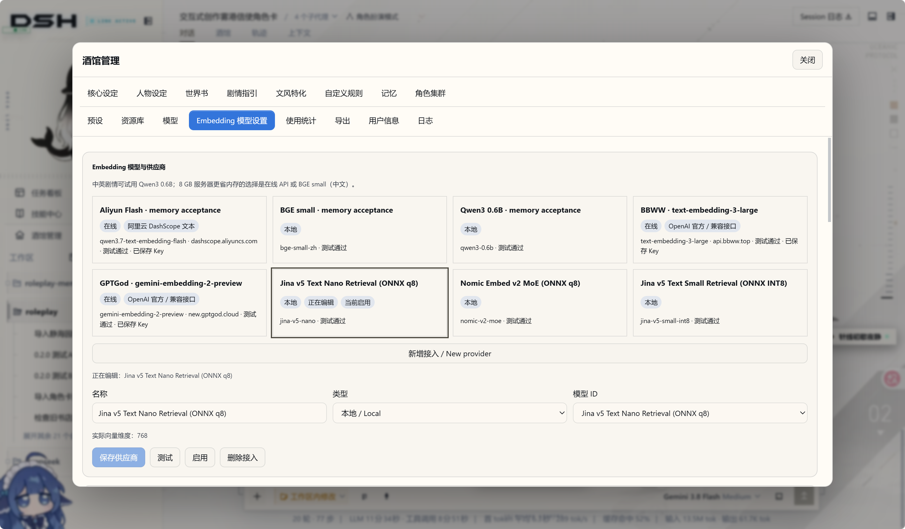

## 角色集群

开启**角色 Agent 集群**后，主要人物分别在独立上下文中推演。每个角色可以选择模型与思考强度，即使用同一个模型也独立运行。它们获得自己的人设、当前剧情、导演笔记和近期已读取的世界书资料，主代理再综合各方建议推进故事。

模型配置分两级：**全局默认模型 + 单角色覆盖**。单角色覆盖属于当前可见对话，并与其世界线共用；但每个实际世界线的输入与结果仍然互相隔离——共享的是偏好，剧情历史各写各的。

后台的子代理不会再出现在会话列表里；保存草稿、资源与导出回复、任务操作也不会再重复提交或过期。

想让一场相遇拥有更多角度，就为这段故事开启角色集群。让每个人物带着自己的性格、立场和打算参与推演，再由主代理把碰撞与交锋写成一幕完整的戏。

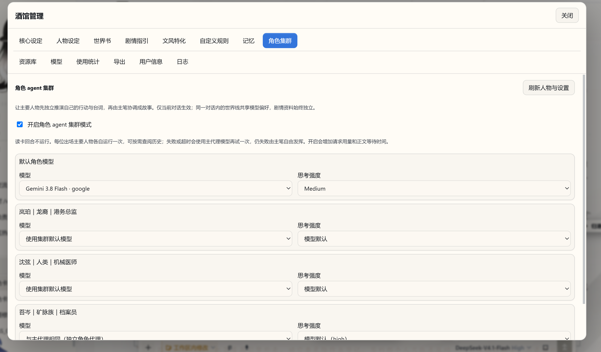

**人物各自推演之外，模型也可以分工。** 你可以让正文、后台记忆、读卡、状态与导出任务使用适合的模型，也可以统一跟随主模型；模型设置支持全局默认和当前会话覆盖。

<details>
<summary>查看多模型协同设置</summary>

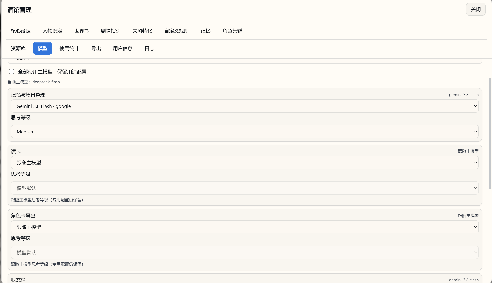

</details>

## 状态栏与决策卡

**行动建议只出现在独立决策卡里**，不再重复塞进状态栏或正文尾部。旧卡片里遗留的行动区域会被隐藏，但原卡本身一个字都不改。

决策卡现在有自己的操作：**折叠／恢复（⌃ / —）**、独立的 **× 稍后处理**、拖动移动，双击或按 Home 复位，可视高度有上限，不会吃掉整个屏幕。

阅读呈现也顺手顺了一批：作者写的状态 HTML/CSS 在导入、生成和旧数据恢复三条路径上都会被校验并保留；围栏状态样式与不透明面板恢复；状态面板撑满可用高度同时保留内部滚动；折叠后的侧栏重新展开按钮保持可见。状态模板的动态槽位可以接收真实数值，同时保留作者原有的 HTML/CSS/JS 结构；任务校验失败会带上结构化诊断、失败时间和重试指引。

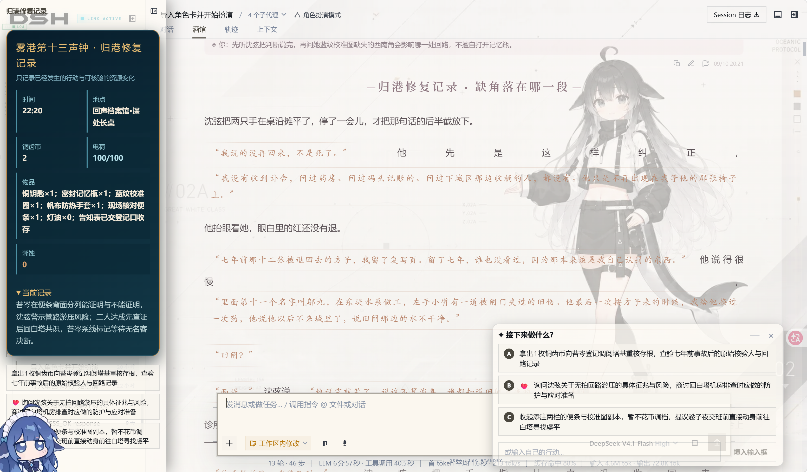

## 全新自有皮肤

项目提供**第一套自有皮肤 `dsh-nexttavern-amber`**：整套界面用同一套设计 token 重绘，**日间与夜间两套主题**切换一次就是两种气氛；侧栏坐着一位 Q 版酒馆看板娘，日夜各是一张不同的画；夜间主题下的酒馆阅读模式铺在陈旧羊皮纸上，作者自己写的墨色一点没动——喜欢安静地读完一篇长文的人，会喜欢这一版。

皮肤随安装包一起装好，但**默认不开**，所以你的界面还是原来的样子。想换上它：打开 **设置 → 插件市场 → 已安装**，找到 `dsh-nexttavern-amber`，把开关打开。它写进 profile 的 `cordis.patch.yml`，热加载大约一秒生效，**不用重启**；看腻了拨回去就行，你的选择在重启后依然保留。这个开关由第三方插件市场提供；已有市场会复用，缺少时才由产品安装上游市场，来源、出站请求与关闭方法见[补丁与依赖来源](#补丁与依赖来源)。

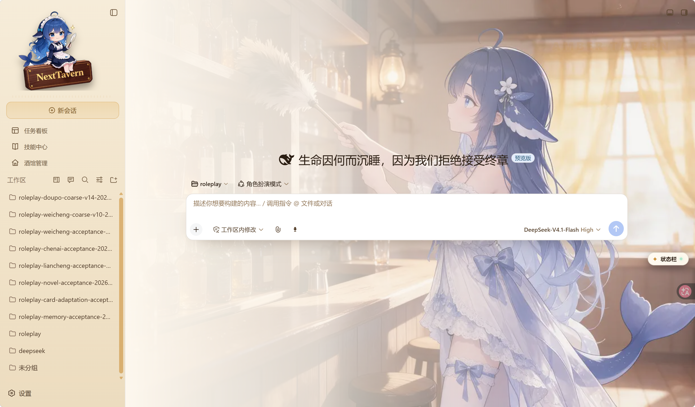

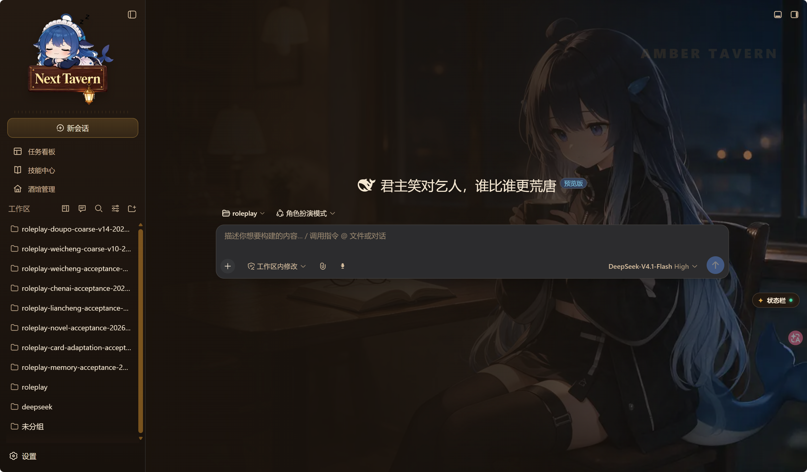

## 世界线与分支

不满意某段发展，可以重新生成；想改一个选择，可以修改玩家消息后发送。不同版本组成当前对话内的世界线，可以来回切换查看。只有在显式选择“在新对话中分支”时，才会创建独立对话。

每条世界线有自己的剧情、状态与记忆；笔记属于实际世界线，而角色的模型偏好与向量索引按对话或查询世界线共享。小说导出跟随你选中的世界线，方便保留你喜欢的故事版本。

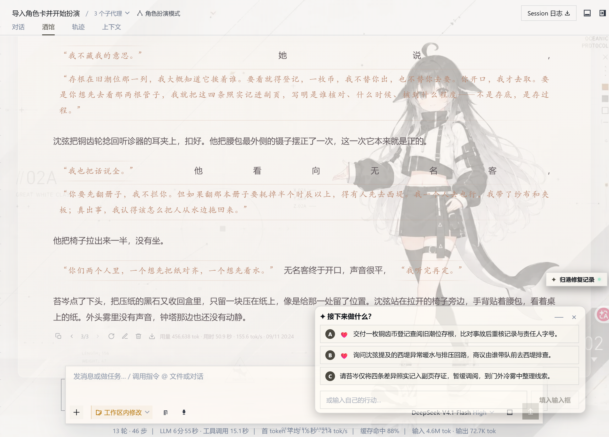

## 按你的方式阅读与创作

在“酒馆管理”中分别调整人物、世界背景、剧情方向、文风和自定义规则。把镜头、节奏与人物边界写进规则，把 HTML/CSS、状态栏和正则美化写进卡片，让不同故事拥有不同的阅读呈现。

正文生成时就能读；局后状态与笔记维护有独立进度。继续输入的玩家行动进入原生队列。

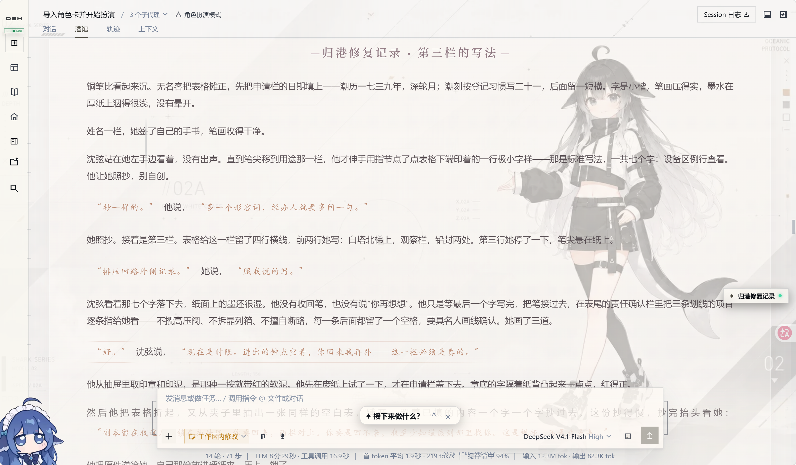

<details>
<summary>查看管理界面、自定义规则与世界书</summary>

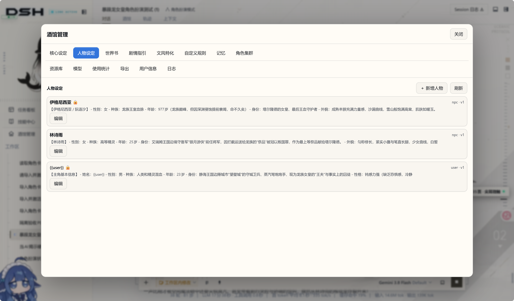

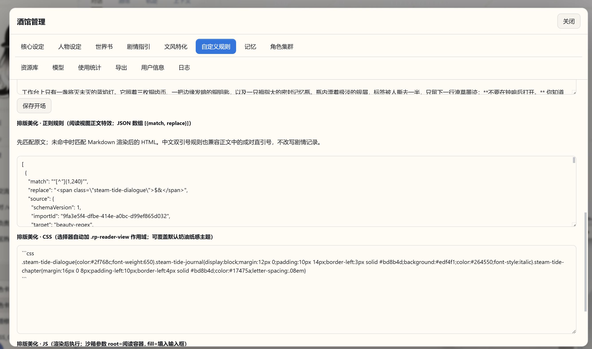

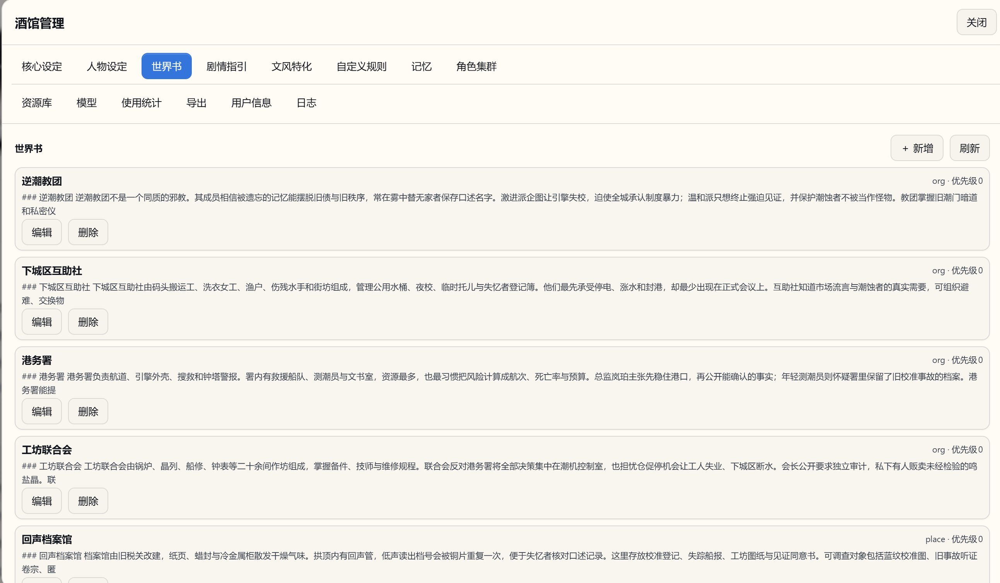

</details>

## 从角色卡到可带走的小说

那些反复推敲的对白、意想不到的转折、终于抵达的结局，都值得成为一份真正的作品。选中你喜欢的世界线，一键整理成小说稿；也可以导出打磨后的完整角色卡，让这个世界继续被阅读、被分享、被创作。

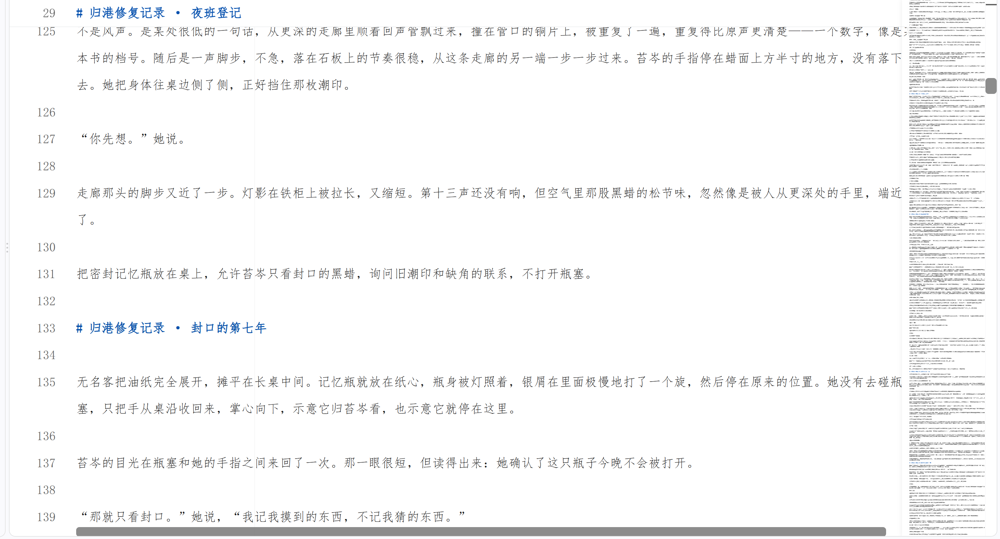

<details>
<summary>查看资源库</summary>

资源库按时间或名称排序，支持刷新、查看文件与下载；角色卡和导出文件保留可识别的主题名称。

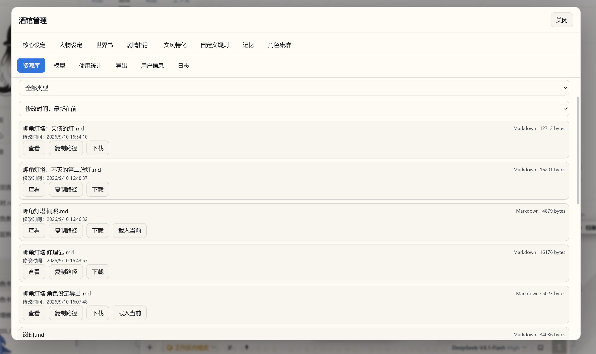

</details>

## 交互式创作

**不必先准备一张完整角色卡，带着想象力来就够了。** 一座永远下雨的港城、一段针锋相对的关系，或只是“我想经历一场慢热的冒险”，都能成为创作的开端。

AI 会和你聊人物、关系、氛围与剧情方向，把你的回答逐步展开成世界背景、多角色人设、开场、文风和阅读排版，再用十二项完整性检查过一遍。你可以亲自雕琢每一处细节，也可以把留白交给它：“你来决定。”从最初的灵感到可以开玩的角色卡，创作本身就是旅程的一部分。

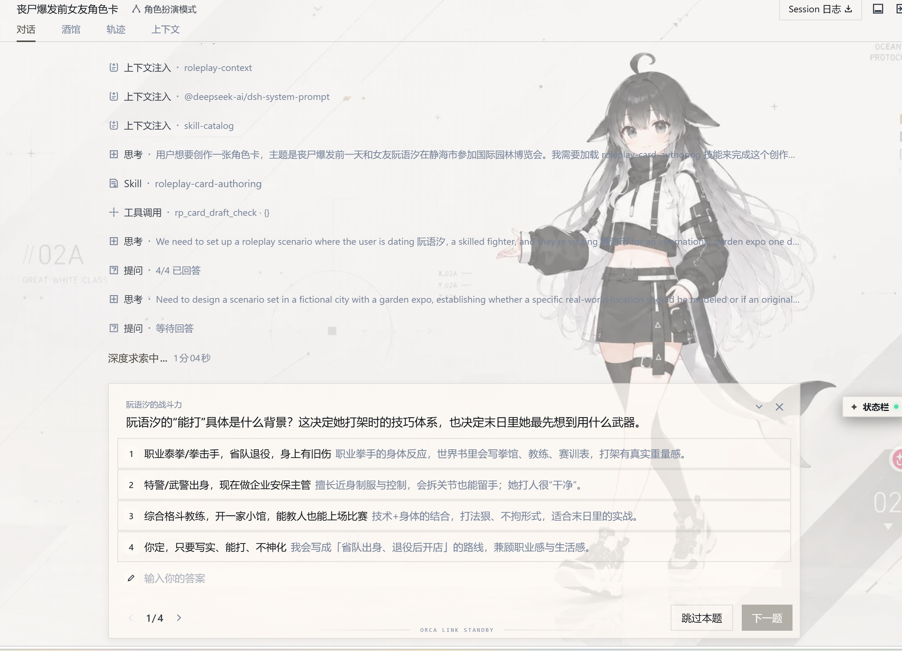

## 用量统计

**尽情探索，也把模型的表现与开销看清楚。** 请求日志、供应商统计和模型统计集中在同一个面板，按会话、时间与模型切换，就能查看输入输出 tokens、缓存命中率、生成速度和费用。嵌入模型的索引、查询、测试与重试也计入同一份统计。

比较不同模型的创作投入，观察长篇推进时的缓存变化，回看一次重生成或角色集群调用的消耗，都有据可查。支持模型价格倍率、手动单价与币种换算，让你按自己的预算与偏好安排下一段故事。

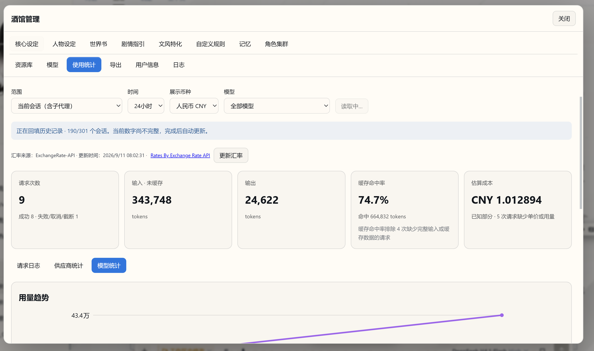

## 架构设计

**功能都在上面了，这一章说它们在同一套运行时里是怎么接起来的。** 写长篇，需要沿途积累的记忆、可随时翻阅的世界资料，也需要人物各自的动机。NextTavern 将这些能力连接进原生 Agent Loop：**主代理推进叙事，记忆代理整理长线，角色代理独立推演，程序把当前故事需要的上下文准备好。** 从读卡、开场到分支与导出，整个创作过程由这套架构贯穿。

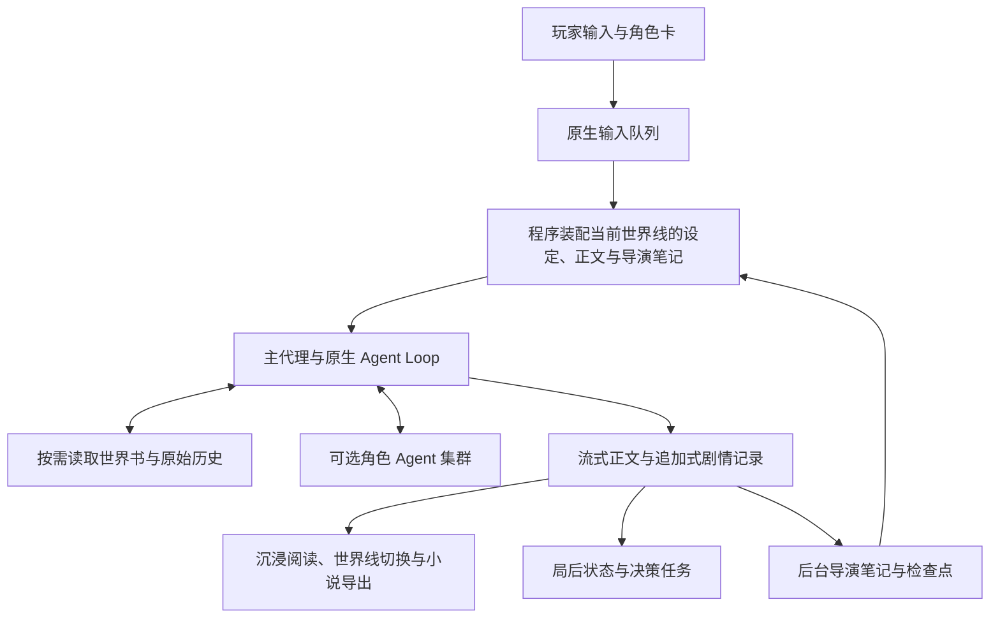
```mermaid
flowchart TD
    Player[玩家输入与角色卡] --> Queue[原生输入队列]
    Queue --> Context[程序装配当前世界线的设定、正文与导演笔记]
    Context --> Writer[主代理与原生 Agent Loop]
    Writer <--> Lore[按需读取世界书与原始历史]
    Writer <--> Cast[可选角色 Agent 集群]
    Writer --> Story[流式正文与追加式剧情记录]
    Story --> Reader[沉浸阅读、世界线切换与小说导出]
    Story --> Tasks[局后状态与决策任务]
    Story --> Memory[后台导演笔记与检查点]
    Memory --> Context
```

五个设计，贯穿你的每一次创作：

1. **让 AI 主动探索世界。** 当前设定、正文和笔记随时可用；需要世界知识或早期细节时，主代理自己查阅资料，再把发现融入故事。
2. **给长篇一套会整理的记忆。** 固定设定始终在场，近期正文保留眼前细节，导演笔记承接长线，历史查询让旧事有迹可循。从当前场景到早期伏笔，信息各有归处。
3. **把“换一种选择”变成真正的世界线。** 重写一句行动，重新生成一次回应，就能沿另一条路线继续。每条世界线保留自己的剧情、状态与记忆，也能单独导出。
4. **让不同角色带着自己的想法登场。** 角色分别推演，主代理综合他们的行动与意图；记忆、状态、读写卡等工作还能交给不同模型协作完成。
5. **让阅读跟上灵感。** 正文边写边读，状态与笔记随后整理。你可以继续酝酿下一步行动，让创作自然衔接。

[阅读完整架构说明：上下文组成、记忆四支柱、预设作用域、长文本流水线与请求成本](ARCHITECTURE.md)

## 下载

**架构说完，下面是取用与维护这一版需要的材料。** 先看这一版发布了哪些文件。

- [主包 dsh-nexttavern.tgz](https://github.com/a86582751/dsh-nexttavern/releases/download/v0.2.8/dsh-nexttavern.tgz)，含统一插件、预构建 UI、源码、preset、参考卡、随包组件、CLI 和可选公网鉴权源包。
- [独立 dsh-debug.tgz](https://github.com/a86582751/dsh-nexttavern/releases/download/v0.2.8/dsh-debug.tgz)。
- [公网鉴权插件 dsh-auth-webserver.tgz](https://github.com/a86582751/dsh-nexttavern/releases/download/v0.2.8/dsh-auth-webserver.tgz)，安装步骤见[手机电脑公网访问指南](PUBLIC-ACCESS.md)。

一键安装器：

- [NextTavern-Setup.exe](https://github.com/a86582751/dsh-nexttavern/releases/download/v0.2.8/NextTavern-Setup.exe)（Windows x64）
- [NextTavern-Setup-arm64.exe](https://github.com/a86582751/dsh-nexttavern/releases/download/v0.2.8/NextTavern-Setup-arm64.exe)（Windows on ARM）
- [NextTavern-Setup.sh](https://github.com/a86582751/dsh-nexttavern/releases/download/v0.2.8/NextTavern-Setup.sh)（Linux，x86_64 / aarch64）
- [nexttavern-setup.tgz](https://github.com/a86582751/dsh-nexttavern/releases/download/v0.2.8/nexttavern-setup.tgz)（安装器的 npm 归档）

校验与来源：

- [SHA256SUMS](https://github.com/a86582751/dsh-nexttavern/releases/download/v0.2.8/SHA256SUMS) 与 [provenance.json](https://github.com/a86582751/dsh-nexttavern/releases/download/v0.2.8/provenance.json)
- [版本说明](https://github.com/a86582751/dsh-nexttavern/releases/tag/v0.2.8)。npm 包名为 `dsh-nexttavern`，通过官方 `dsh plugin --profile web add dsh-nexttavern` 安装。

## 安装

此处适合指定独立 home、工作区与固定端口的玩家。需要 Node.js 24+ 和 npm；以下为 PowerShell 示例，每条命令成功后再继续。

**升级前先在旧环境导出角色卡或小说，并保留旧目录备份。** 旧会话不能直接延续，小说不包含完整状态。新 home 和新工作区应使用未占用的路径，不复制旧会话数据库。

```powershell
npm install -g @deepseek-ai/dsh@0.1.7-rc.2
$env:DSH_HOME = Join-Path $PWD 'nexttavern-028-home'
$Workspace = Join-Path $PWD 'nexttavern-028-workspace'
New-Item -ItemType Directory -Path $env:DSH_HOME,$Workspace -ErrorAction Stop | Out-Null
dsh plugin --profile web add dsh-nexttavern
dsh web --host 127.0.0.1 --port 3510
```

浏览器中选择刚建的工作区，配置自己的模型供应商，新建会话时选“角色扮演模式”。后续启动仍须使用同一个 `DSH_HOME`，再运行最后一条命令。

也可以从 [v0.2.8 Release](https://github.com/a86582751/dsh-nexttavern/releases/tag/v0.2.8) 下载主包，与 `SHA256SUMS` 核对后，以本地归档替代 npm 包名：

```powershell
dsh plugin --profile web add ./dsh-nexttavern.tgz
```

不再需要 alpha.3 的手工 preset 初始化和宿主字节补丁。统一插件使用自己的兼容提供者，停用或激活失败时恢复原生提供者；普通 DSH 上传、附件和侧栏由官方提供。

### 首次准备失败时

网络失败后先恢复网络，再用同一 home 重试。首启准备有校验、锁与事务检查点，能识别中断并恢复；不要手工改 receipt、pin 或删除用户目录。

如果官方命令失败后包已装上、bundle 却未登记，可在停止目标服务后用同一个 home 执行以下两条，再重启：

```powershell
dsh plugin --profile web remove dsh-nexttavern
dsh plugin --profile web add dsh-nexttavern
```

若 pnpm 提示构建脚本未批准，先核对提示的包和 `profiles/web/pnpm-workspace.yaml` 中的 `allowBuilds`；不要把整个依赖树设为无条件信任。再次失败时保留终端错误与版本信息，隐去密钥后[反馈](https://github.com/a86582751/dsh-nexttavern/issues/new/choose)。

## 文档扩展

PNG／JSON 人物卡解析由产品内置；文件上传和附件使用宿主的原生入口。统一插件随包准备自有 `dsh-nexttavern-anydoc`，用于 TXT、CSV、DOCX 等文档解析、分页读取与完整 Markdown 转换，保留上游署名；不需要再装旧 `file-upload`／`read_document` 或 Office 插件。

想把文档作为角色卡来源，可上传原文件并说明用途。DOCX 读取已经覆盖；PDF／扫描件的可读性仍取决于文档和所用转换组件，本版不承诺 OCR 或所有格式都可用。长文本转角色卡读取工作区 TXT，不依赖 PDF 转换。可选工具请按各自的宿主兼容要求安装，不要把旧 alpha.3 扩展直接挂进新 profile。

## 补丁与依赖来源

本版固定 Harness **0.1.7-rc.2** 与 pi-ai **0.85.1**。产品使用自有 UI、Session Controller、持久化、投影、计量和 pi-ai 兼容提供者；它们随包校验并准备为独立版本组件，不要求玩家修改宿主已安装文件。版本、来源与许可证见随包 metadata、`provenance.json` 和 [NOTICE](NOTICE.md)。

- [anydoc](https://github.com/a86582751/dsh-plugin-anydoc) 基于 [beancookie/dsh-plugin-anydoc](https://github.com/beancookie/dsh-plugin-anydoc)，保留原作者历史与 MIT 署名，由自有 TypeScript 源码维护。
- [pi](https://github.com/a86582751/pi) 基于 [earendil-works/pi](https://github.com/earendil-works/pi)，保留 MIT 署名；兼容层统一处理四条协议的流终止与释放。
- 官方上传、附件和侧栏替代旧社区上传工具与 `better-sidebar`，不需要额外安装这些退休组件。

第三方 [dsh-market](https://github.com/dsh-market/dsh-market)（npm 名 `dshmarket`，MIT）用于浏览社区插件和开关[自有皮肤](#全新自有皮肤)。已有市场会原样复用；缺少时产品才解析并安装上游版本，将解析版本与校验信息留在当前 profile，不再固定旧 1.39.0，也不使用市场 fork。它仍是独立的第三方项目；市场目录和评论可能访问 [awesome-dsh-plugin.com](https://awesome-dsh-plugin.com)、giscus 与 GitHub。在设置里停用市场即可关闭这些市场功能；酒馆本身的启停不依赖市场。

公网玩家可按[手机电脑公网访问指南](PUBLIC-ACCESS.md)显式配置随包提供的鉴权插件、自己的 Cloudflare Access、域名和登录身份。默认安装只监听本机，模型 Key、私人地址和会话不随包分发。旧公网配置请单独核对新宿主兼容情况，不当作旧会话迁移工具。

## 更新、卸载与回滚

**0.2.5 → 0.2.8 是迁移，不是旧会话原地续写。** 在旧环境导出角色卡／小说，备份旧目录，再按[安装](#安装)使用新 home 和工作区。一键安装器也应选择新根目录；旧安装保持独立，必要时继续用旧版本读取或导出资料。

同一兼容版本线内更新时，先停止当前服务、备份当前 home 和工作区，核对新版本说明，再通过官方 `plugin add` 安装目标包版本或归档，重启宿主以加载新模块。准备过程拒绝坏包和未知组件，不会把失败写成成功；持久组件按版本保留，回滚须使用匹配的旧包与对应备份，不混用其他实例的 receipt 或 pin。

**停用／重新启用：** 在官方 **设置 → 插件 → 插件配置** 中切换 `dsh-nexttavern` 总开关；停用后恢复原生 UI 和提供者。皮肤是独立开关，默认关闭，见[自有皮肤](#全新自有皮肤)。

**卸载插件：** 先停止目标服务，确认 `DSH_HOME` 指向要操作的安装，再执行：

```powershell
dsh plugin --profile web remove dsh-nexttavern
```

受控卸载移除产品注册及其受管配置，保留故事、卡片、资源、笔记、用户预设副本和模型设置，也不把玩家已有市场当作产品删除。它不会删除整个 home 或工作区；之后重新安装仍可使用该版本线兼容的用户资料。删除安装器根目录会连同 `home`／`workspace` 删除用户资料，完整清理前必须先备份，详见 [Windows](INSTALL-WINDOWS.md#卸载与回滚) 与 [Linux](INSTALL-LINUX.md#卸载与回滚)。

## 源码与验证范围

如果你想自己重建一套界面，或者核对这个包是怎么做出来的，这一节就是路线图。

**TypeScript 是唯一维护源码。** 手写 `.ts` / `.mts`，`.js` / `.mjs` 由共享构建清单经 TypeScript 5.9.3 生成。维护源码集中在 `src/`，生成物在 `lib/`，包含运行时、UI、记忆、鉴权、读卡、遥测、分支及发布工具链。根入口和 `./client` 导出保持，内部深路径已有迁移；开发者请按[重建指南](CONTRIBUTING.md)更新直接引用。

`provenance.json` 记录维护源码提交、逐文件来源、工具版本和 SHA-256；随包 metadata 记录组件版本与上游固定来源。主仓库不携带完整官方补丁快照。想重建 UI：

```powershell
npm ci --prefix ./build-tools --ignore-scripts --no-audit --no-fund
npm run build
```

公开源码可按登记配方重建四份浏览器 bundle，包括根产品与兼容提供者。改动源码后请更新自己的版本号与 provenance，不要冒充原始 Release。兼容 fork 各自有无需维护仓库的独立重建命令和归档摘要。

架构设计与各部分的取舍写在[架构说明](ARCHITECTURE.md)里。整合安装、生命周期、记忆和 UI 有对应验收证据。完整付费行为验收使用 alpha.1 候选；迁移到 rc.2 后完成了最小源码检查和本机／服务器实际安装，没有在 rc.2 重跑整套付费验收。纯净 VM 与真实 ARM64 仍未验证；两个一键安装器各自适用哪些场景，写在 [Windows 一键安装指南](INSTALL-WINDOWS.md) 与 [Linux 一键安装指南](INSTALL-LINUX.md) 里。

## 社区支持

感谢 [@ljs1997sh](https://github.com/ljs1997sh) 在 NextTavern 发布后迅速带来 [dsh-nexttavern-qq-mobile](https://github.com/ljs1997sh/dsh-nexttavern-qq-mobile)，为手机玩家提供 QQ 风格界面、紧凑布局，以及手机、局域网和远程访问方案，让更多人能随时继续自己的故事。0.2.5 的自有皮肤是本仓库内的独立实现，没有合并它的界面，也没有转发它的代码。

这是一个由作者独立维护的社区项目，请按它的仓库说明了解安装方式和适用场景。这里提供的 CF Access 鉴权插件和[公网访问指南](PUBLIC-ACCESS.md)需要按指南一步步配置和确认。

## 反馈与许可

带着你的世界来，也把体验和想法带回来。[分享反馈与建议](https://github.com/a86582751/dsh-nexttavern/issues)，一起打磨下一段更好的创作旅程。反馈问题时请附版本与复现步骤，并隐去密钥和私密内容。

自有代码以 **[GPL-3.0](LICENSE)** 开源。随包的上游补丁与社区改动各自保留原许可（DeepSeek、pi 和 anydoc 的 MIT 条款等），逐项列在 [NOTICE](NOTICE.md) 里。
